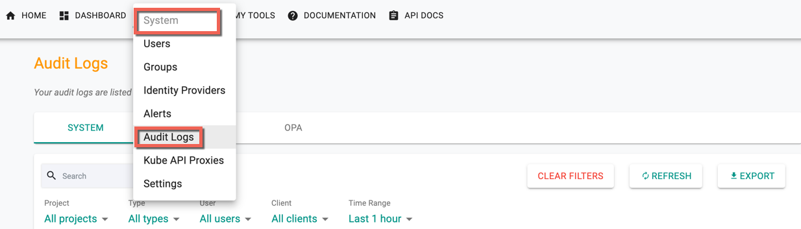
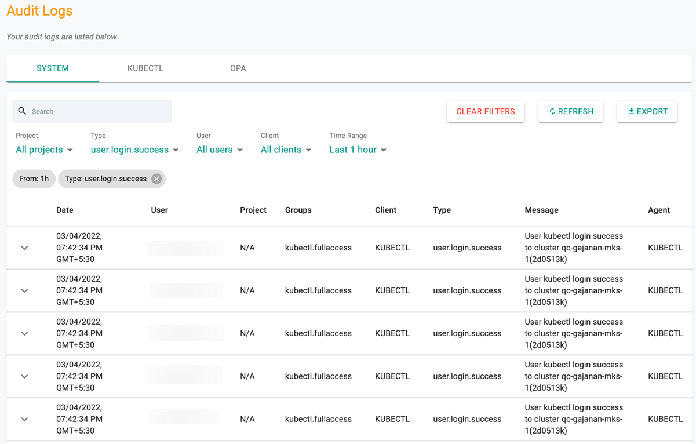
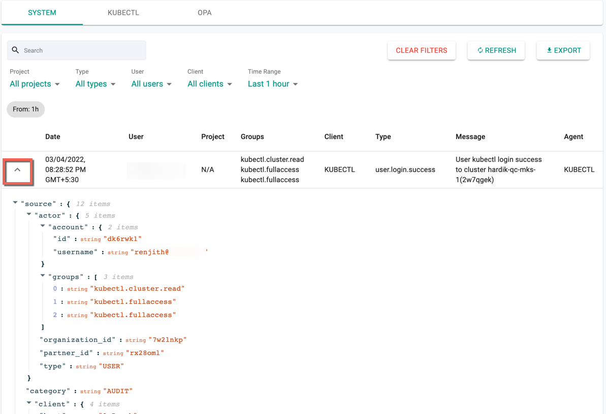
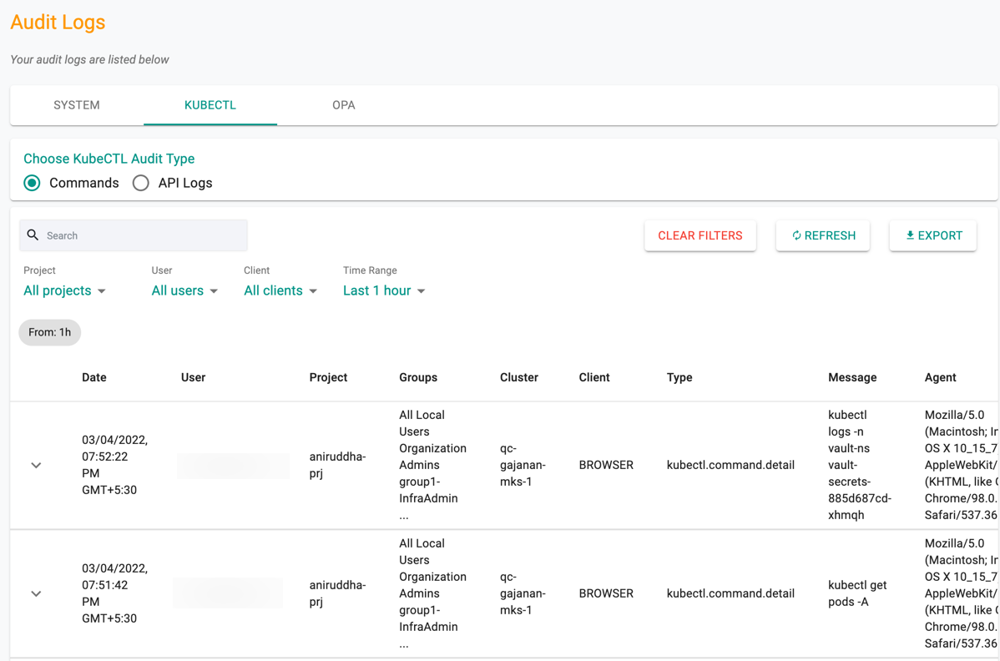

Audit logs provide a chronological record of all activities performed by authorized users in the organization. Administrators can view logs but cannot delete them.

- Navigate to **System → Audit Logs** to access logs.

---

## System Logs

System logs contain the entire history of actions in the organization. Logs are sorted by date/time (latest first).  

---

## Filters

Use canned filters to quickly retrieve required data:  

- Project  
- Action type  
- User  
- Client type (Browser, CLI, KUBECTL)  
- Time range  

Logs can also be expanded to view complete JSON payload.  

---

## KUBECTL Logs

Displays history of `kubectl` commands and API calls.  

Options:  
- **Search** logs  
- **Clear Filters** to reset view  
- **Refresh** for latest logs  
- **Export** logs in CSV  

---

## Export to SIEM

Audit logs (system, kubectl, OPA) can be streamed to a corporate SIEM for centralized monitoring.  See [SIEM Integration](../admins/siem/overview.md) for additional details.
