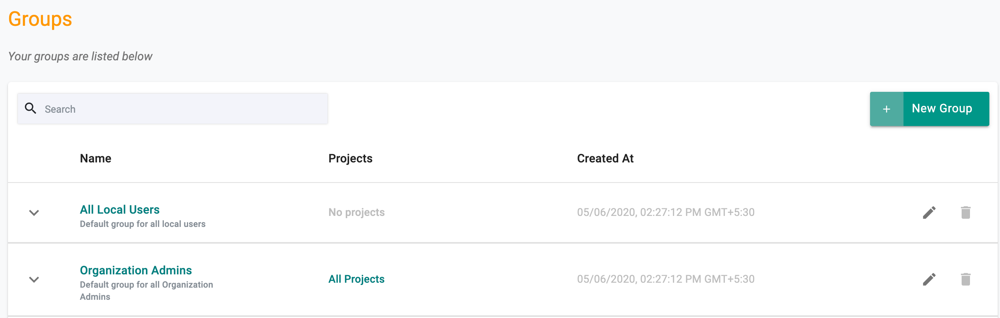
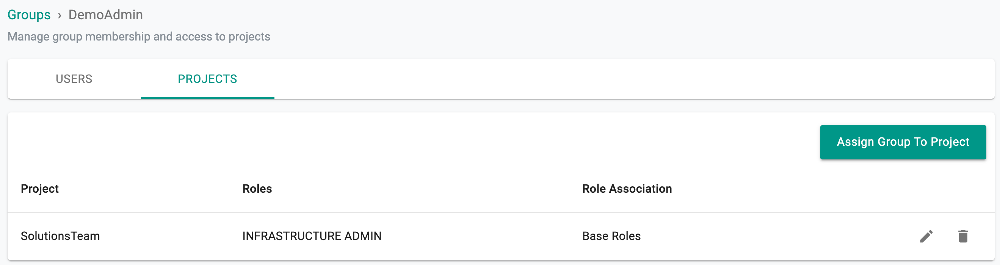
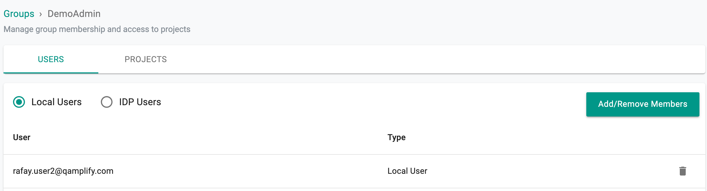

A group is a collection of users that have the same role or roles. Groups make it easier to manage access consistently instead of assigning roles individually.

---

## Default Groups

All Organizations come with two default groups:

- **All Local Users** – All users that are managed locally in the Org belong to this group. It has the least privileges in the platform.  
- **Organization Admins** – Users in this group have access to **all projects**. This is the most privileged role.  

---

## Viewing Your Groups

End users can view the groups they belong to from by navigating to **System -> Users -> Select the User → Groups** tab. Groups determine the projects, roles, and permissions available to a user.  

---

## Example: Group and Project Access

In the example below, the group is associated with a project and assigned a base role. Users automatically inherit the project access and permissions defined for the group.

!!! note
    Namespace selection is mandatory when a group is assigned the Namespace Admin or Namespace Read Only role.  

---

## Review Group Membership

Users can see the projects and roles associated with their groups.  

- **Users tab** – shows the list of users in the group  

  

- **Projects tab** – shows projects associated with the group and the assigned role  

---
