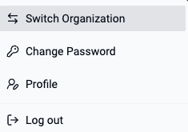

Customers can request for "Multiple Orgs" if they require complete isolation across their Orgs. For example, a separate Org for a business unit that is in the process of being divested. Org Admins can access all their Orgs and seamlessly switch between their Orgs as well via an integrated Org Switcher. 

- In the console, click on your email address.
- Click on "Change Organization".
- Select the Org you wish to switch to

!!! info
	The Org Switcher is only available for Local Users (not SSO users) assigned to multiple Orgs. 
