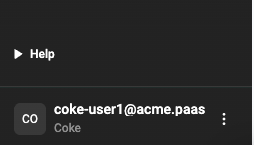

Every customer is provisioned with at least one Organization (i.e. Tenant). After a successful login, you can identify the name of your Org on the bottom left of the screen. In the image below, you can see that the name of the Org is **Coke**. 

!!! Important
	It is strongly recommended that customers have at least "two" Organization Admins. This will ensure that there is a second admin user that can perform privileged actions in case the first admin is unavailable or locked out.
