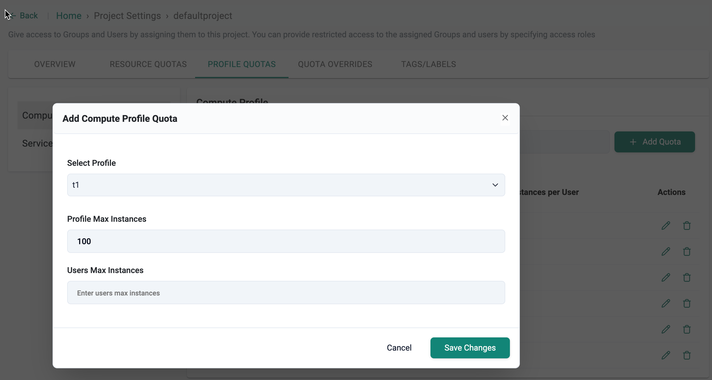
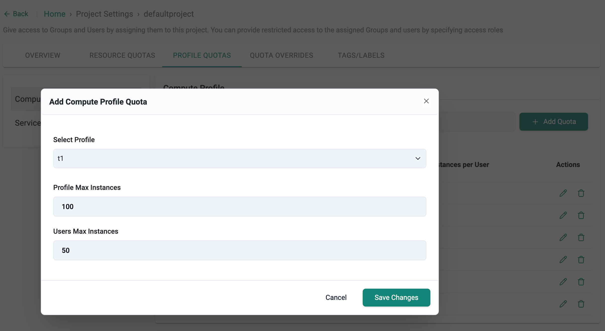
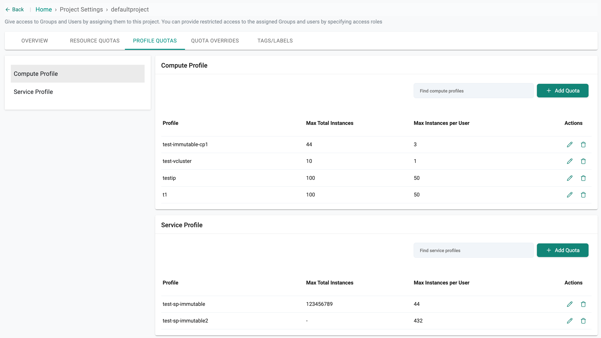

## Overview

Quotas control how many instances of a Compute or Service Profile can be launched at different scopes: Organization, Project, and User. This hierarchy ensures centralized governance while allowing granular control at the team and user level.

**Profile quotas** are applied at three levels:

- **Organization-Level Quota**: Sets a global cap on the number of profile instances across the entire organization.
- **Project-Level Quota**: Limits the number of instances that can be launched within a specific project.
- **User-Level Quota**: Further restricts the number of instances each user can launch under a project.

This multi-level quota system provides fine-grained control over resource usage and simplifies profile instance governance across teams and users.


### Quota Enforcement Hierarchy


| Level         | Scope                      | Configuration Location                    | Enforcement Order                   |
|---------------|-----------------------------|--------------------------------------------|--------------------------------------|
| Organization  | Across all projects/users   | Global Settings (YAML)                     | Highest (applies globally)        |
| Project       | Individual project          | Project → Profile Quotas                  |  Enforced after org-level          |
| User          | Per user within a project   | Project → Profile Quotas |  Enforced last (most granular)     |

> ⚠️ **Note:** Quotas are enforced top-down. Organization level limits apply globally and override project or user level settings. Project level quotas are enforced next and restrict resource usage within that project. Finally, user level quotas apply the most granular control, limiting individuals within the bounds set by project and organization levels.

---

## Organization-Level Quota

- Defines the global cap for how many instances of a profile can be launched across all projects and users in the organization.
- Ensures resource governance at the highest level—helpful for budgeting, capacity planning, and preventing runaway usage.

__Configure via Global Settings YAML__


```
profiles:
 - name: demo-quota-globalsettings
   quota:
      max-instances: 100 #This profile can have orglevel quota of 100
```

>**Note:**  If the org-level quota is set to 100, a maximum of 100 instances can be launched across all projects and users.

## Project-Level Quota

- Defines the maximum number of compute or service profile instances that can be launched within a specific project.
- Enables controlled, team-specific resource allocation without breaching organization-level limits.


__Configure via Project Settings UI__

- Click the **Settings** icon in the controller for the desired project and select the **Profile Quotas** tab.
- Click **+ Add Quota** to add a quota for either Compute Profile or Service Profile, depending on your requirement.
- In the Add Compute Profile Quota dialog:
    - **Select Profile**: Choose the compute profile.
    - **Profile Max Instances**: Enter the total number of instances allowed across the project (e.g., 100).
- Click **Save Changes** to apply the quota settings.



>**Note**:
> - If a project's profile quota is 100, no more than 100 instances of that profile can be launched in that project even if other projects have spare capacity.
> - Users can follow the same process to add quotas for service profiles as well.

##  User-Level Quota

- Limits the number of profile instances an individual user can launch within a project.
- Ensures fair usage among users, preventing one user from monopolizing the project quota.


__Configure via Project Settings UI__

- Click the **Settings** icon in the controller for the desired project and select the **Profile Quotas** tab.
- Click **+ Add Quota** to add a quota for either Compute Profile or Service Profile, depending on your requirement.
- In the Add Compute Profile Quota dialog:
    - **Select Profile**: Choose the compute profile.
    - **Profile Max Instances**: Enter the total number of instances allowed across the project (e.g., 100).
    - **Users Max Instances**: Specify the maximum number of instances a single user can launch within the project (for example, 50).
- Click **Save Changes** to apply the quota settings.



After quotas have been set at the project and user levels, this page provides a comprehensive view of the assigned compute and service profile quotas



---
