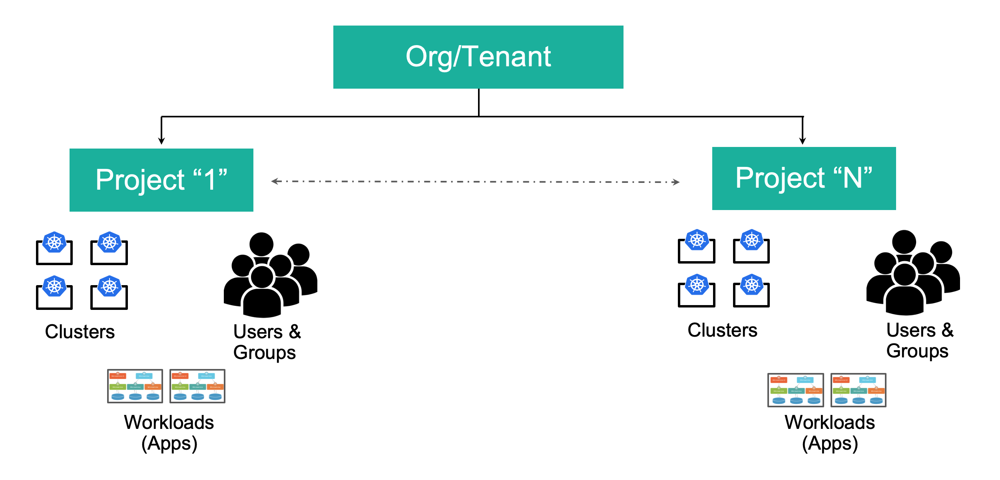
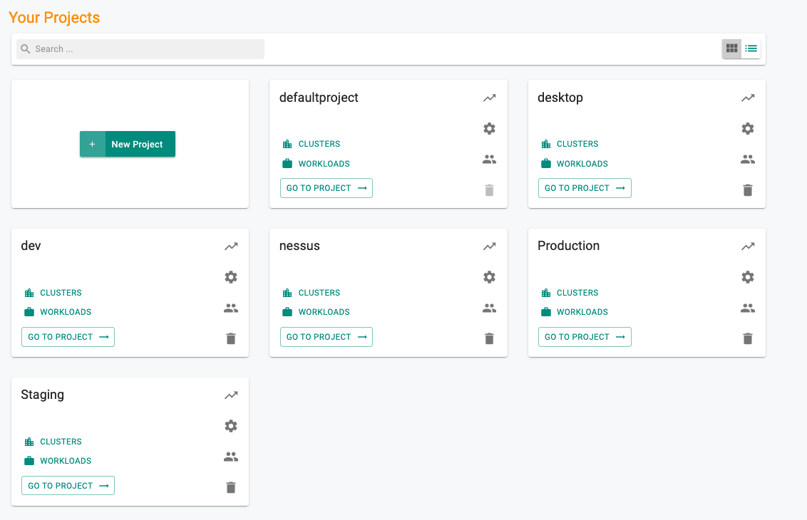
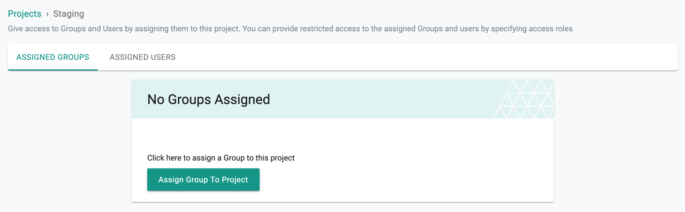
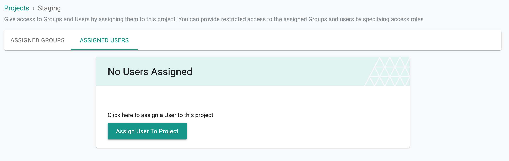

A Project allows you to organize and compartmentalize your infrastructure, user access and resources. All Organizations start life with a "Default Project". Organization Admins can create as many projects in the Organization as you like.

!!! Important
	Only Organization Admins are allowed to create Projects

---

## Overview

A Project is a logical "Isolation Boundary" that comprises

- One or more managed clusters
- Cloud Credentials
- PSPs
- Namespaces
- Users
- Groups
- Workloads and Workload Templates
- Blueprints and Addons
- Pipelines
- Integration Resources (Registries, Repositories, Secret Stores, Aggregation Endpoints etc)

---

## Default Project

All Organizations come bootstrapped with one project called "default project". Note that this project cannot be deleted from the Org.

---

## Create Project  

To create a Project

- Login into Web Console as an Organization Admin
- Click on "New Project"
- Provide a name and description

Once a Project is created, Administrators need to assign "Groups" and/or "Users" to it.

---

## View Project

Organization Admins can view the list of all projects in their Organization.

---

## Project Dashboard

A high level dashboard is available for every project and all authorized users of a project can view it.

From the dashboard, users can export the required Cluster(s) details.

### Export Cluster Data

To view the list of clusters and their details within a project, click on the respective **vertical ellipsis icon**.

- Use the **filter** to view the data for a specific environment, Blueprint, Blueprint Version, K8s Version, Custom Labels, Project Name, and Actions
- Click on the **Settings** icon to choose the required columns to display in the dashboard
- Click on the **Export** button to download the required cluster details based on the selections made

Similarly, users can export the Violations, and Audit Logs from the project dashboard

---

## Switching Projects

Users that are assigned to multiple projects can switch between projects easily. The user's current project scope is displayed on the top banner. In the example below, the user is currently in the "Default Project".

To switch to another project, click on the projects dropdown and select the Project you would like to switch to. In the example below, the user has the option to switch to one of the available projects.

---
## Update Project

Organization Admins can add/remove Groups or Users from a Project.

!!! Note
	It is generally operationally more practical to assign Groups to projects vs managing individual users in a project.

---

### Add/Remove Group

- Click on the "Users/Groups" icon navigate to the section where you can select and assign groups to Project

---

### Add/Remove Users

- Click on the "Users/Groups" icon navigate to the section where you can select and assign users to Project

---

## Delete Project  

Organization Admins are allowed to Delete a Project as long as there are no resources associated to it. You will be prompted to delete the existing resources before you are allowed to delete a project.

---
