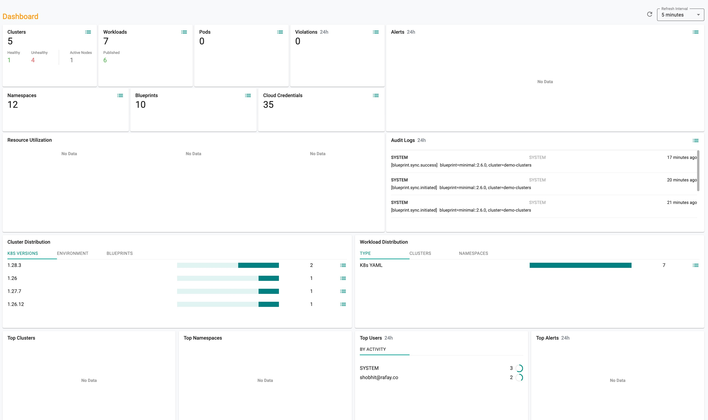
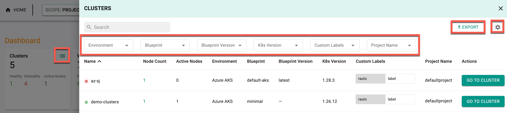
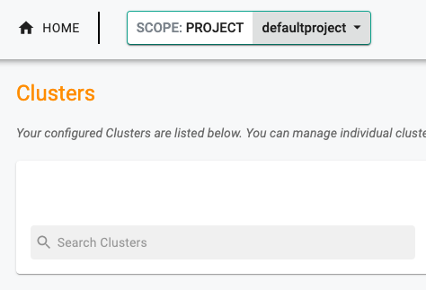
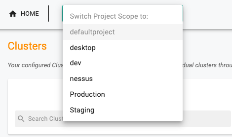

A Project allows you to organize and compartmentalize infrastructure, user access, and resources. All Organizations start with a "Default Project". Once assigned to a project, end users can view project details, monitor resources, and switch between projects.

---

## Project Dashboard

A high-level dashboard is available for every project. All authorized users of a project can view it.

From the dashboard, users can export cluster details, violations, and audit logs.

### Export Cluster Data

To view the list of clusters and their details within a project, click on the respective **vertical ellipsis icon**.

- Use the **filter** to view data for a specific Environment, Blueprint, Blueprint Version, K8s Version, Custom Labels, Project Name, and Actions  
- Click the **Settings** icon to choose the required columns to display in the dashboard  
- Click the **Export** button to download cluster details based on the selections made  

Similarly, users can export Violations and Audit Logs from the project dashboard.

---

## Switching Projects

Users that are assigned to multiple projects can switch between them easily. The current project scope is displayed on the top banner. In the example below, the user is in the "Default Project".

To switch to another project, click the **Projects dropdown** and select the project you would like to switch to. In the example below, the user has the option to switch to one of the available projects.

---
