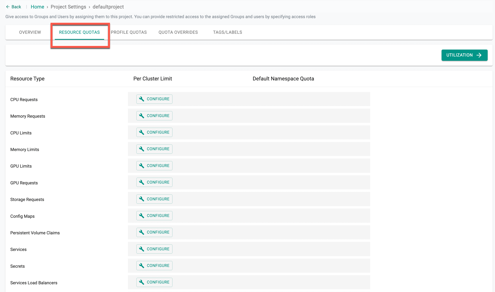

# Resource Quotas Overview

Admins can define **Project-level and Namespace-level quotas** that are enforced across all namespaces within a cluster. Kubernetes ResourceQuota objects are used to enforce these limits.  

Default quotas for namespaces within a cluster **must not exceed** the Project quota. Quotas are actively enforced at the cluster level.

---

## Resource Types and Limits

| Resource Type | Description |
| --------------- |------------------------------------- |
| CPU Limit  | Maximum CPU (millicores) allocated to the project/namespace |
| CPU Request  | Minimum CPU (millicores) guaranteed to the project/namespace |
| Memory Limit  | Maximum memory (bytes) allocated to the project/namespace |
| Memory Request  | Minimum memory (bytes) guaranteed to the project/namespace |
| GPU Limit  | Maximum GPUs allocated to the project/namespace |
| GPU Request  | Minimum GPUs guaranteed to the project/namespace |
| Storage Request | Minimum storage (GB) guaranteed to the project/namespace |
| Services Load Balancers  | Maximum number of load balancer services per project/namespace |
| Services Node Ports  | Maximum number of node port services per project/namespace |
| Pods  | Maximum number of pods in non-terminal state |
| Services  | Maximum number of services per project/namespace |
| ConfigMaps | Maximum number of ConfigMaps per project/namespace |
| Persistent Volume Claims | Maximum PVCs per project/namespace |
| Replication Controllers  | Maximum number per project/namespace |
| Secrets  | Maximum number per project/namespace |

> **Important:** Project Limit must be higher than Namespace Limit. Set reasonable limits for ConfigMaps and Secrets to avoid operational issues.



> **Note:** To configure `ephemeralStorageLimits` and `ephemeralStorageRequests`, use [RCTL](./quotas_cli.md), API, or Terraform.

---

## Quota Overrides

**Quota overrides** allow admins to set **cluster-specific limits** different from the default Project quota.  

- Only **Org Admins** can create or modify quota overrides.  
- Supported interfaces: **UI, CLI, API, Terraform**.  

### Cluster-Specific Quotas via YAML

Example YAML to override CPU requests for a specific cluster:

```yaml
apiVersion: system.k8smgmt.io/v3
kind: Project
metadata:
  name: example-project
patch:
- op: replace
  path: /spec/clusterResourceQuota/cpuRequests
  value: 200m


---
