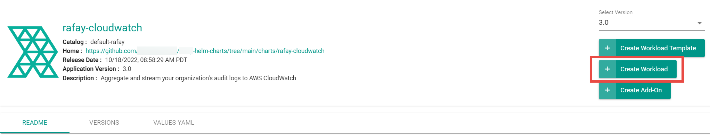
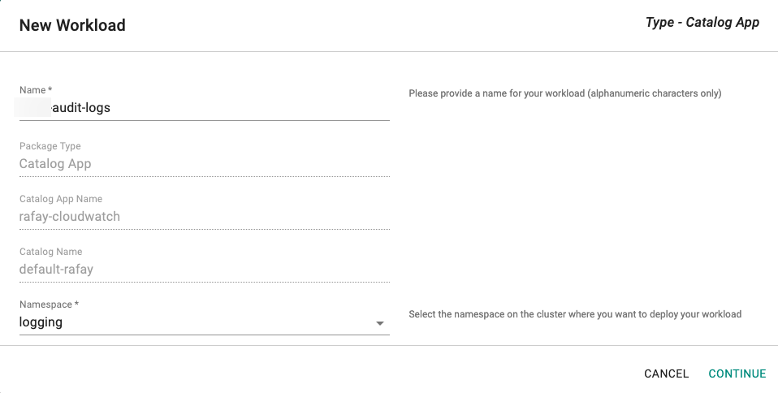
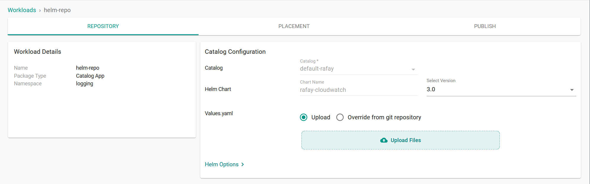

To aggregate and stream your Org's audit log data to AWS CloudWatch using the web console or the command line (RCTL).


=== "Web Console"

    Use the web console to configure your audit logs.

    ## Prerequisites

    - Customize the Values file (YAML). (See [below for creating a values.yaml file](#creating--values--yaml)).
    - Create a namespace in your cluster.


    ## Configure Workload

    **Note**: Only one audit log workload is needed for an organization.

    1. In the web console, select **Catalog**.
    2. For Filter by Catalog, select **default-rafay**.
      
    3. Select **rafay-cloudwatch**, then select **Create Workload**.
      
    4. Enter a name for the workload. Example: rafay-audit-logs.
    5. Select the namespace.
      
    6. Click **Continue**.
    7. On the Repository tab, for **Values yaml**:
        - Create a **values.yaml** file. (See [below for creating a values.yaml file](#creating--values--yaml))
        - Click **Upload Files**.
        - Select the **values.yaml** file.
        - Click **Open**.
          
    8. Click **Save and Go to Placement**.
    9. Update the following for Placements:
        - Select the appropriate **Drift Action**.
        - Select **Specified Clusters** for the Placement Policy.
        - Select the cluster from the cluster list.
        - Click **Save and go to Publish**.
    10. Click **Publish**.


=== "RCTL"

    Use the Command Line Interface (RCTL) to automate reproducible workflows without having to use the web console.

    ## Prerequisites

    - Download RCTL
    - Configure RCTL
    - Customize the Values file (YAML). (See [below for creating a values.yaml file](#creating--values--yaml)).
    - Create a namespace in your cluster.

    **Note**: Set the correct project using RCTL.


    ## Create a Repository

    Create a repository.yaml file using the following example. Replace **demo** with the name of the project you are adding this repository to. Optionally, you can change **helm-repo** to another name; if you change the name, use that name for **repository_ref** in the workload.yaml file (see [Create a Workload](#create--workload)).

    ```
    apiVersion: config.rafay.dev/v2
    kind: Repository
    metadata:
      name: helm-repo
      project: demo
    spec:
      repositoryType: HelmRepository
      endpoint: https://rafaysystems.github.io/rafay-helm-charts/
      credentialType: CredentialTypeNotSet
    ```

    Run the create repository command and include the repository.yaml file.

    ```
    ./rctl create repository -f repository.yaml
    ```


    <a id="create--workload"></a>
    ## Create a Workload

    Create a workload.yaml file using the following example. Replace the names used in **clusters**, **namespace**, and **project** to match your environment where you want to publish the workload.

    ```
    name: audit-logs
    namespace: ns-name
    type: Helm
    project: demo
    clusters: demo-cluster
    repository_ref: helm-repo
    repo_artifact_meta:
      helm:
        chartName: rafay-cloudwatch
    values: ./values.yaml
    ```

    Run the create workload command and include the workload.yaml file.

    ```
    ./rctl create workload workload.yaml
    ```


    ## Publish a Workload

    Run the publish workload command. Replace **workload-name** with the name used in the workload.yaml file. Example: audit-logs.
    ```
    ./rctl publish workload workload-name
    ```


---

<a id="creating--values--yaml"></a>
## Values YAML File

Create a values.yaml file that contains your CloudWatch information. Use the example below and change the following:

- `rafay_api_key` - Your organization's API key. In the web console, select **My Tools > Manage Keys**.
- `rafay_api_secret` - Your organization's API Secret key. In the web console, select **My Tools > Manage Keys**.
- `secret_name` - (Optional) Specify existing k8s secret name that contains your organization's API key & secret. (See [below is an example of k8s secret](#example--k8s--secret))


```yaml
# Default values for Rafay CloudWatch audit log integration.
# This is a YAML-formatted file.
# Declare variables to be passed into your templates.

config:
  ## Rafay console URL
  url: https://console.rafay.dev
  ## Rafay API Key
  rafay_api_key: API_KEY
  ## Rafay API Secret
  rafay_api_secret: API_SECRET
  ## Send Initial logs to CloudWatch based on following value. Default to "14d" days.
  ## This value can not be greater than 14 days.
  filter: 14d
  ## Time Interval to send logs to cloudwatch
  interval: 1m
  ## CloudWatch Logs Group
  logGroup: logs
  ## CloudWatch Log Stream for auditlogs
  auditLogStream: auditlogs-prod
  ## CloudWatch Log Stream for kubectl logs
  kubectlLogStream: kubectl-logs-prod
  ## CloudWatch Log Stream for OPA logs
  opaLogStream: opa-logs-prod
  ## Create above specified logs streams.
  createLogStreams: True
  ## AWS Region
  aws_region: us-west-1
  ## Existning Secret Name or leave it empty
  secret_name: ""
image:
  repository: registry.rafay-edge.net/rafay-logs/rafay-cloudwatch
  pullPolicy: Always
  # Overrides the image tag whose default is the chart appVersion.
  tag: 0.3.5

serviceAccount:
  # Specifies whether a service account should be created
  create: true
  # Annotations to add to the service account
  annotations: {}
  # The name of the service account to use.
  # If not set and create is true, a name is generated using the fullname template
  name:
rbac:
  create: true
replicaCount: 1
imagePullSecrets: []
nameOverride: ""
fullnameOverride: ""
deploymentAnnotations: {}
podAnnotations: {}
resources: {}
  # We usually recommend not to specify default resources and to leave this as a conscious
  # choice for the user. This also increases chances charts run on environments with little
  # resources, such as Minikube. If you do want to specify resources, uncomment the following
  # lines, adjust them as necessary, and remove the curly braces after 'resources:'.
  # limits:
  #   cpu: 100m
  #   memory: 128Mi
  # requests:
  #   cpu: 100m
  #   memory: 128Mi
nodeSelector: {}
tolerations: []
affinity: {}
```

---

<a id="example--k8s--secret"></a>
## Example of k8s secret with API Key and Secret.
```yaml
apiVersion: v1
kind: Secret
data:
  rafaykey: cmFmYXlrZXkK
  rafaysecret: cmFmYXlzZWNyZXQK
```
