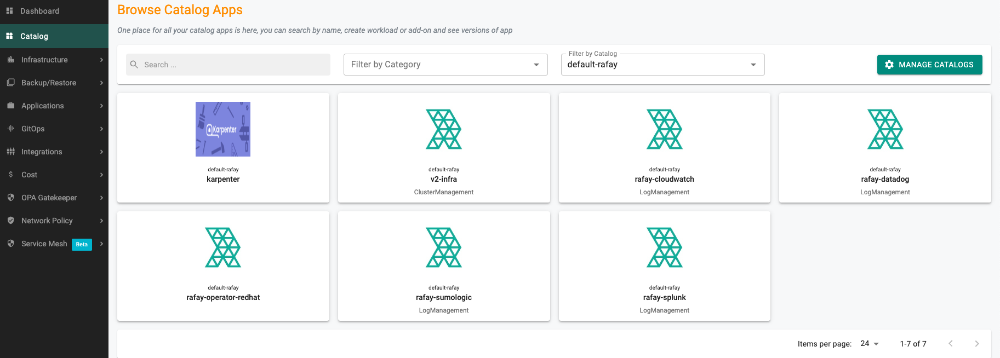
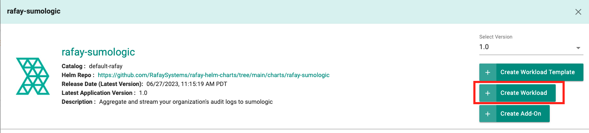
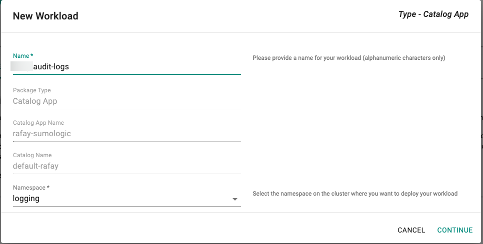
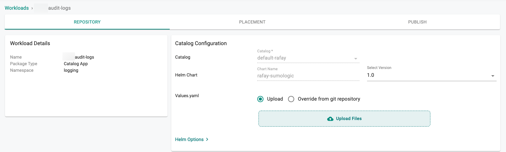

To scrape and send audit log data to a SumoLogic server using the web console.


=== "Web Console"

    Use the web console to configure your audit logs.

    ## Prerequisites

    - Customize the Values file (YAML). (See [below for creating a values.yaml file](#creating--values--yaml)).
    - Create a namespace in your cluster.


    ## Configure Workload

    **Note**: Only one audit log workload is needed for an organization.

    1. In the web console, select **Catalog**.
    2. For Filter by Catalog, select **default**.
      
    3. Select **rafay-sumologic**, then select **Create Workload**.
      
    4. Enter a name for the workload. Example: rafay-audit-logs.
    5. Select the namespace.
      
    6. Click **Continue**.
    7. On the Repository tab, for **Values yaml**:
        - Create a **values.yaml** file. (See [below for creating a values.yaml file](#creating--values--yaml))
        - Click **Upload Files**.
        - Select the **values.yaml** file.
        - Click **Open**.
          
    8. Click **Save and Go to Placement**.
    9. Update the following for Placements:
        - Select the appropriate **Drift Action**.
        - Select **Specified Clusters** for the Placement Policy.
        - Select the cluster from the cluster list.
        - Click **Save and go to Publish**.
    10. Click **Publish**.

---

<a id="creating--values--yaml"></a>
## Values YAML File

Create a values.yaml file that contains your SumoLogic information. Use the example below and change the following:

- `rafay_api_key` - Your organization's API key. In the web console, select **My Tools > Manage Keys**.
- `rafay_api_secret` - Your organization's API Secret key. In the web console, select **My Tools > Manage Keys**.
- `endpoint` - The SumoLogic endpoint. You can use any existing collector endpoint or create seperate for rafay audit logs. Example: `endpoint.collection.sumologic.com`. (See [below for creating a SumoLogic Collector](#creating--sumologic--collector))
- `sumologic_token` - The SumoLogic UniqueHTTPCollectorCode value.
- `secret_name` - (Optional) Specify existing k8s secret name that contains your organization's API key, secret and SumoLogic UniqueHTTPCollectorCode token. (See [below is an example of k8s secret](#example--k8s--secret))


```yaml
# Default values for rafay sumologic audit log integration.
# This is a YAML-formatted file.
# Declare variables to be passed into your templates.

config:
  ## Rafay console URL
  url: https://console.rafay.dev
  ## Rafay API Key
  rafay_api_key: RAFAY_API_KEY
  ## Rafay API Secret
  rafay_api_secret: RAFAY_API_SECRET
  ## Send Initial logs to sumologic adog based on following value. Defaults to "14d" days
  filter: 14d
  ## Time Interval to send logs to sumologic
  interval: 1m
  ## sumologic endpoint (Without "/" & https)
  endpoint: endpoint.collection.sumologic.com
  ## sumologic UniqueHTTPCollectorCode
  sumologic_token: SUMOLOGIC_TOKEN
  ## Set to source name of ddddthe collector
  ## Existing Secret Name or leave it empty
  secret_name: ""
image:
  repository: registry.rafay-edge.net/rafay-logs/rafay-sumologic
  pullPolicy: Always
  # Overrides the image tag whose default is the chart appVersion.
  tag: 1.0.2
serviceAccount:
  # Specifies whether a service account should be created
  create: true
  # Annotations to add to the service account
  annotations: {}
  # The name of the service account to use.
  # If not set and create is true, a name is generated using the fullname template
  name:
rbac:
  create: true
replicaCount: 1
imagePullSecrets: []
nameOverride: ""
fullnameOverride: ""
deploymentAnnotations: {}
podAnnotations: {}
resources: {}
  # We usually recommend not to specify default resources and to leave this as a conscious
  # choice for the user. This also increases chances charts run on environments with little
  # resources, such as Minikube. If you do want to specify resources, uncomment the following
  # lines, adjust them as necessary, and remove the curly braces after 'resources:'.
  # limits:
  #   cpu: 100m
  #   memory: 128Mi
  # requests:
  #   cpu: 100m
  #   memory: 128Mi
nodeSelector: {}
tolerations: []
affinity: {}
```


---

<a id="creating--sumologic--collector"></a>
## Creating a SumoLogic Collector

1. In the SumoLogic console, select **Manage Data > Collection**.
2. Click **Add Collector**.
3. Select **Hosted Collector**.
4. Enter a name for the collector. Example: **audit-logs-sumologic**.
5. Click **Save**.
6. Click **Show URL** and copy `endpoint` and `sumologic_token` in the **values.yaml** file. Example: `https://ENDPOINT/receiver/v1/http/SUMOLOGIC_TOKEN`

---

<a id="example--k8s--secret"></a>
## Example of k8s secret with API Key, Secret and Splink token.
```yaml
apiVersion: v1
kind: Secret
data:
  rafaykey: cmFmYXlrZXkK
  rafaysecret: cmFmYXlzZWNyZXQK
  token: dG9rZW4K
```
