Follow the steps below to integrate your system with Authentik for Single Sign On (SSO).

!!! important
	Only users with **Organization Admin** privileges can configure SSO.

---

## Step 1: Create Group

- Login as an Organization Admin
- Go to **System** → **Groups**
- Click on **New Group**
- Provide a name and optionally, a description

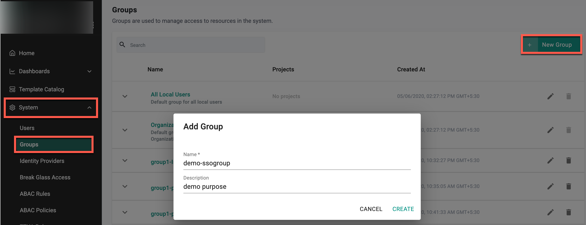

- Click **Create**

---

## Step 2: Assign Group to Project

- After creating the group, go to the **Projects** tab and click **Assign Group to Project**
- Select a project from the drop-down, then choose a base role or a custom role
- Click **Save & Exit**

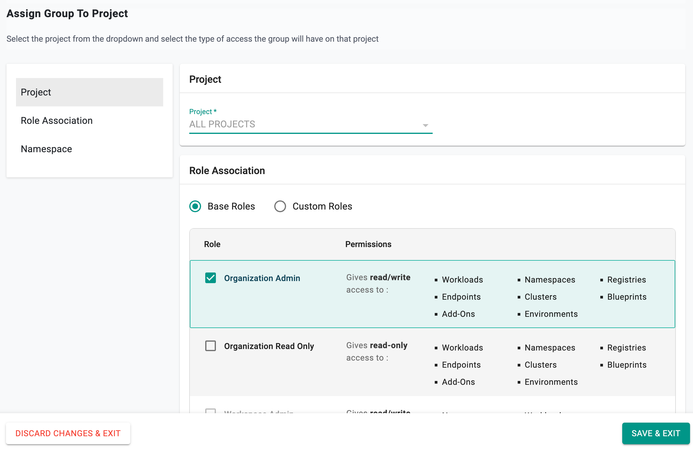

---

## Step 3: Create Group in Authentik

- Log in to **Authentik** as an **Administrator**
- Select **Groups** under **Directory**, and click **Create**
- Enter the same group name used in Step 1 (e.g., `demo-ssogroup`), and click **Create**

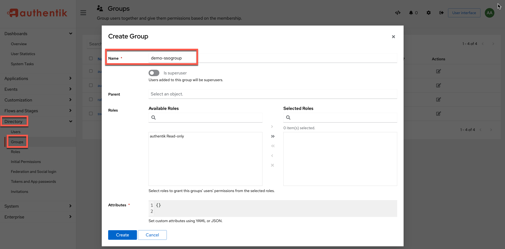

---

## Step 4: Create IdP

- Go to **System** → **Identity Providers**
- Click on **New Identity Provider**
- Provide a name, select **Custom** from the IdP Type drop down
- Enter the **domain** for which you would like to enable SSO
- Provide an admin email who can access Authentik

!!! Important
	Within an org, the domain of an IdP cannot be used for another IdP.

- Optionally, toggle **Encryption** if you wish to send/receive encrypted SAML assertions  
- Provide the **Group** attribute ```http://schemas.xmlsoap.org/claims/Group```
- Optionally, toggle **Include Authentication Context**
- Click **Save & Continue**

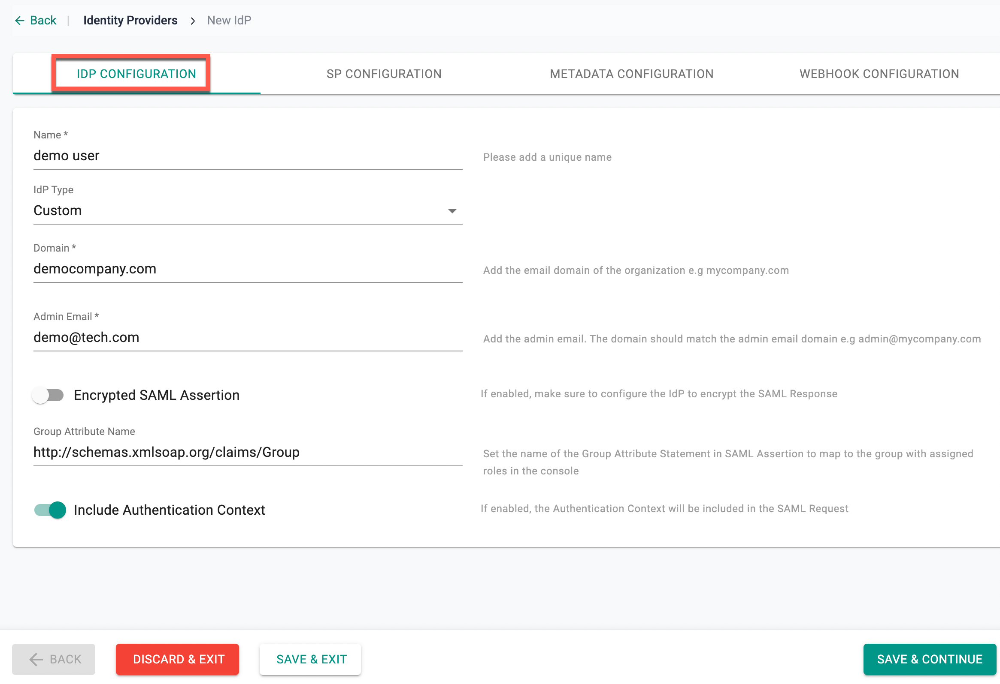

!!! Important
	Encrypting SAML assertions is optional because HTTPS already provides transport security. Encrypted assertions add another layer of protection ensuring only the SP can decrypt the assertion.

---

## Step 5: View SP Details

The IdP configuration wizard will display the following details to copy/paste into Authentik:

- Assertion Consumer Service (ACS) URL  
- SP Entity ID
- Name ID Format

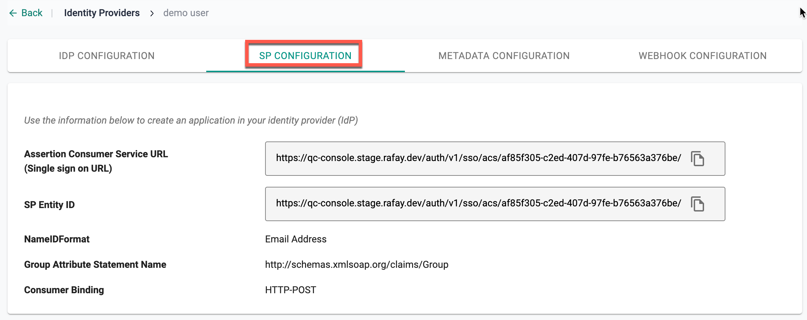

---

## Step 6: Create User in Authentik

- In **Authentik**, select **Users** under **Directory**, and click **Create**
- Provide a username, name, and email ID using the same domain name defined in Step 4
- Click **Create**

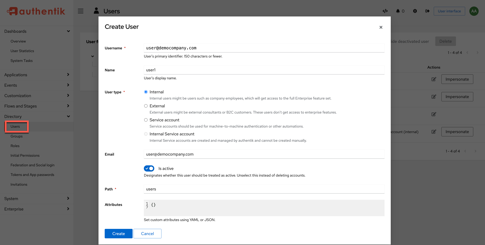

---

## Step 7: Add User to the Group

- Once the user is created, click on the user and select the **Groups** tab
- Click **Add to Existing Group**, and then click the `+` icon

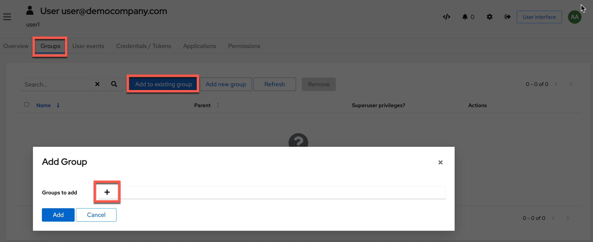

- Select the group from the list (e.g., `demo-ssogroup`), and click **Add**


- If the user already exists, select the username from available options. To add a new user manually, enter the `username`, `name`, and `email address` using the configured domain.
- Click **Create**

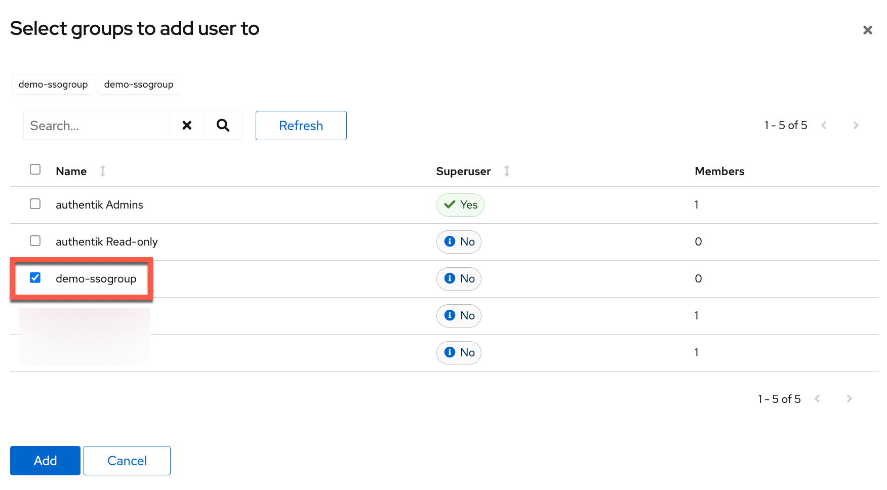

- Navigate to the **Groups** page to verify that the user has been added.

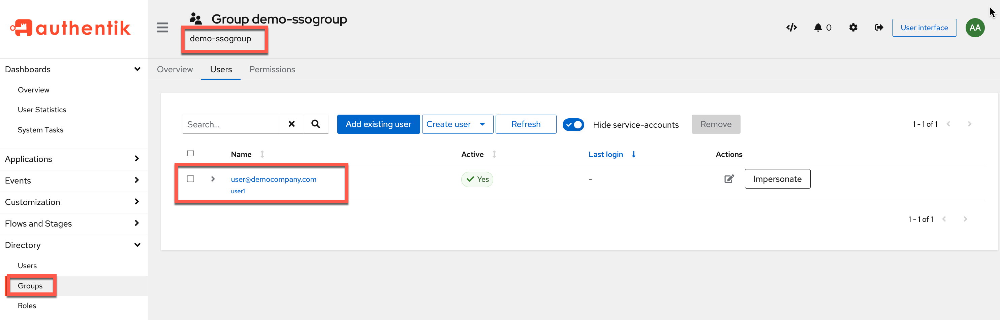

---

## Step 8: Create Application

- In **Authentik**, go to **Applications** → **Create with Provider**  

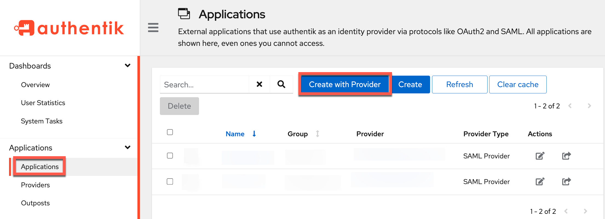

- Provide a name and enter the same group name used earlier (e.g., `demo-ssogroup`)
- Click **Next**

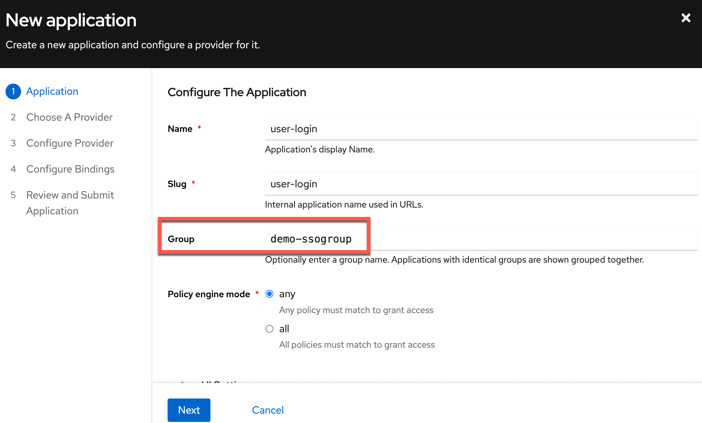

- Choose provider type **SAML Provider**, and click **Next**

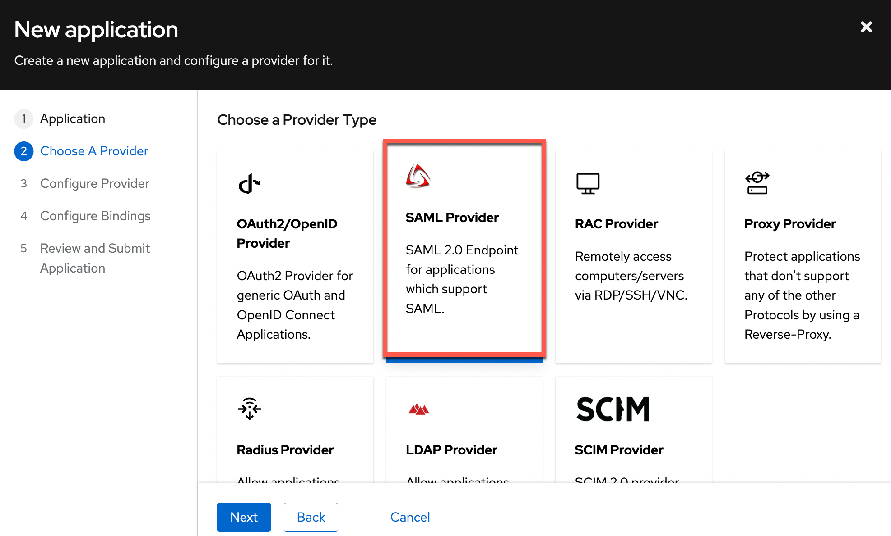

The **Configure SAML Provider** page appears.

- Select the authorization flow (either *implicit* or *explicit*)
- Copy and paste the ACS URL (from Step 5) into the **ACS URL** and **Issuer** fields  
- Select `Post` for **Service Provider Binding**

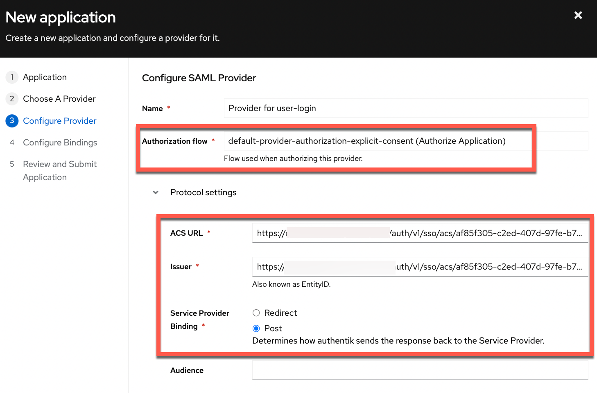

- Under **Advanced Flow Settings**, select `default-authentication-flow`  

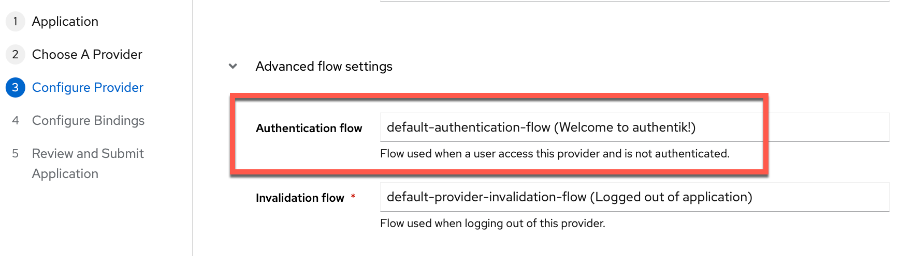

- Under **Advanced Protocol Settings**, configure:  
  - Signing Certificate: `authentik Self-signed Certificate`  
  - NameID Property Mapping: `authentik default SAML Mapping: Email`  
- Provide other details as required, and click **Next**

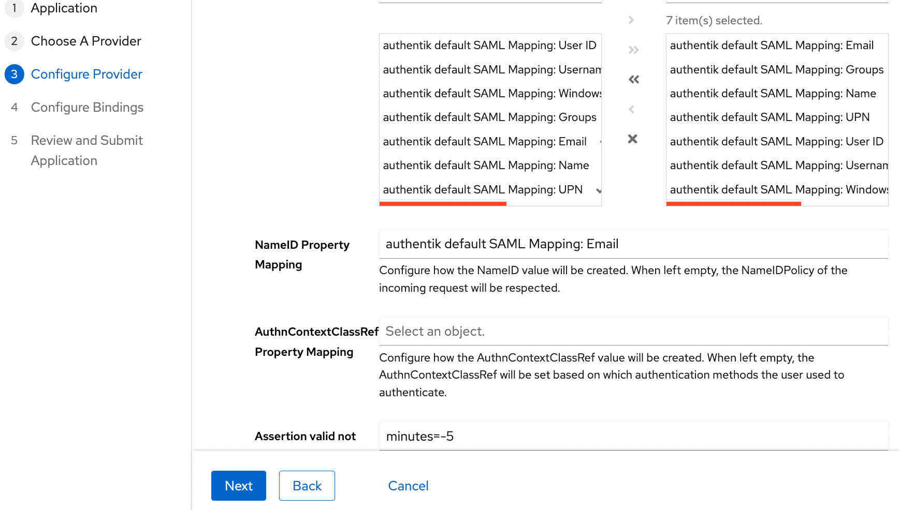

- To bind policies/groups/users, click **Bind existing policy/group/user**
- Select the **Group** tab and choose the group (e.g., `demo-ssogroup`)
- Click **Save Binding** → **Next**

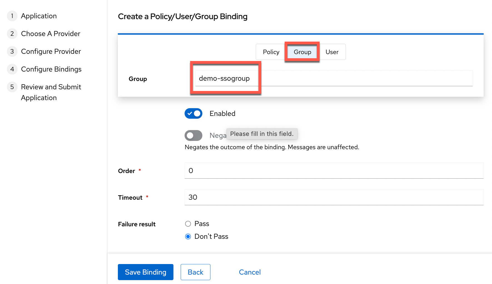

- Once all details are entered, click **Submit**

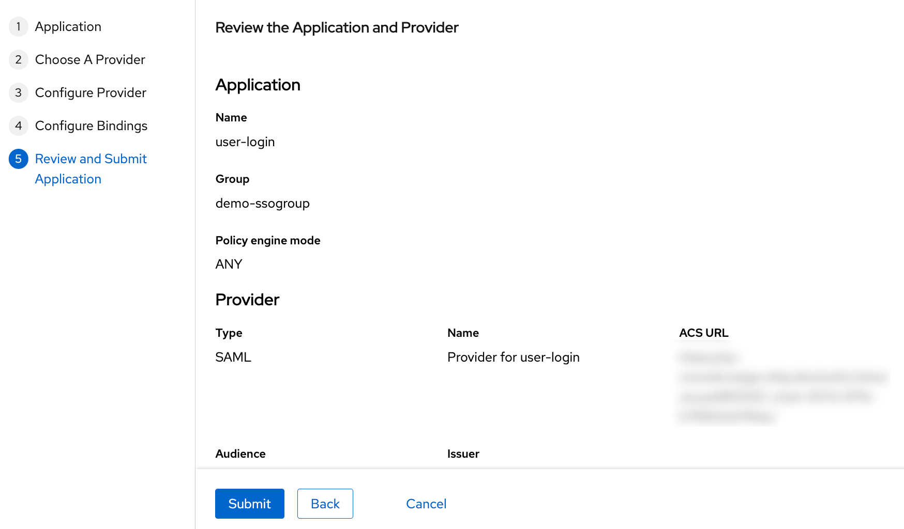

---

## Step 9: Specify IdP Metadata

- In **Authentik**, open the **Providers** page, select the created provider  
- Click **Copy download URL**

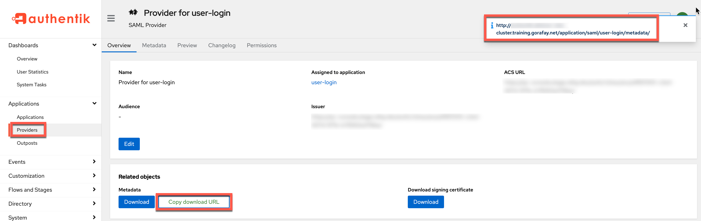

- Paste the Identity Provider Metadata URL into the IdP configuration wizard
- Click **Save & Exit**

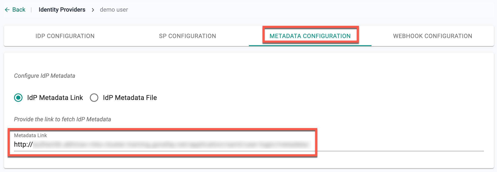

- After this, IdP details can be viewed, edited, or updated in the Identity Provider page.

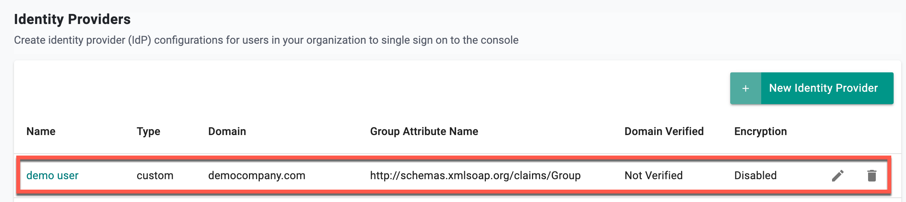

---

## Step 10: Impersonate the User

Use the **Impersonate** option in Authentik to verify the user's access and assigned applications.

- On the Authentik user details page, click **Impersonate**

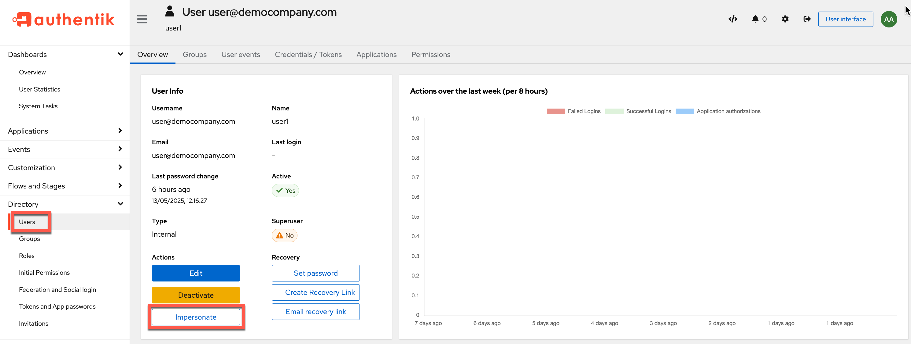

- The **My Applications** page appears, showing the applications assigned to the user's group

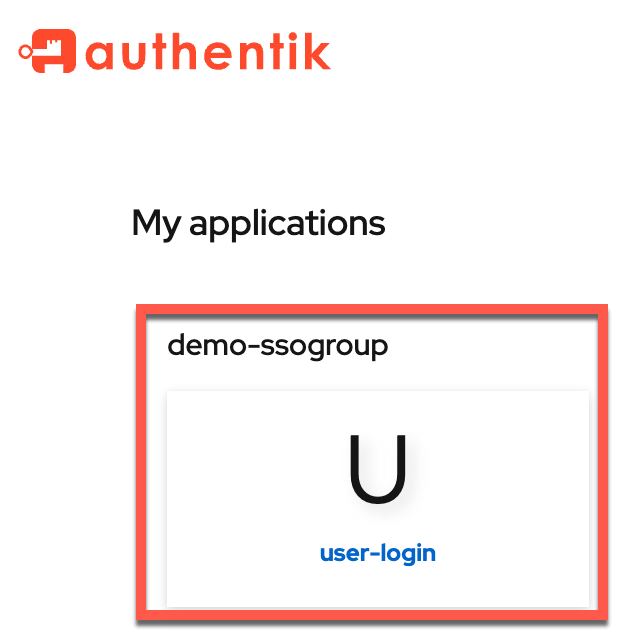

- Click on the application card (e.g., **user-login**) to initiate SSO and confirm successful access.

---
