Follow the steps below to integrate access to the web console with [AWS SSO for Single Sign On (SSO)](https://aws.amazon.com/single-sign-on/).

!!! Important
	Only users with "Organization Admin" privileges can configure SSO in the web console.

----

## Step 1: Create IdP

- Login into the web console as an Organization Admin  
- Click on **System → Identity Providers**  
- Click on **New Identity Provider**  
- Provide a name, select **Custom** from the "IdP Type" drop down  
- Enter the **Domain** for which you would like to enable SSO  

!!! Important
	Within an org, the domain of an IdP cannot be used for another IdP. A domain existing in an org can be used in multiple orgs (for one IdP in each org)

- Keep the toggle **Encrypted SAML Assertion** disabled (AWS SSO does not support encrypted SAML assertion)  
- Provide a name for the **Group Attribute Name**  
- Optionally, toggle **Include Authentication Context** if you wish to send/receive auth context information in assertion  
- Click on **Save & Continue**  

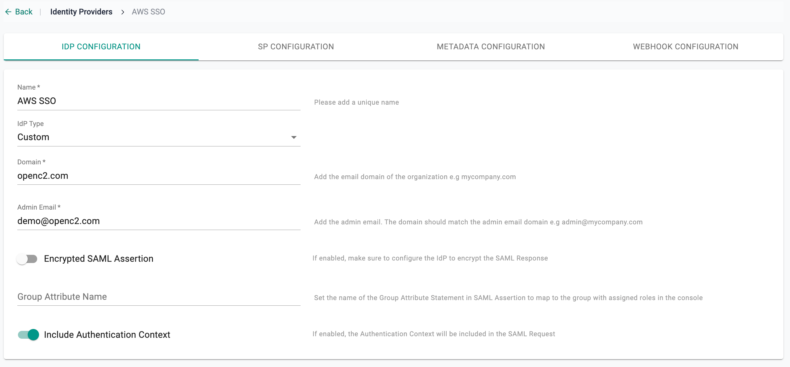

---

## Step 2: View SP Details

The IdP configuration wizard will display critical information that you need to copy/paste into your AWS SSO Console:

- Assertion Consumer Service (ACS) URL  
- SP Entity ID  
- Name ID Format  
- Group Attribute Name  

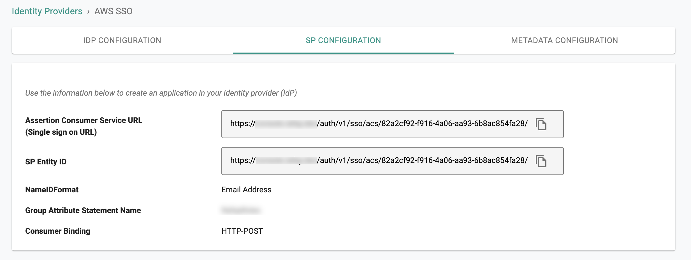

---

## Step 3: Create App in AWS SSO

- Login into your AWS SSO Admin Portal as an Administrator  
- Select **Applications → Add a new application**  
- Select **Add a custom SAML 2.0 application** from the AWS SSO Application Catalog  

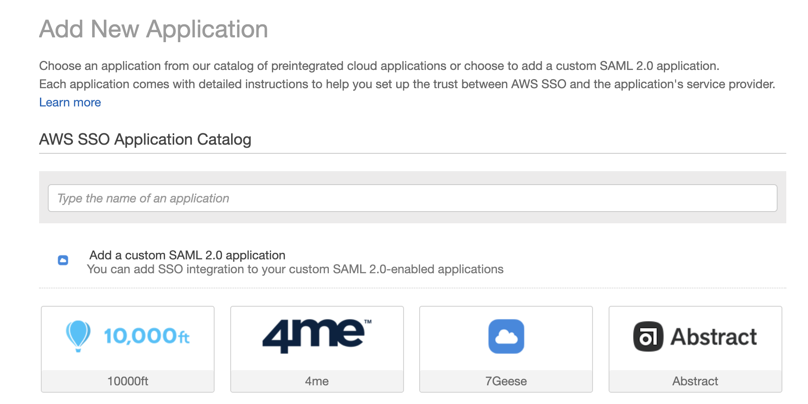

---

## Step 4: Configure SAML Settings

On the **Configure Custom SAML 2.0 application** page, go to the **Details** section:

- Provide a display name for the web console  
- Optionally add a description  

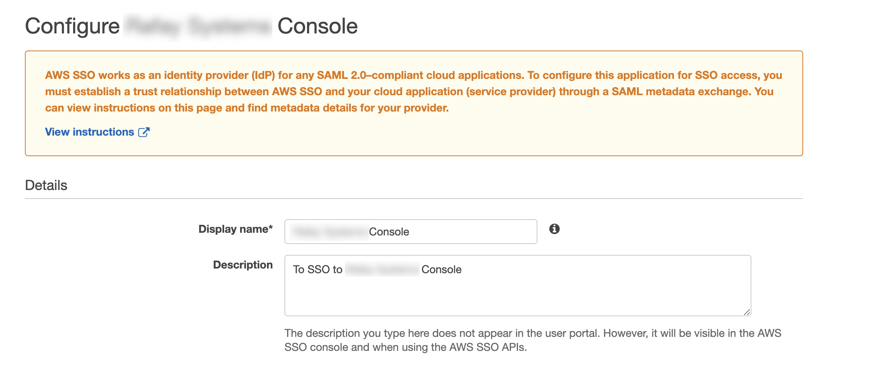

In the **Application metadata** section:

- Select the option *If you don't have a metadata file, you can manually type your metadata values*  
- Copy/paste the ACS URL from Step 2 into the **Application ACS URL**  
- Copy/paste the Entity ID from Step 2 to **Application SAML audience**  
- Save changes  

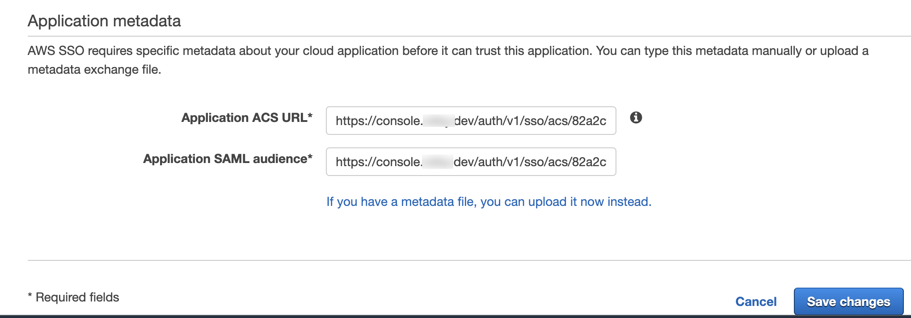

Go to the **Attribute mappings** tab:

- For the **Subject** attribute, enter `${user:email}` and select the format as `emailAddress`  
- Add a new attribute mapping  
- Enter the Group Attribute Statement Name from Step 2 for the group attribute  
- For the group attribute, enter the user attribute that you want to send to the application (e.g., static text `OrgAdmin`, `${user:groups}`, or another custom attribute)  
- Save changes  

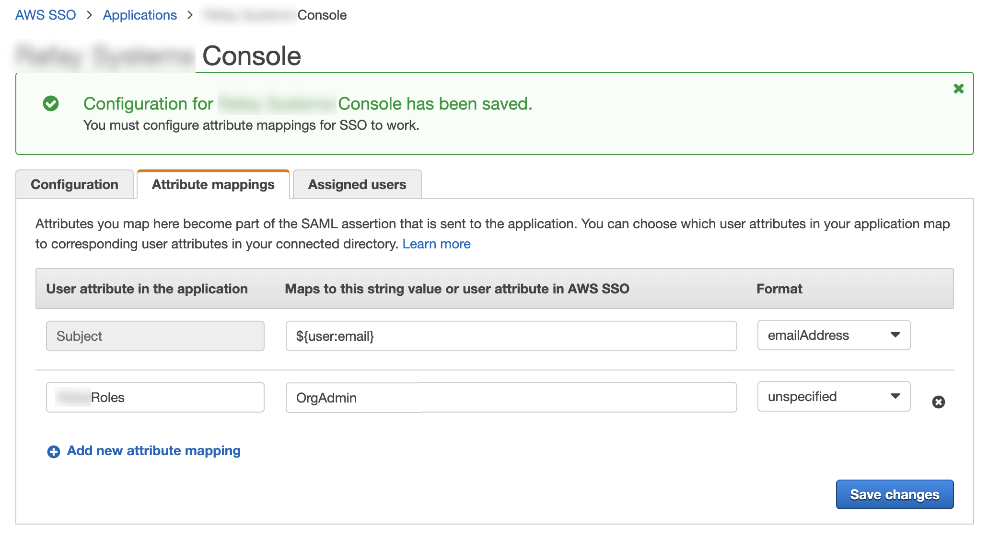

Go to the **Assign users** tab:

- Click on **Assigned Users**  
- On the **Users** tab, select the users to allow access to the application  
- On the **Groups** tab, select the groups that should have access  

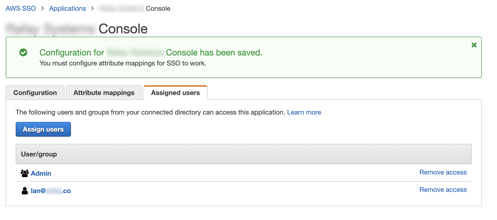  
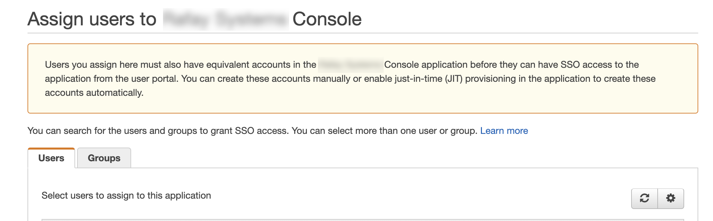

---

## Step 5: Configure Groups

- Identical named groups with the **group attribute** names need to be created in the console. Ensure that these groups are mapped to the appropriate Projects with the correct privileges. Example: the group `OrgAdmin` configured as an **Organization Admin** with access to all Projects.  

- User lifecycle management can be completely offloaded to AWS SSO. Example: no users are managed in the `OrgAdmin` group because they are all managed in the attached AWS tenant.  

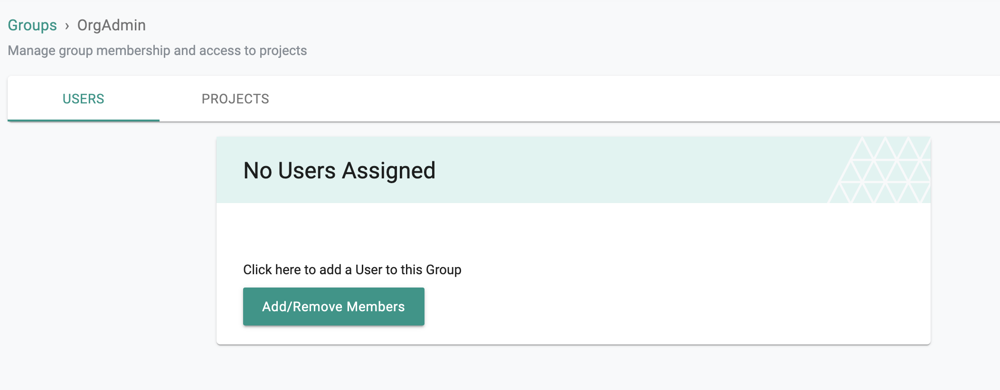

- If no group attribute is sent from AWS SSO, users will see the **No Access** message when they try to sign in. As an Organization Admin, you can manually add the console’s local group to AWS SSO IdP users to manage access.  

---

## Step 6: Specify IdP Metadata

- Go back to **AWS SSO Admin Portal → Applications → Application configuration page**  
- Select the **Configuration** tab  
- Download the AWS SSO SAML metadata file or copy the Metadata URL  

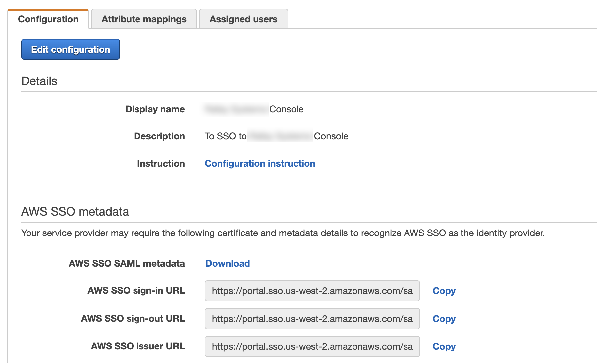

- Return to the console’s IdP configuration wizard  
- Go to the **Metadata Configuration** tab  
- Select **IdP Metadata File**  
- Upload the downloaded AWS SSO IdP Metadata file  
- Complete IdP Registration  

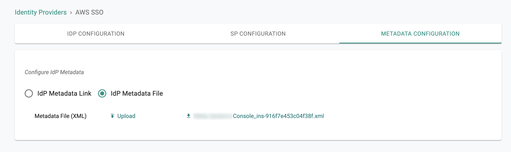

- Once complete, you can view details about the IdP configuration on the Identity Provider page and edit/update if required.  

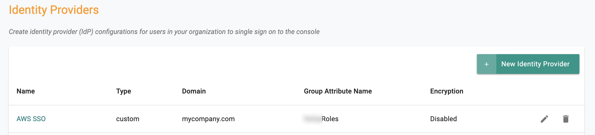

---
