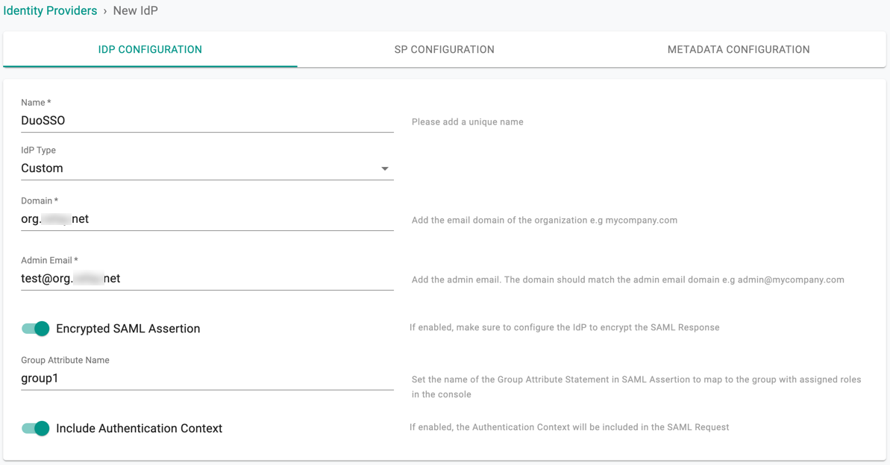
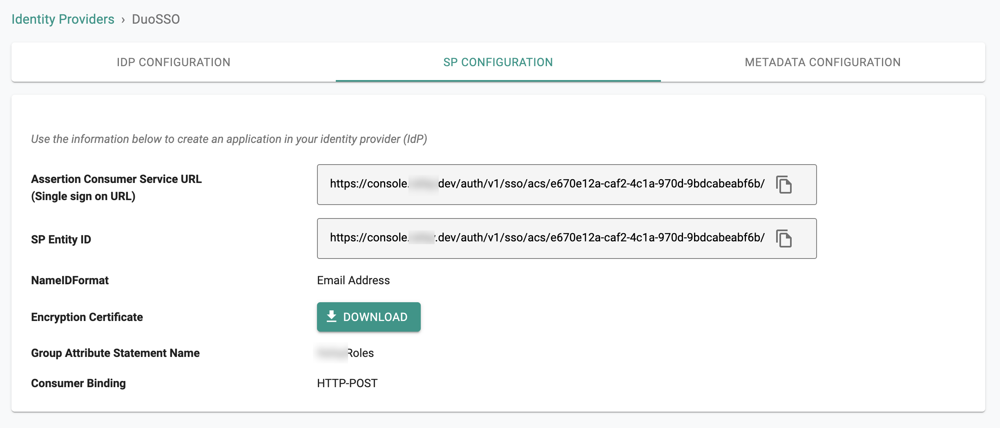
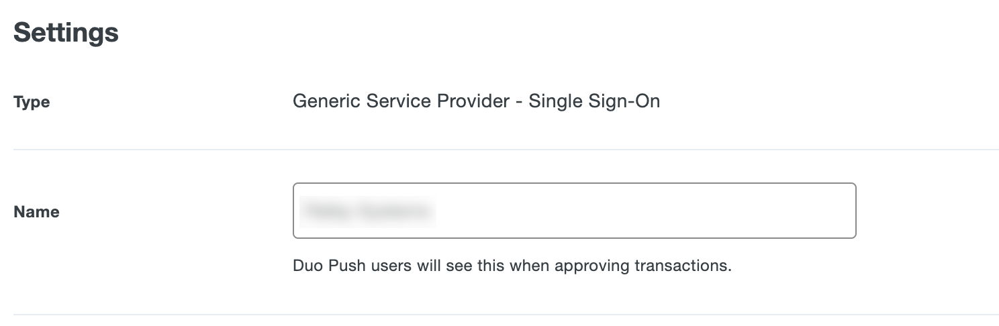
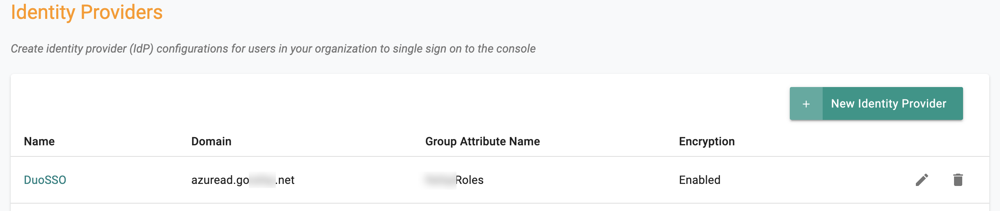

Follow the steps documented below to integrate access to your Web Console with [Duo Single Sign On (SSO)](https://duo.com/product/single-sign-on-sso).

!!! Important
	Only users with **Organization Admin** privileges can configure SSO in the Web Console.

---

## Step 1: Create IdP

- Login into the Web Console as an Organization Admin.  
- Click on **System → Identity Providers**.  
- Click on **New Identity Provider**.  
- Provide a name and select **Custom** from the **IdP Type** dropdown.  
- Enter the **Domain** for which you would like to enable SSO.  

!!! Important
	Within an org, the domain of an IdP cannot be used for another IdP. A domain existing in an org can be used in multiple orgs (for one IdP in each org).

- Optionally, toggle **Encryption** if you wish to send/receive encrypted SAML assertions.  
- Provide a name for the **Group Attribute Name**.  
- Optionally, toggle **Include Authentication Context** if you wish to send/receive authentication context information in assertion.  
- Click on **Save & Continue**.  

!!! Important
	Encrypting SAML assertions is optional because privacy is already provided at the transport layer using HTTPS. Encrypted assertions provide an additional layer of security ensuring that only the SP (Org) can decrypt the SAML assertion.

---

## Step 2: View SP Details

The IdP configuration wizard will display the information required for your Duo SSO Console. Provide the following to your Duo administrator:

- Assertion Consumer Service (ACS) URL  
- SP Entity ID  
- Name ID Format  
- Group Attribute Name  

---

## Step 3: Create App in Duo

1. Login into your Duo Admin Portal as an Administrator.  
2. Select **Applications → Protect an Application**.  
3. Search for **Generic Service Provider**.  
4. Select **Protect** for the Generic Service Provider with Protection Type *2FA with SSO hosted by Duo* to create a new application.  

---

## Step 4: Configure SAML Settings for App in Duo

1. In the Generic Service Provider - Single Sign-On page, go to **Service Provider**:  
     - Provide an **App Name** for the Web Console.  
     - Copy/Paste the Entity ID from Step 2.  
     - Copy/Paste the ACS URL from Step 2 into the **Assertion Consumer Service** and **Service Provider Login URL**.  

2. Go to **SAML Response** section:  
    - Keep the **NameID format** as `emailAddress`.  
    - Keep the **NameID attribute** as `EmailAddress`.  

3. Configure access policies:  
    - Go to **Policy** to define user access.  
    - Go to **Settings -> Name** and enter the app display name.  
    - Go to **Settings -> Permitted Groups** to assign groups or allow all users.  

  

---

## Step 5: Configure Group Attribute to Send

The **Group** configuration step ensures that Duo sends user group/role membership as part of SSO. This is used to transparently map users to the correct role.

- **Option 1**: Users and groups synced from Active Directory (AD). See Step 5.1.  
- **Option 2**: Authentication source from a SAML IdP. See Step 5.2.  

---

### Step 5.1: Map Duo Group Synced from AD to Role Attributes

1. Go to **SAML Response -> Role attributes**.  
2. Provide the same **Group Attribute Name** configured in Step 1.  
3. Map the **Service Provider's Role** to the corresponding Duo Groups.  
4. Configure multiple roles/group mappings as required.  
5. Save the application settings in Duo Admin Portal.  

---

### Step 5.2: Map IdP Attribute to Group Attribute to Send

1. Go to **SAML Response -> Map attributes**.  
2. Provide the **IdP Attribute** that contains the group/role information.  
3. Enter the name of the SAML Response Attribute configured in Step 1.  
4. Save the application settings.  

Example: Using the IdP attribute name `UserRoles` and sending it as `Group Attribute` in the SAML Response.  

---

## Step 6: Specify IdP Metadata

1. In Duo Admin Portal, go to **Applications → App configuration**.  
2. Copy the **Metadata URL** from the **Metadata -> Metadata URL** section.  

3. Navigate back to the Web Console’s IdP configuration wizard.  
4. Paste the Metadata URL from Duo into the Identity Provider Metadata URL.  
5. Complete IdP Registration.  

6. Once complete, you can view and edit IdP configuration details in the Web Console.  

---
