Follow the steps documented below to integrate access to your Web Console with [Duo for Single Sign On (SSO)](https://duo.com/product/single-sign-on-sso).

!!! Important
	Only users with "Organization Admin" privileges can configure SSO in the Web Console.

----

## Step 1: Create IdP

- Login into the Web Console as an Organization Admin
- Click on System -> Identity Providers
- Click on "New Identity Provider"
- Provide a name, select "Custom" from the "IdP Type" drop down
- Enter the "Domain" for which you would like to enable SSO

!!! Important
	Within an org, the domain of an IdP cannot be used for another IdP. A domain existing in an org can be used in multiple orgs (for one IdP in each org)

- Optionally, toggle "Encryption" if you wish to send/receive encrypted SAML assertions from your IdP
- Provide a name for the "Group Attribute Name"
- Optionally, toggle "Include Authentication Context" if you wish to send/receive auth context information in assertion
- Click on Save & Continue

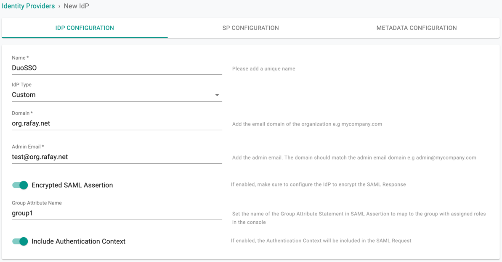

!!! Important
	Encrypting SAML assertions is optional because privacy is already provided at the transport layer using HTTPS. Encrypted assertions provide an additional layer of security on top ensuring that only the SP (Org) can decrypt the SAML assertion.

---
## Step 2: View SP Details

The IdP configuration wizard will display critical information that you need to copy/paste into your Duo SSO Console. Provide the following information to your Duo administrator.

- Assertion Consumer Service (ACS) URL  
- SP Entity ID
- Name ID Format
- Group Attribute Name

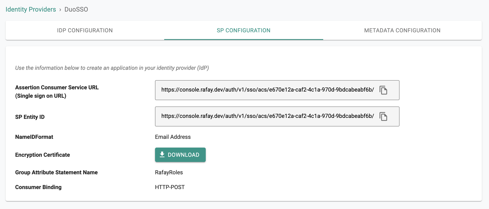

---

## Step 3: Create App in Duo

- Login into your Duo Admin Portal as an Administrator
- Select Applications > Protect an Application
- Search for Generic Service Provider
- Select "Protect" for the Generic Service Provider with Protection Type "2FA with SSO hosted by Duo" to create a new application

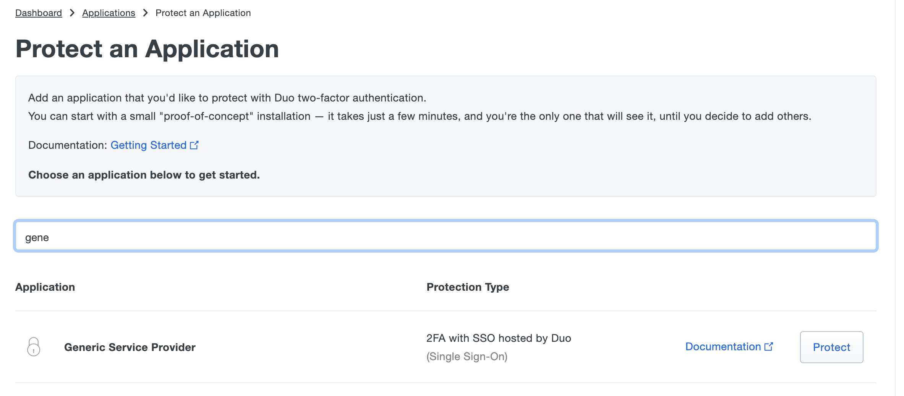

---

## Step 4: Configure SAML Settings For App in Duo

In the "Generic Service Provider - Single Sign-On" page, go to "Service Provider" section and:

- Provide an App Name for the Web Console in the "Service Provider Name" section
- Copy/Paste the Entity ID from Step 2 to "Entity ID"
- Copy/Paste the ACS URL from Step 2 into the "Assertion Consumer Service"
- Copy/Paste the ACS URL from Step 2 into the "Service Provider Login URL"

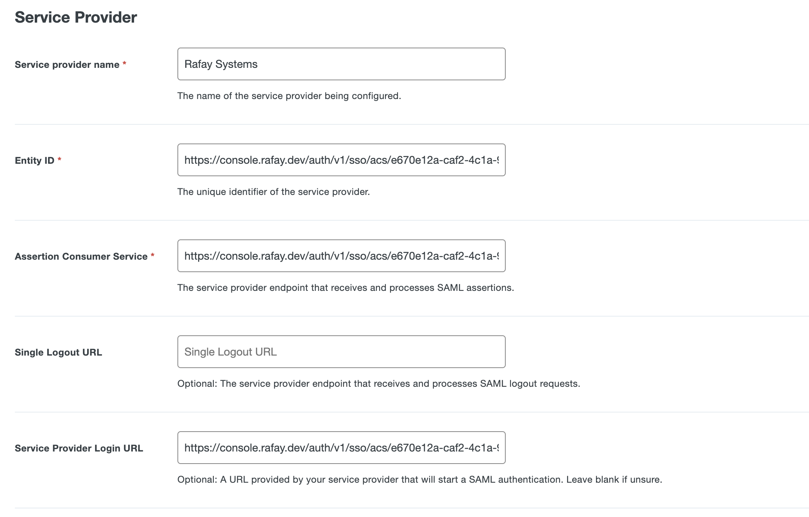

- Go to "SAML Response" section
- Keep the "NameID format" as emailAddress
- Keep the "NameID attribute" as EmailAddress

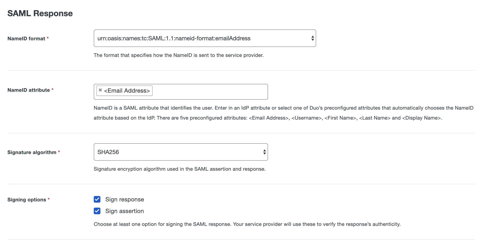

- Go to Policy to configure the defines the policy for users to access Application
- Go to Settings > Name and enter the App name to display in Duo push notification for users when accessing the web console

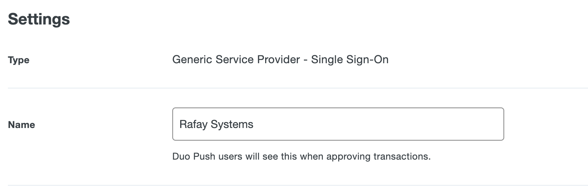

- Go to Settings > Permitted Groups to assign users in certain groups to access the Application or allow all users

---

## Step 5: Configure Group Attribute to Send

The "Group" configuration step is critical because it will ensure that Duo will send the groups/roles the user belongs to as part of the SSO process. The controller uses the group information to transparently map users to the correct group/role.

__Option 1__
Users and groups synced from Active Directory (AD) for your Duo Authentication Source. Follow Step 5.1 below to configuration the Role Attributes

__Option 2__
Your Duo Authentication Source is from SAML Identity Provider. Follow Step 5.2 to map IdP Attribute for Group Attribute in SAML Response to send to the controller.

---

### Step 5.1: Map Duo Group Synced from AD to Role Attributes

- Go to SAML Response > Role attributes section
- Provide the name for the "Attribute Name" to the same group attribute name that configured in Step 1
- Enter the "Service Provider's Role" as how the Group Name configured in the controller and select the "Duo Groups" that you would like the users belong to have this Role (refer to the section below for Groups Configuration in Web Console)
- Configure multiple roles and Group mappings as required
- Then SAVE the settings for this application in Duo Admin Portal

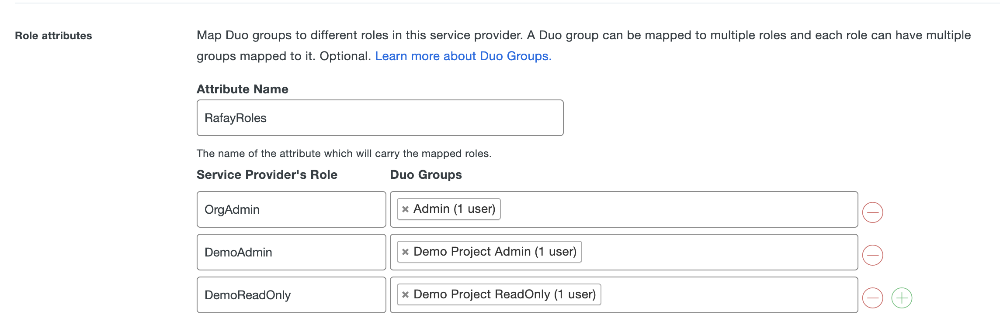

---

__*Groups Configuration In Web Console*__

- Identical named groups with the "Service Provider's Role" names need to be created on the controller. Ensure that these groups are mapped to the appropriate Projects with the correct privileges. In the example below, the Group "OrgAdmin" is configured as an "Organization Admin" with access to all Projects.

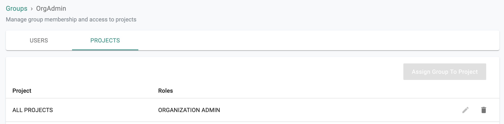

- It is important to emphasize that because of SSO via Duo, user lifecycle management can be completely offloaded to the IdP. In the example below, note that there are no users managed in the "OrgAdmin" group because they are all managed in the attached Duo tenant.

---

### Step 5.2: Map IdP Attribute to Group Attribute to Send

- Go to SAML Response > Map attributes section
- Provide the name for the "IdP Attribute" that contains the group/role information sent from IdP
- And enter the name of the SAML Response Attribute that configured in the controller Step 1
- Then SAVE the settings for this application in Duo Admin Portal

In the illustrative example below, we are using the attribute name "UserRoles" from IdP source and send to the controller in the SAML Response attribute name

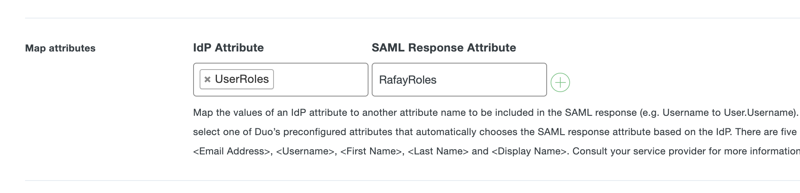

---

__*Groups Configuration In __Web Console__

- Identical named groups with the group/role information sent from the configured IdP Attribute need to be created in your Org on the controller. Ensure that these groups are mapped to the appropriate Projects with the correct privileges. In the example below, the Group "OrgAdmin" is configured as an "Organization Admin" with access to all Projects.

- It is important to emphasize that because of SSO via Duo, user lifecycle management can be completely offloaded to the IdP. In the example below, note that there are no users managed in the "OrgAdmin" group because they are all managed in the attached Duo tenant.

---

## Step 6: Specify IdP Metadata

- Go back to Duo Admin Portal > Applications > App configuration page.
- Copy the "Metadata URL" from the Metadata > Metadata URL section

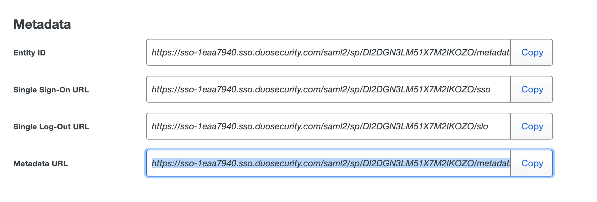

- Navigate back to the Web Console's IdP configuration wizard
- Paste the Metadata Url from Duo to the Identity Provider Metadata URL
- Complete IdP Registration

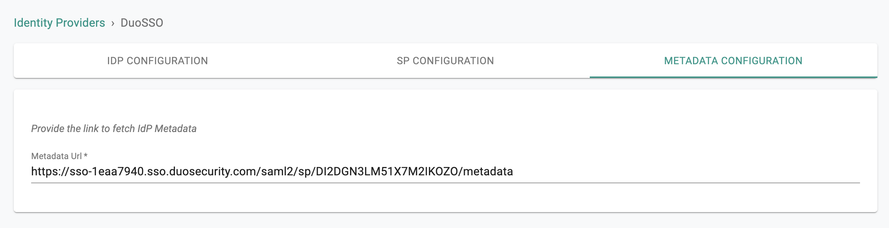

- Once this process is complete, you can view details about the IdP configuration on the Identity Provider page.
- You can also edit and update the configuration if required.  

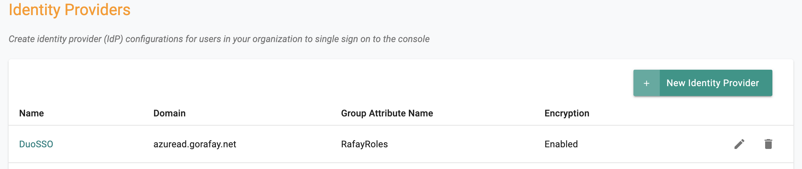

---
