Follow the steps documented below to integrate your Rafay Org with [Microsoft Entra ID](https://www.microsoft.com/en-us/security/business/identity-access/microsoft-entra-id) (formerly Azure AD) for Single Sign On (SSO) of users to the Rafay Platform.

!!! important
	Only users with "Organization Admin" privileges can configure IdP Integrations

----

## Step 1: Create IdP

1. Login into the Web Console as an Organization Admin.
2. Click on __System__ and __Identity Providers__.
3. Click on __New Identity Provider__.
4. Provide a name, select "Custom" from the __IdP Type__ drop down.
5. Enter the "Domain" for which you would like to enable SSO.
!!! Important
	Within an org, the domain of an IdP cannot be used for another IdP. A domain existing in an org can be used in multiple orgs (for one IdP in each org)
6. Enter an email for the __Admin Email__.
7. Optionally, toggle __Encrypted SAML Assertion__ if you wish to send/receive encrypted SAML assertions.
8. Provide a name for the __Group Attribute Name__, for this exercise we are using "RafayRoles" and will use this value later.
9. Optionally, toggle __Include Authentication Context__ if you wish to send/receive auth context information in assertion.
10. Click on __Update & Continue__.

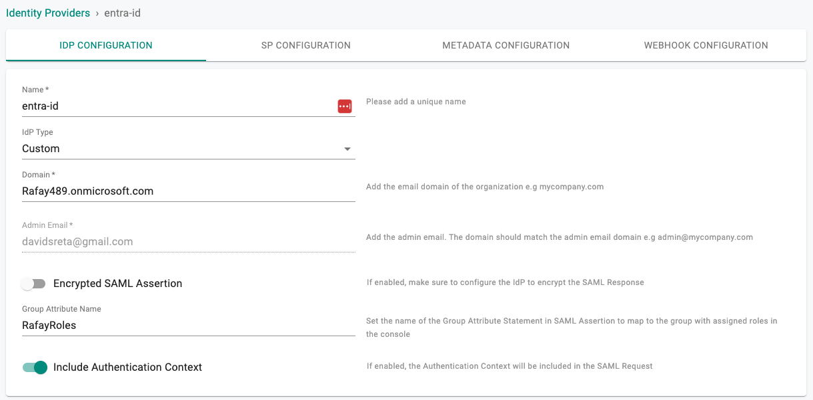

!!! Important
	Encrypting SAML assertions is optional because privacy is already provided at the transport layer using HTTPS. Encrypted assertions provide an additional layer of security on top ensuring that only the SP (Org) can decrypt the SAML assertion.

---
## Step 2: View SP Details

The IdP configuration wizard will display critical information that you need to copy/paste into your Entra ID Enterprise Application. Provide the following information to your Entra ID administrator.

- Assertion Consumer Service (ACS) URL  
- SP Entity ID
- Name ID Format

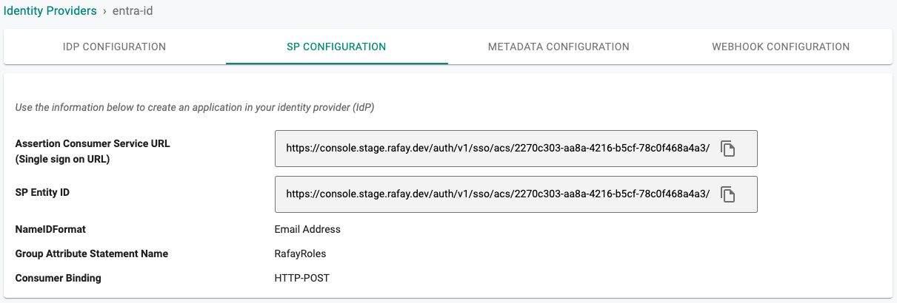

---

## Step 3: Create the Rafay Application in Entra

1. Login into your Entra admin center as an Administrator.
2. Browse to  __Identity > Applications > Enterprise applications__ and then select __New application__.
3. Select __Create your own application__.

---

4. Select __Non-gallery application__ and select __Create__ to create a new application.

---

## Step 4: Configure SAML

In the application configuration page

1. Go to __Single sign-on__ and select __SAML__.

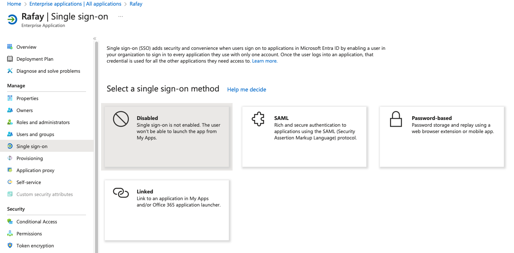

---

2. Click __Edit__ for Basic SAML Configuration.

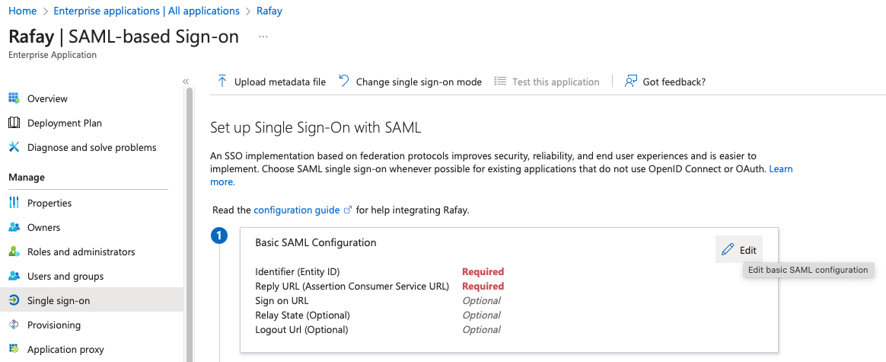

---

3. Copy/Paste the Entity ID from Step 2 into the __Identifier__.
4. Copy/Paste the ACS URL from Step 2 into the __Reply URL__.
5. Click __Save__ to save the configuration.

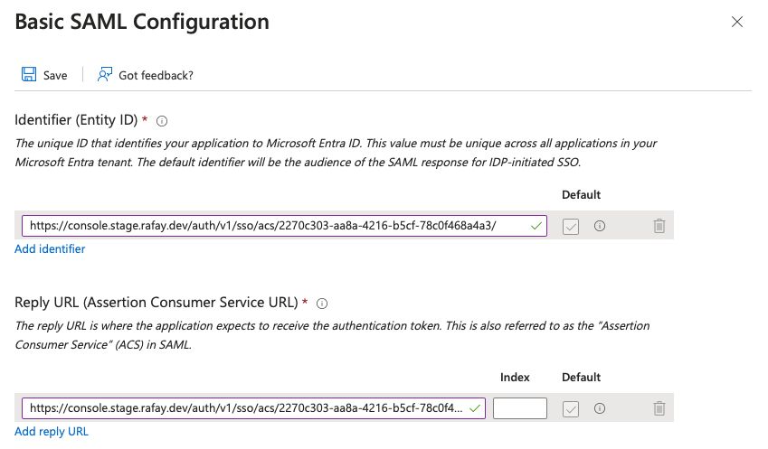

---

6.. Click __Edit__ User Attributes & Claims.

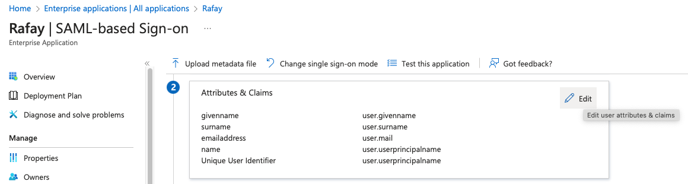

---

7. Click on __Add new claim__.
8. Enter the Group Attribute Name we entered in Step 1 as the __Name__.
9. Select "user.assignedroles" for the __Source attribute__.
10. Click on __Save__ to save the settings.

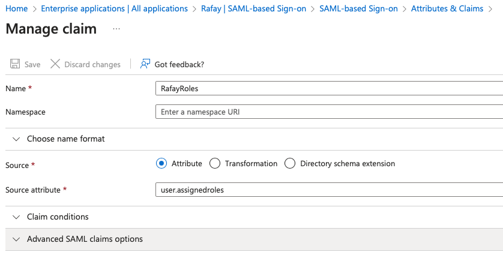

---

## Step 5: Assign Users an App Role

The controller will manange permissions for a given role or group name. The "Group" configuration step is critical because it will ensure that Entra ID will send the groups or roles the user belongs to as part of the SSO process. The controller uses the group information to transparently map users to the correct group/role.

If you are utilizing App Roles and a roles claim follow step 5.1.

Otherwise, follow Step 6.2 to use a group claim for the Group Attribute to send to the controller.

---

### Step 5.1: Configure an App Role

__*Create App Role*__

1. Login into your Entra admin center as an Administrator.
2. Browse to  __Identity > Applications > App registrations__ and then select __All applications__.
3. Select the __Rafay__ application.
4. Select __App roles__ and then __+ Create app role__.
5. Enter a __Display name__ such as "rafay-org-admins".
6. Select "Users/Groups" as the __Allowed member types__.
7. Set the __Value__ to "rafay-org-admins".
8. Enter a __Description__.
9. Enable the app role.
10. Select __Apply__.

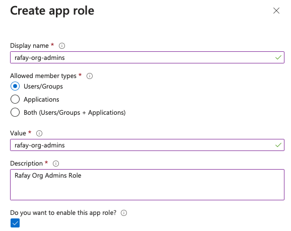

__*Assign the Application an Owner*__

1. In your app registration, under __Manage__, select __Owners__, and __Add owners__.
2. In the new window, find and select the owner(s) that you want to assign to the application. Selected owners appear in the right panel. Once done, confirm with __Select__ and the app owner(s) appear in the owner's list.

__*Assign App Role to the Application*__

1. Browse to __Identity > Applications > App registrations__ and then select __All applications__.
2. __Select All applications__ to view a list of all your applications. If your application doesn't appear in the list, use the filters at the top of the All applications list to restrict the list, or scroll down the list to locate your application.
3. Select the application to which you want to assign an app role.
4. Select __API permissions > Add a permission__.
5. Select the My __APIs__ tab, and then select the "Rafay" app.
6. Under __Permission__, select the roles you want to assign.
7. Select the __Add permissions__ button complete addition of the roles.

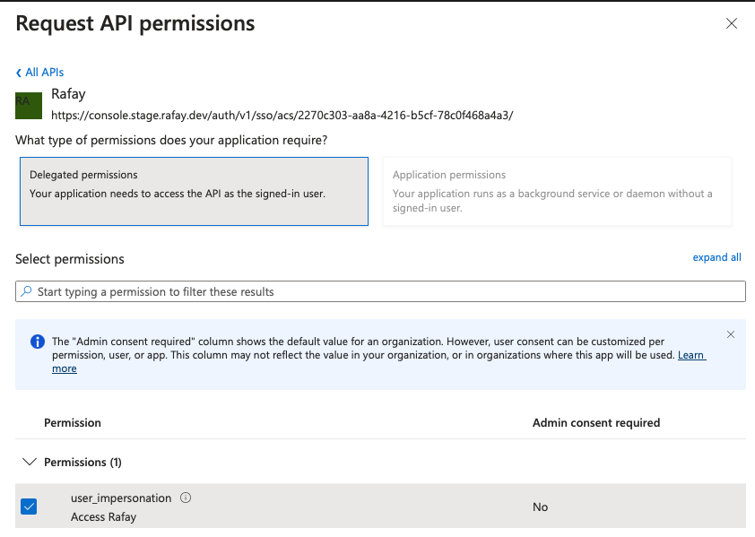

__*Grant admin consent*__

1. In the app registration's __API permissions__ pane, select __Grant admin consent for Rafay__.
2. Select __Yes__ when prompted to grant consent for the requested permissions.

The __Status__ column should reflect that consent has been __Granted for Rafay__.

__*Assign User to App Role*__

1. Browse to __Identity > Applications > Enterprise applications__.
2. Select __All applications__ to view a list of all your applications. If your application doesn't appear in the list, use the filters at the top of the __All applications__ list to restrict the list, or scroll down the list to locate your application.
3. Select the application in which you want to assign users or security group to roles.
4. Under __Manage__, select __Users and groups__.
5. Select __Add user__ to open the __Add Assignment__ pane.
6. Select the __Users and groups__ selector from the __Add Assignment__ pane. A list of users and security groups is displayed. You can search for a certain user or group and select multiple users and groups that appear in the list. Select the __Select__ button to proceed.
7. Select __Select a role__ in the __Add assignment__ pane. All the roles that you defined for the application are displayed.
8. Choose a role and select the __Select__ button.
9. Select the Assign button to finish the assignment of users and groups to the app.
10. Browse to the __Applications__ page for the User we just added.

Confirm that the users and groups you added appear in the Users and groups list.

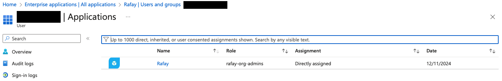

---

### Step 5.2: Configure Group Claim for Users and Groups Synced from Active Directory

__Assign Active Directory Users and Groups to the App:__

1. Go to __Enterprise applications > Rafay > Users and groups__ and select __Add user/group__.

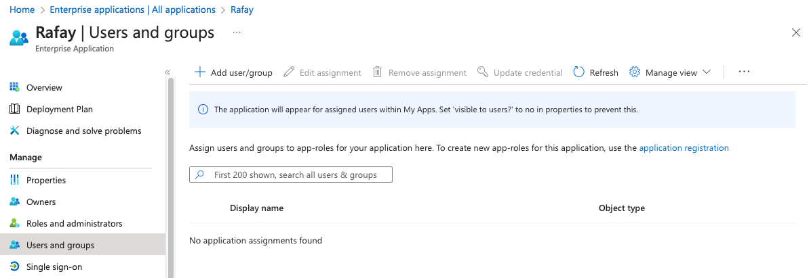

2. Select the Users and/or Groups synced from Active Directory to allow access to the Web Console.

3. Assign the User Role for the selected groups.

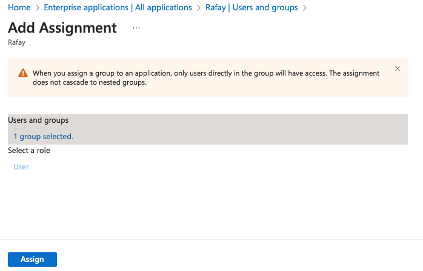

---

__Add Group Claims Using Active Directory Group Names:__

1. Go to __Enterprise applications > Rafay > Single sign-on__.
2. Click __Edit__ for __User Attributes & Claims__.
3. Select __Add a group claim__.
4. Select the __Source attribute__ as "sAMAccountName" from your Active Directory group name/memberships of the users to send in the group claim.
5. Provide the name for the__Name__ to the same group attribute name that was configured in Step 1.
6. Save the settings.

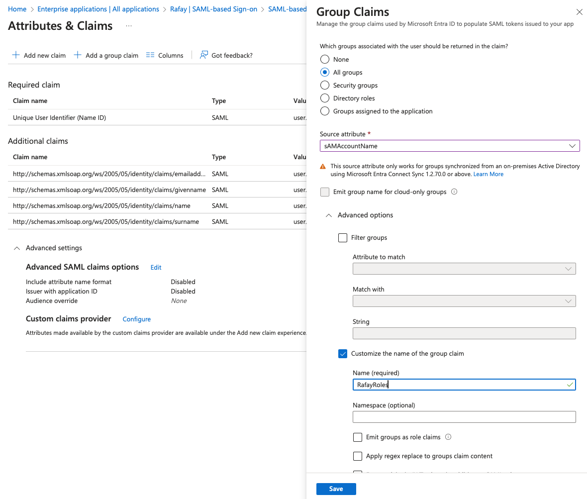

---

__*Groups Configuration In Web Console*__

Identical named groups with the Active Directory group names need to be created in your Org. Ensure that these groups are mapped to the appropriate Projects with the correct privileges. In the example below, the Group "OrgAdmin" is configured as an "Organization Admin" with access to all Projects.

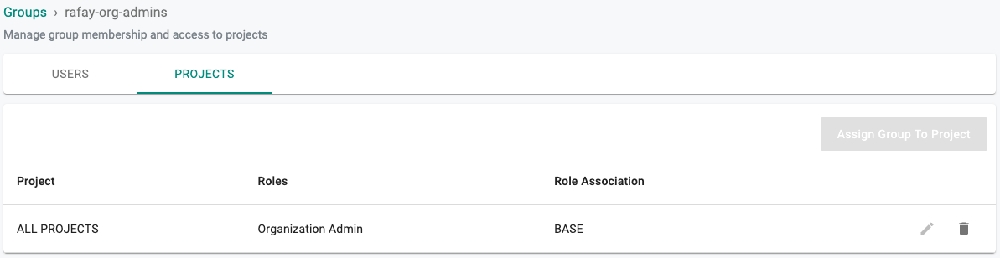

It is important to emphasize that because of SSO via Entra ID, user lifecycle management can be completely offloaded to the IdP. In the example below, note that there are no users managed in the "OrgAdmin" group because they are all managed in the attached Entra tenant.

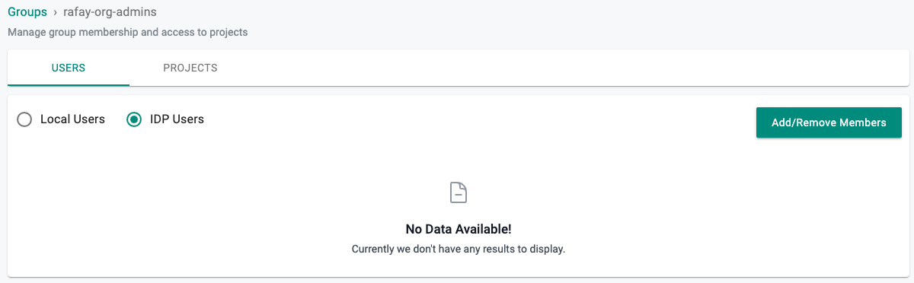

---

## Step 6: Specify IdP Metadata

1. In the Entra Admin Center browse to the __Enterprise applications > Rafay > Single sign-on__ configuration page.
2. Copy the "App Federation Metadata Url" URL from the __App > SAML Certificates__ section.

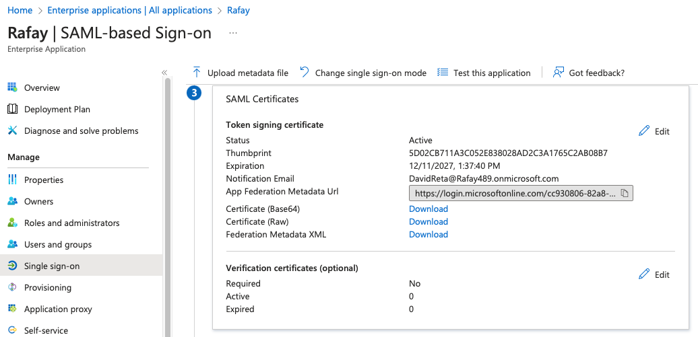

3. Navigate back to the Web Console's IdP configuration wizard.
4. Paste the App Federation Metadata Url from Entra to the Identity Provider Metadata URL.
5. Complete IdP Registration.

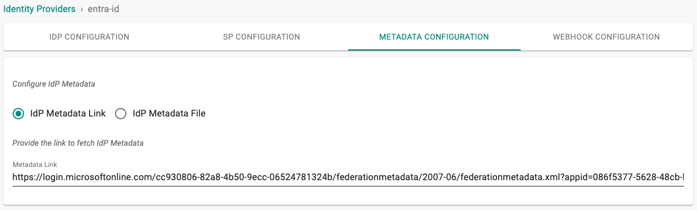

- Once this process is complete, you can view details about the IdP configuration on the Identity Provider page.
- You can also edit and update the configuration if required.  

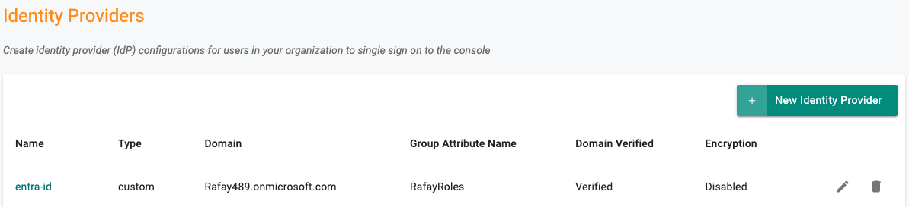

---
