Follow the steps below to integrate Microsoft Entra ID (formerly Azure AD) for Single Sign On (SSO).

!!! important
    Only users with "Organization Admin" privileges can configure IdP integrations.

---

## Step 1: Create Identity Provider

- Login into the web console as an Organization Admin.  
- Navigate to **System -> Identity Providers**.  
- Click **New Identity Provider**.  
- Provide a name, select **Custom** from the IdP Type drop down.  
- Enter the **Domain** for which you would like to enable SSO.

!!! important
    Within an org, the domain of an IdP cannot be used for another IdP. A domain existing in an org can be used in multiple orgs (for one IdP in each org).

- Enter an **Admin Email**.  
- Optionally, toggle **Encrypted SAML Assertion** if you wish to send/receive encrypted SAML assertions.  
- Provide a name for the **Group Attribute Name** (for example, `OrgRoles`).  
- Optionally, toggle **Include Authentication Context** if you wish to send/receive auth context information in assertion.  
- Click **Update & Continue**.  

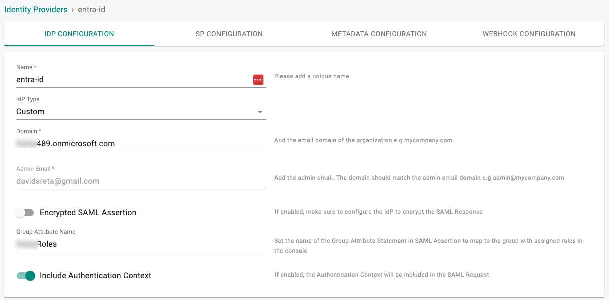

!!! important
    Encrypting SAML assertions is optional because privacy is already provided at the transport layer using HTTPS. Encrypted assertions provide an additional layer of security ensuring that only the SP can decrypt the SAML assertion.

---

## Step 2: View Service Provider Details

The IdP configuration wizard will display critical information that you need to copy/paste into your Entra ID Enterprise Application. Provide the following information to your Entra ID administrator:  

- Assertion Consumer Service (ACS) URL  
- SP Entity ID  
- Name ID Format  

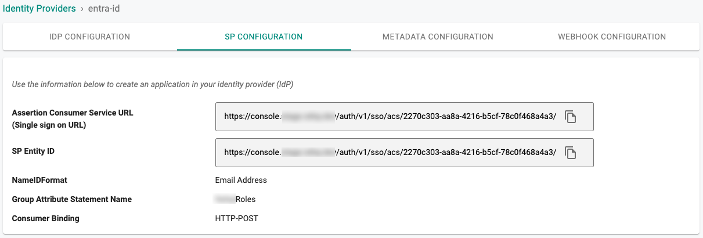

---

## Step 3: Create the Application in Entra

1. Login into the Entra admin center as an Administrator.  
2. Navigate to **Identity > Applications > Enterprise applications** and select **New application**.  
3. Select **Create your own application**.  
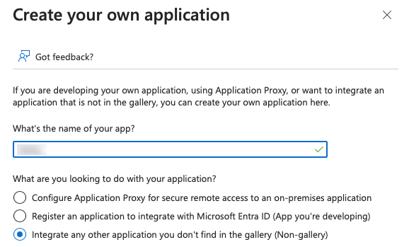
4. Select **Non-gallery application** and click **Create**.  
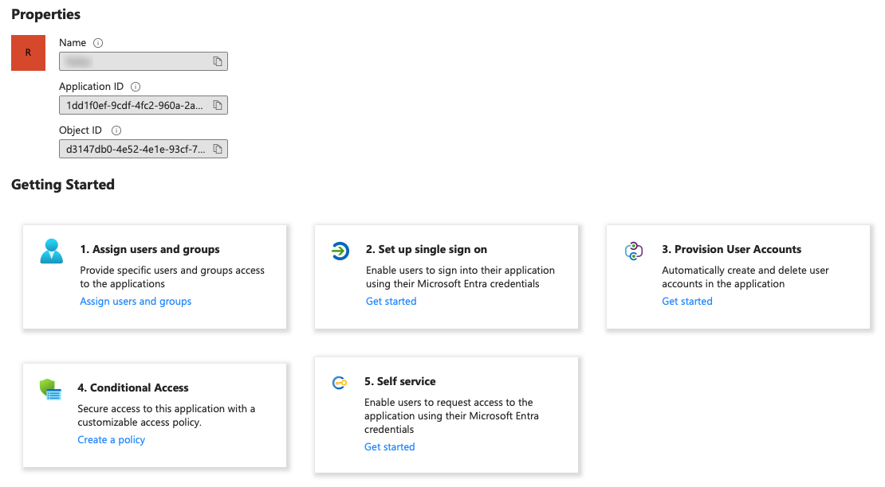

---

## Step 4: Configure SAML

1. In the application configuration page, go to **Single sign-on** and select **SAML**.  
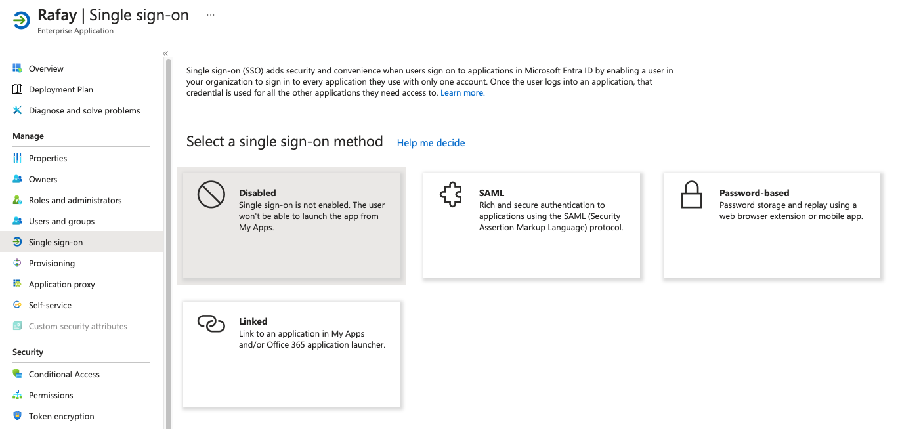
2. Click **Edit** for Basic SAML Configuration.  
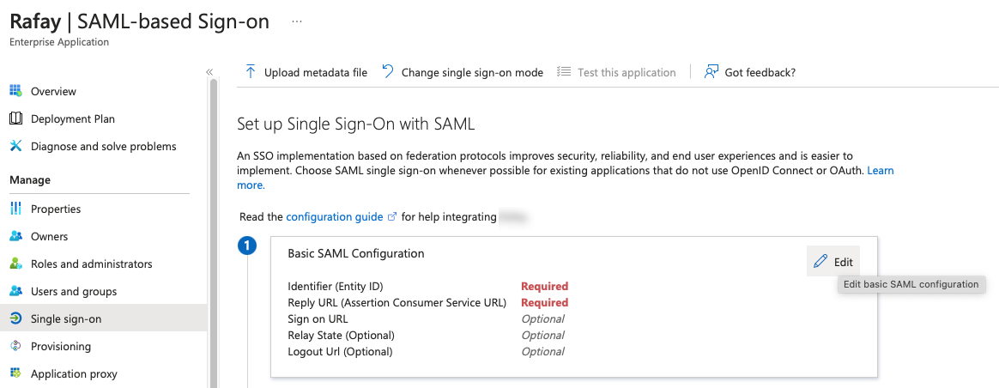
3. Copy/Paste the Entity ID from Step 2 into the **Identifier**.  
4. Copy/Paste the ACS URL from Step 2 into the **Reply URL**.  
5. Click **Save**.  
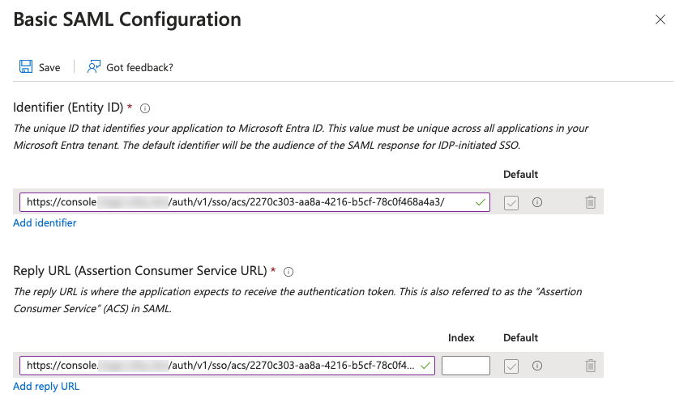
6. Click **Edit** User Attributes & Claims.  
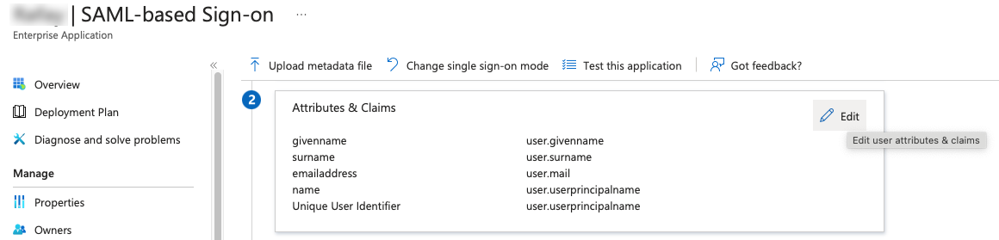
7. Add a new claim:  
    - **Name**: the Group Attribute Name from Step 1 (e.g., `OrgRoles`)  
    - **Source attribute**: `user.assignedroles`  
8. Save the settings.  

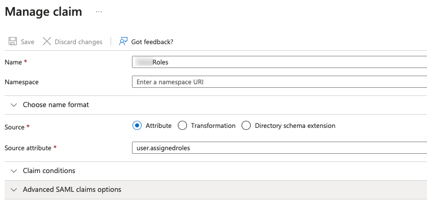

---

## Step 5: Assign Users an App Role

The controller manages permissions based on roles or group names. The "Group" configuration step ensures that Entra ID sends the groups or roles the user belongs to as part of the SSO process. The controller uses this information to map users to the correct group/role.  

Choose one of the following options:  

- **Step 5.1**: Use App Roles and a roles claim  
- **Step 5.2**: Use a Group Claim for the Group Attribute  

---

### Step 5.1: Configure an App Role

**Create App Role**  

1. Login into the Entra admin center.  
2. Go to **Identity -> Applications -> App registrations -> All applications**.  
3. Select your application.  
4. Under **App roles**, click **+ Create app role**.  
5. Enter a Display name (e.g., `org-admins`).  
6. Select **Users/Groups** as Allowed member types.  
7. Set the **Value** (e.g., `org-admins`).  
8. Provide a description.  
9. Enable the app role.  
10. Click **Apply**.  

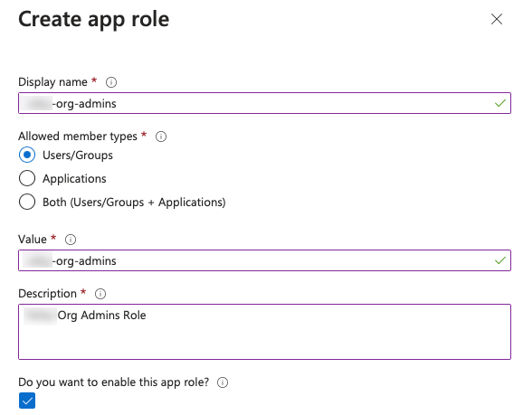

**Assign User to App Role**  

1. Navigate to **Enterprise applications > All applications**.  
2. Select your application.  
3. Under **Manage**, select **Users and groups**.  
4. Click **Add user**.  
5. Select the user(s) or group(s), then select a role.  
6. Click **Assign**.  

---

### Step 5.2: Configure Group Claim for Users and Groups Synced from Active Directory

**Assign AD Users and Groups to the App**  

1. Go to **Enterprise applications > [Your App] > Users and groups** and click **Add user/group**.  
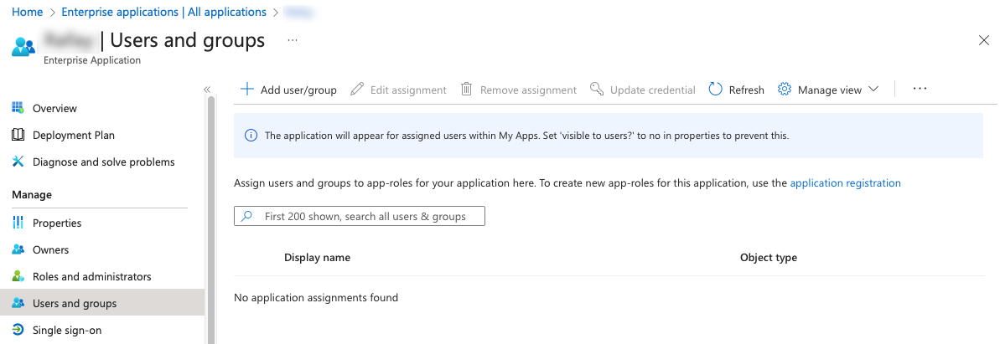
2. Select the users or groups synced from Active Directory.  
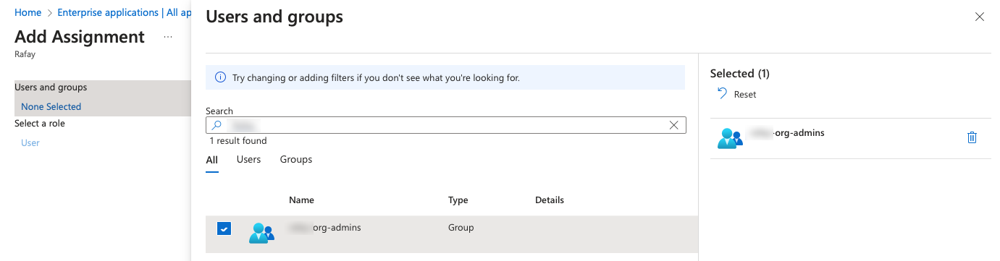
3. Assign a role for the selected groups.  
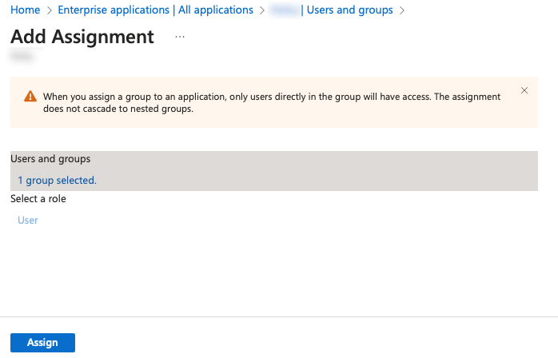

**Add Group Claims Using AD Group Names**  

1. Go to **Enterprise applications > [Your App] > Single sign-on**.  
2. Click **Edit** under **User Attributes & Claims**.  
3. Select **Add a group claim**.  
4. Choose `sAMAccountName` as the source attribute.  
5. Provide the **Name** matching the Group Attribute from Step 1.  
6. Save the settings.  

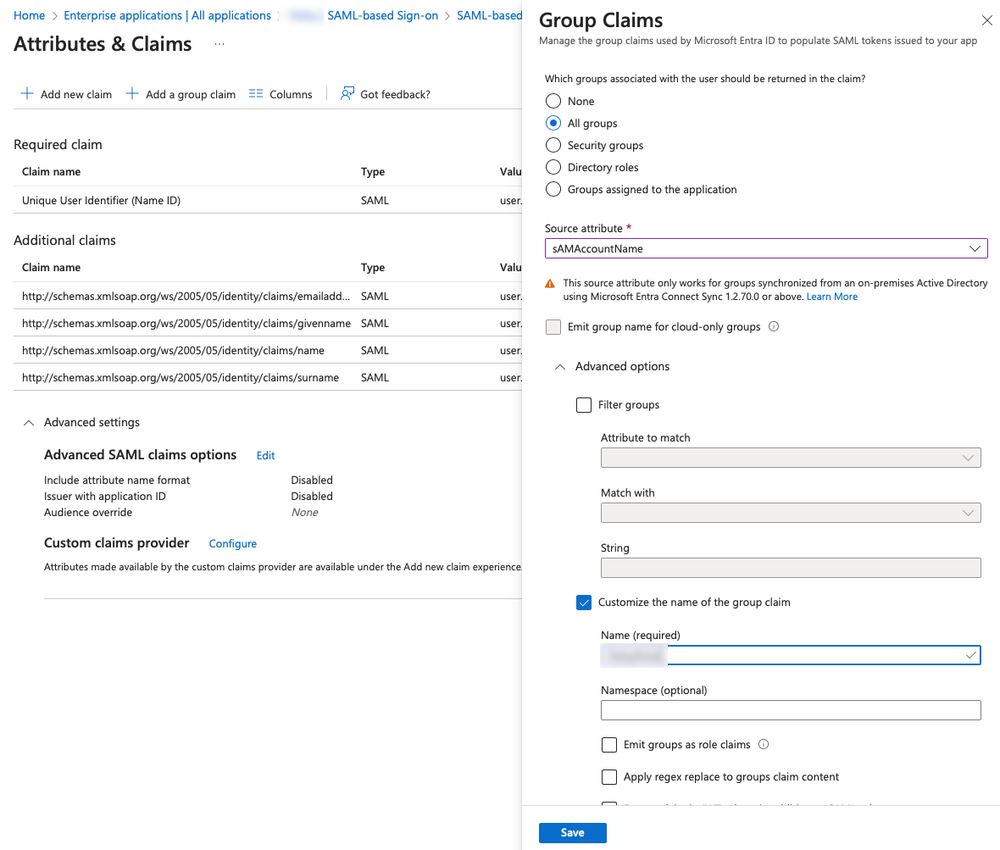

**Groups in Web Console**  

Groups with identical names to Active Directory groups must be created in the web console. Ensure these are mapped to the appropriate Projects with the correct privileges.  

---

## Step 6: Specify IdP Metadata

1. In the Entra Admin Center, browse to **Enterprise applications > [Your App] > Single sign-on**.  
2. Copy the **App Federation Metadata URL** from the SAML Certificates section.  
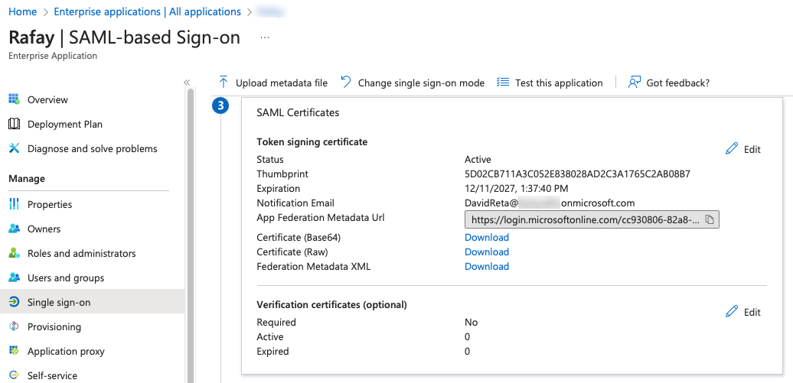
3. In the web console’s IdP configuration wizard, paste the URL into the Identity Provider Metadata field.  
4. Complete IdP Registration.  

5. Once this process is complete, you can view details about the IdP configuration on the Identity Provider page.

---
