Follow the steps documented below to integrate your Org and Google Workspace for Single Sign On (SSO).

!!! important
	Only users with "Organization Admin" privileges can configure SSO in the Web Console.

----
## Step 1: Create IdP

- Login into the Web Console as an Organization Admin
- Click on System and Identity Providers
- Click on "New Identity Provider"
- Provide a name, select "Custom" from the "IdP Type" drop down
- Enter the "Domain" for which you would like to enable SSO

!!! Important
	Within an org, the domain of an IdP cannot be used for another IdP. A domain existing in an org can be used in multiple orgs (for one IdP in each org)

- Optionally, toggle "Encryption" if you wish to send/receive encrypted SAML assertions  
- Provide a name for the "Group Attribute Name"
- Optionally, toggle "Include Authentication Context" if you wish to send/receive auth context information in assertion
- Click on Save & Continue

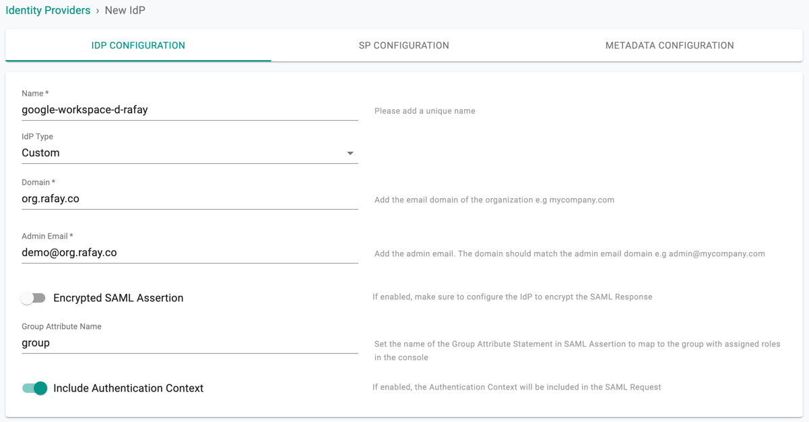

!!! Important
	Encrypting SAML assertions is optional because privacy is already provided at the transport layer using HTTPS. Encrypted assertions provide an additional layer of security on top ensuring that only the SP (Org) can decrypt the SAML assertion.

---
## Step 2: View SP Details

The IdP configuration wizard will display critical information that you need to copy/paste into your Google Workspace. Provide the following information to your Google Workspace administrator.

- Assertion Consumer Service (ACS) URL  
- SP Entity ID
- Name ID Format

---

## Step 3: Create App in Google Workspace

- Login into your Google Workspace as an Administrator
- Select **Apps**

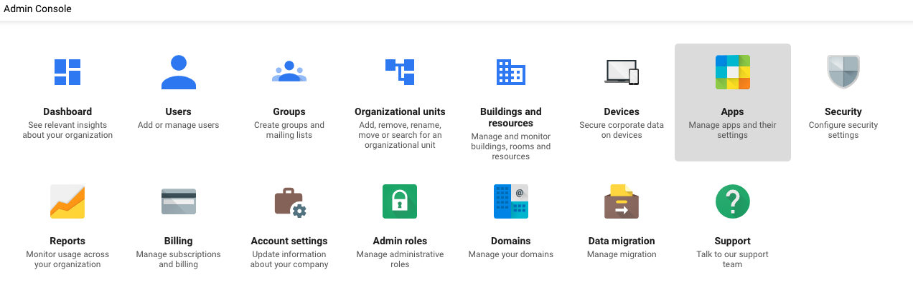
---

- Select **SAML apps** to create a new application

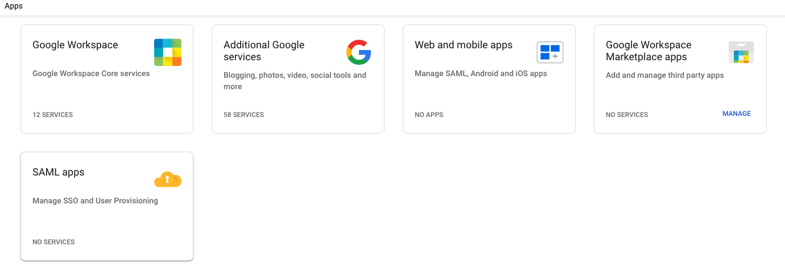

---

## Step 4: General Settings

- Select the **Add App** dropdown
- Select **Add custom SAML app**
- Provide an App Name for the Web Console
- Click "Add" button to add the application

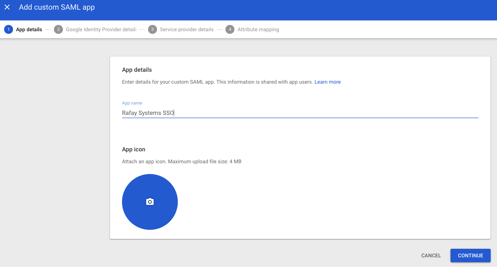

- Download IdP metadata by selecting **DOWNLOAD METADATA** under Option 1: Download Idp metadata

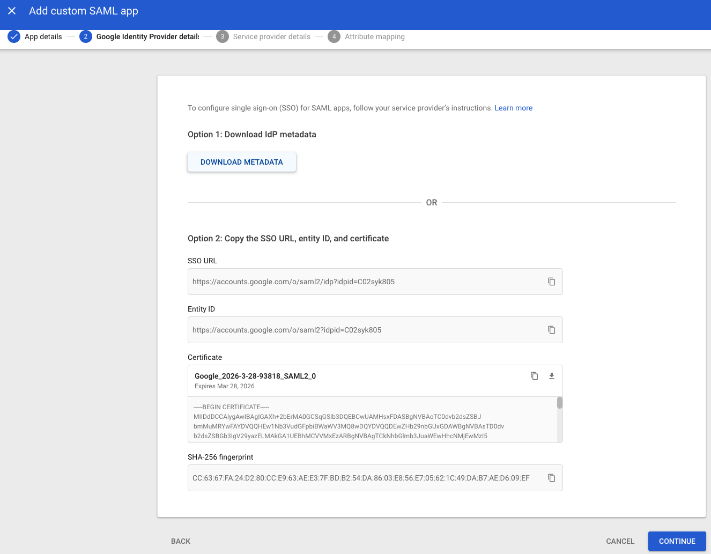

---

## Step 5: Configure SAML

- Copy/Paste the Entity ID from Step 2
- Copy/Paste the ACS URL from Step 2 into the "Reply URL"
- Copy/Paste the ACS URL from Step 2 into the "Sign on URL"
- Set **Name ID** to **EMAIL**
- Then click on **CONTINUE**

- Click on **FINISH**

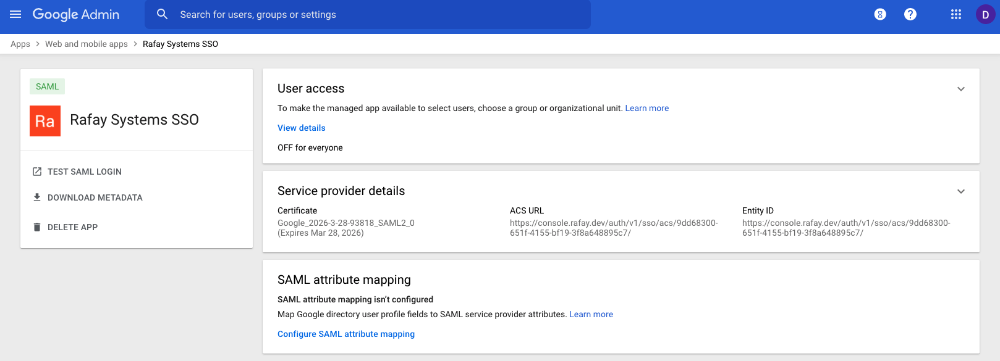

---
## Step 6: Create Group in Google Workspace

- In the Admin Console select **Groups**

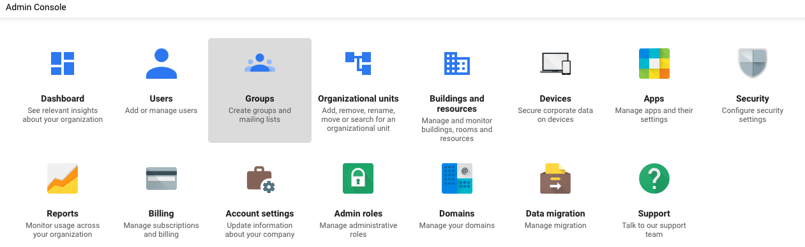

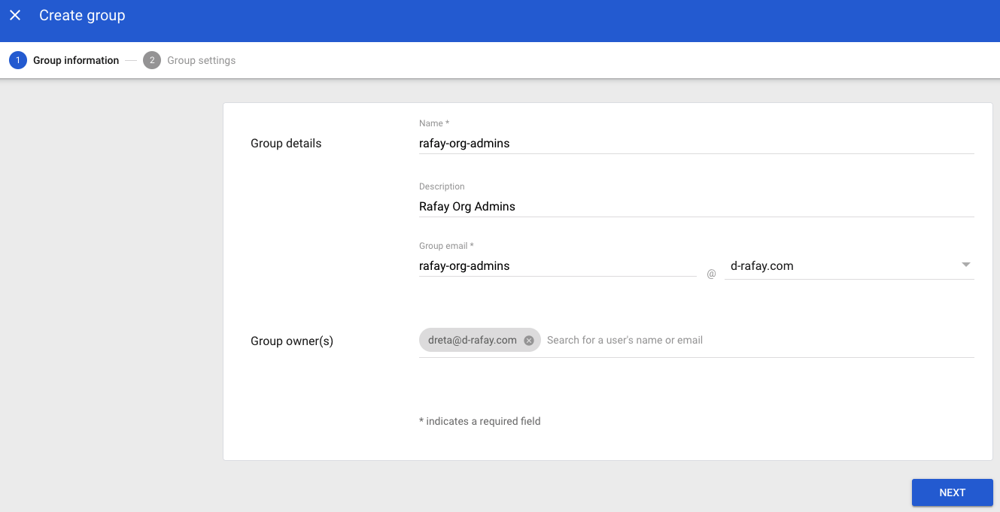

- Enter a group name, this same group will need to be configured in the Console

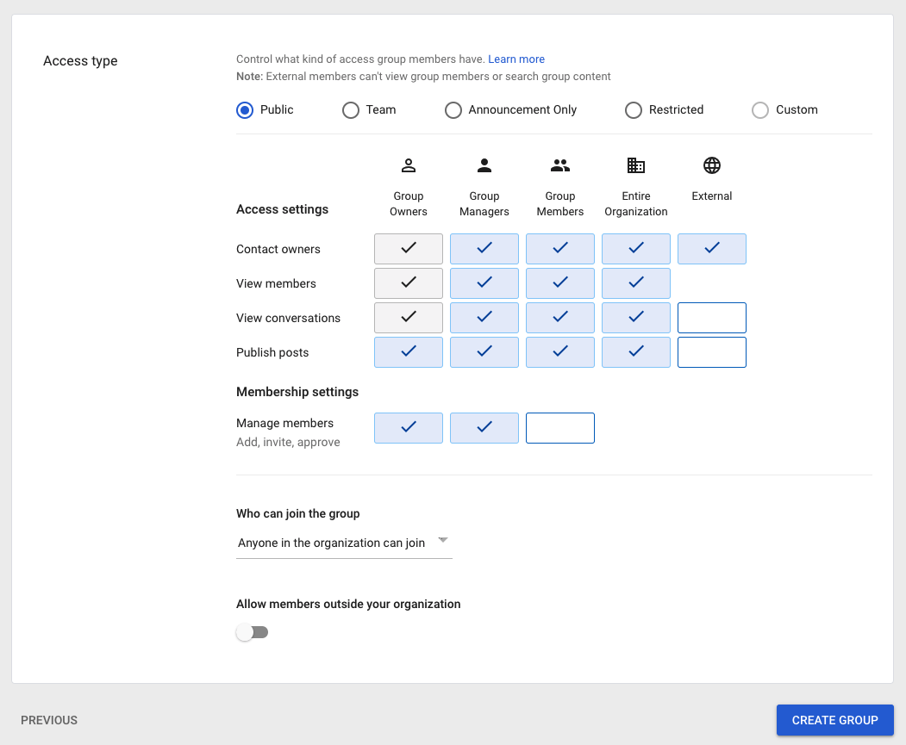

- Select **CREATE GROUP**

---
## Step 7: Assign User to Group in Google Workspace

- In the Admin Console select **Users**

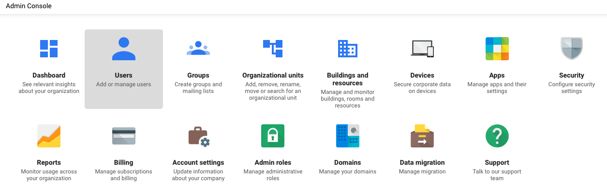

- Select **Add to groups**

- Add the user to the group created in Step 6

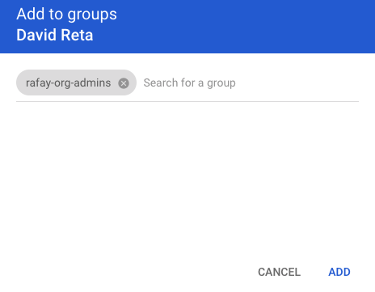

---
## Step 8: Enable SSO in Google Workspace

- Go to **Apps -> Web and mobile apps -> Rafay Systems SSO -> Service Status** and set Service status to **ON for everyone
- Optionally you can enable for **rafay-org-admins** by selecting groups and enter **rafay-org-admins**.

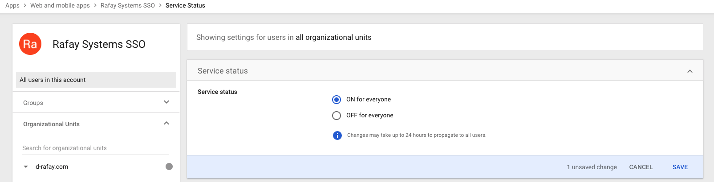

---
## Step 9: Configure SSO Attribute Mapping for SSO SAML Configuration

The SSO Attribute Mapping configuration step for Groups is critical because it will ensure that Google Workspace will send the groups the user belongs to as part of the SSO process. The group information is used to transparently map users to the correct group/role. In the illustrative example below, we are using **Rafay** as the name of the group attribute statement.

- Go to **Users -> More** and select **Manage custom attibutes**
- Select **ADD CUSTOM ATTRIBUTE** and enter a Category. The name should be the **Group Attribute Statement Name** we set in Step 1
- Set type to **Text**, Visibility to **Visible to User and admin**, and No. of values to **Single Value**

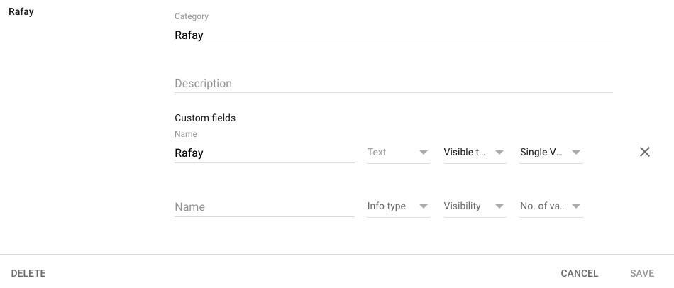

- Go to **Apps -> Web and mobile apps -> Rafay Systems SSO -> SAML Attribute mapping** and select **Configure SAML attribue mapping**
- Select **ADD MAPPING** and set the Google Directory attributes to the custom field we created earlier and set the App attributes to the **Group Attribute Name** we created in Step 1

---
## Step 10: Add Group Name to user in Google googleworkspace

- Go to **User Information** for the desired user account and edit the attribute we set in Step 9
- Set the value to the group name

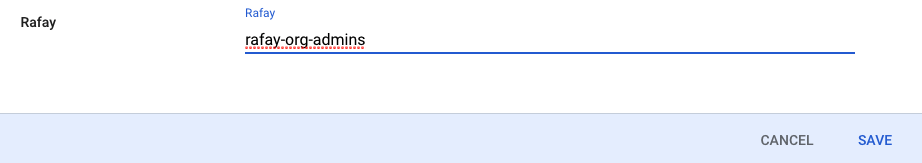

---
## Step 11: Specify IdP Metadata File

- Navigate back to the Web Console's IdP Metadata Configuration page
- Select IdP Metadata File and upload the file downloaded in Step 4
- SAVE the IdP Settings

---
## Step 12: Create group in Console

An identical named group needs to be created as was created in Step 6. Ensure that this group is mapped to the appropriate Projects with the correct privileges. In the example below, the Group **rafay-org-admins** is configured as an "Organization Admin" with access to all Projects.

* Create a new group in the Console and select **CREATE**

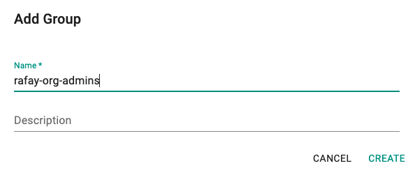

---
## Recap

Congratulations! You have successfully enabled SSO using Google Workspace. You should be able to login to the Web Console using your Google Workspace credentials.

---
