Follow the steps documented below to integrate your Organization and Google Workspace for Single Sign-On (SSO).

!!! important
    Only users with **Organization Admin** privileges can configure SSO in the Web Console.

---

## Step 1: Create IdP

- Login into the Web Console as an Organization Admin  
- Navigate to **System > Identity Providers**  
- Click **New Identity Provider**  
- Provide a name and select **Custom** from the **IdP Type** dropdown  
- Enter the **Domain** for which you would like to enable SSO  

!!! important
    Within an organization, the domain of an IdP cannot be reused for another IdP.  
    A domain existing in one organization can also be used in another organization (for one IdP in each).  

- Optionally, toggle **Encryption** if you wish to send/receive encrypted SAML assertions  
- Provide a name for the **Group Attribute Name**  
- Optionally, toggle **Include Authentication Context** if you wish to send/receive auth context information in assertion  
- Click **Save & Continue**  

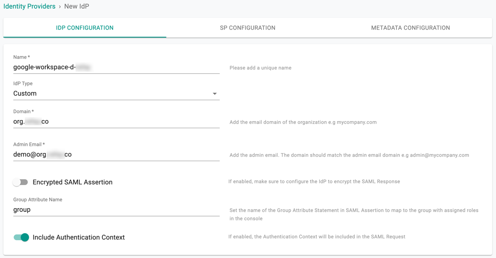

!!! important
    Encrypting SAML assertions is optional because privacy is already provided at the transport layer using HTTPS.  
    Encrypted assertions provide an additional layer of security ensuring that only the SP (organization) can decrypt the SAML assertion.

---

## Step 2: View SP Details

The IdP configuration wizard will display information you need to copy/paste into your Google Workspace configuration:

- Assertion Consumer Service (ACS) URL  
- SP Entity ID  
- Name ID Format  

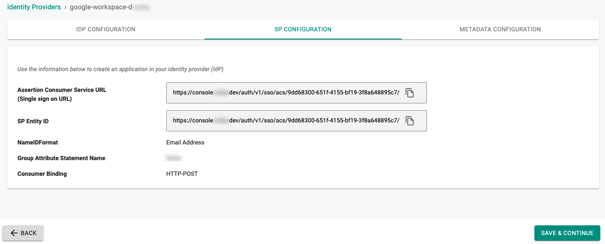

---

## Step 3: Create App in Google Workspace

- Login into your Google Workspace as an Administrator  
- Select **Apps**  

- Select **SAML apps** to create a new application  

---

## Step 4: General Settings

- Select the **Add App** dropdown  
- Select **Add custom SAML app**  
- Provide an App Name for the Web Console  
- Click **Add** to add the application  

- Download IdP metadata by selecting **DOWNLOAD METADATA** under *Option 1: Download IdP metadata*  

---

## Step 5: Configure SAML

- Copy/Paste the **Entity ID** from Step 2  
- Copy/Paste the **ACS URL** from Step 2 into the **Reply URL**  
- Copy/Paste the **ACS URL** from Step 2 into the **Sign on URL**  
- Set **Name ID** to **EMAIL**  
- Click **CONTINUE**  

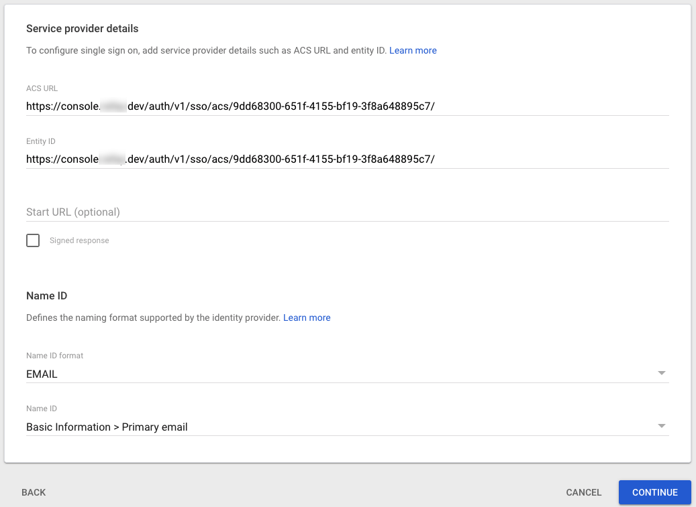

- Click **FINISH**  

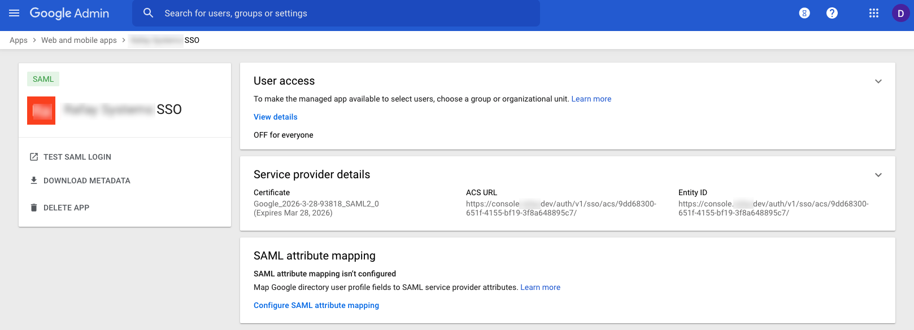

---

## Step 6: Create Group in Google Workspace

- In the Admin Console select **Groups**  

   

- Enter a group name and click **Next**. This same group will need to be configured in the Console.  

- Select the access type and click **Create Group**

  

---

## Step 7: Assign User to Group in Google Workspace

- In the Admin Console select **Users**  

  

- Select **Add to groups**  

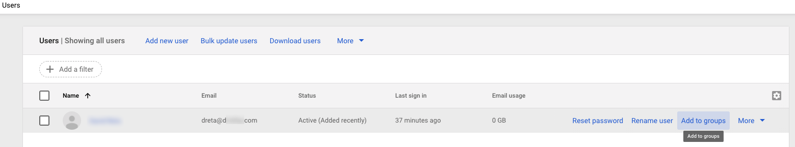  

- Add the user to the group created in Step 6  

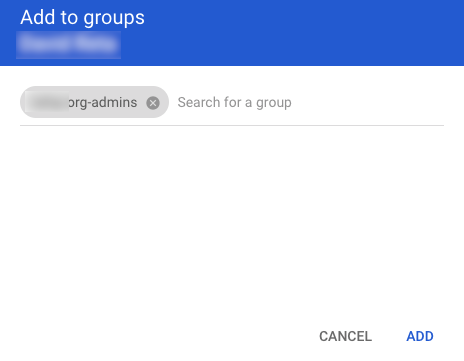

---

## Step 8: Enable SSO in Google Workspace

- Go to **Apps -> Web and mobile apps -> [Your SSO App] -> Service Status**  
- Set Service status to **ON for everyone**  
- Optionally, enable for a specific admin group by selecting groups  

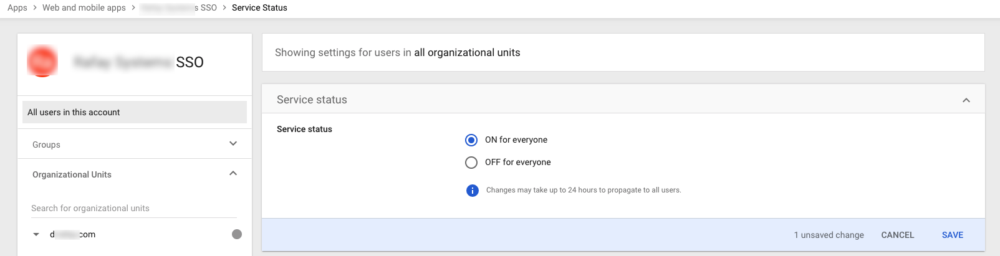

---

## Step 9: Configure SSO Attribute Mapping

The SSO Attribute Mapping step ensures Google Workspace sends the user’s group information as part of the SSO process.  

- Go to **Users > More > Manage custom attributes**  
- Select **ADD CUSTOM ATTRIBUTE**  
- Enter a Category (the name should match the **Group Attribute Statement Name** set in Step 1)  
- Set type to **Text**, Visibility to **Visible to User and admin**, and values to **Single Value**  

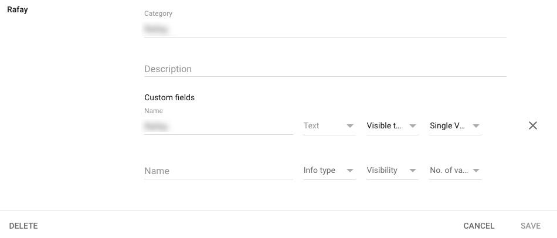

- Go to **Apps > Web and mobile apps > [Your SSO App] > SAML Attribute mapping**  
- Select **Configure SAML attribute mapping**  
- Select **ADD MAPPING** and set:  
  - Google Directory attributes → custom field created above  
  - App attributes → **Group Attribute Name** from Step 1  

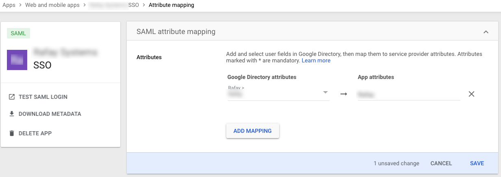

---

## Step 10: Add Group Name to User in Google Workspace

- Go to **User Information** for the desired user account  
- Edit the attribute configured in Step 9  
- Set the value to the group name  

---

## Step 11: Specify IdP Metadata File

- Navigate back to the Web Console’s IdP Metadata Configuration page  
- Select **IdP Metadata File** and upload the file downloaded in Step 4  
- Save the IdP Settings  

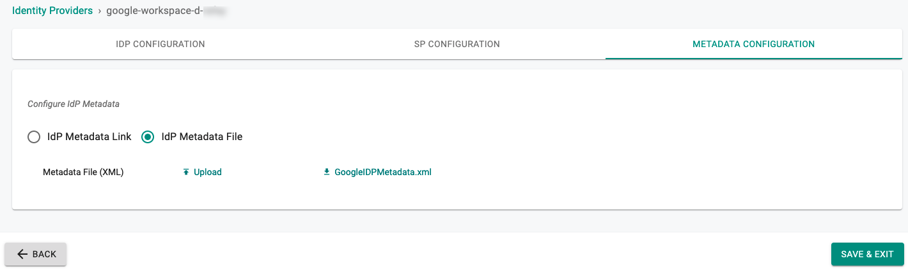

---

## Step 12: Create Group in Console

An identical named group must be created in the Console (same as the group in Step 6).  
Ensure this group is mapped to the appropriate Projects with the correct privileges.  

* Create a new group in the Console and select **CREATE**  

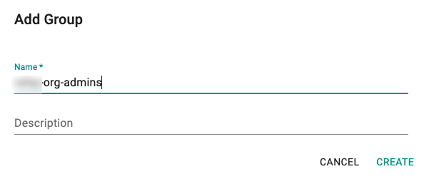  
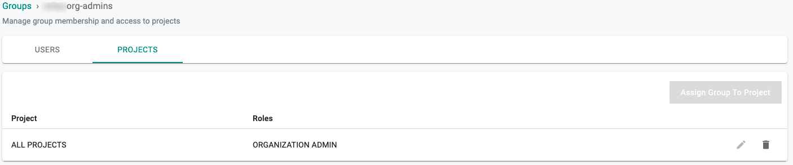

You have successfully enabled SSO using Google Workspace.  
Organization members should now be able to log in to the Web Console using their Google Workspace credentials.

---
