Follow the steps documented below to integrate your Org and KeyCloak Organizations for Single Sign On (SSO).

!!! important
	Only users with "Organization Admin" privileges can configure SSO in the Web Console.

---

## Step 1: Create IdP

- Login into the Web Console as an Organization Admin
- Click on System and select **Identity Providers**
- Click on **New Identity Provider**
- Provide a name, select "Custom" from the IdP Type drop down
- Enter the **domain** for which you would like to enable SSO

!!! Important
	Within an org, the domain of an IdP cannot be used for another IdP. A domain existing in an org can be used in multiple orgs (for one IdP in each org)

- Optionally, toggle **Encryption** if you wish to send/receive encrypted SAML assertions  
- Provide a name for the **Group** attribute
- Optionally, toggle "Include Authentication Context" if you wish to send/receive auth context information in assertion
- Click on **Update & Continue**

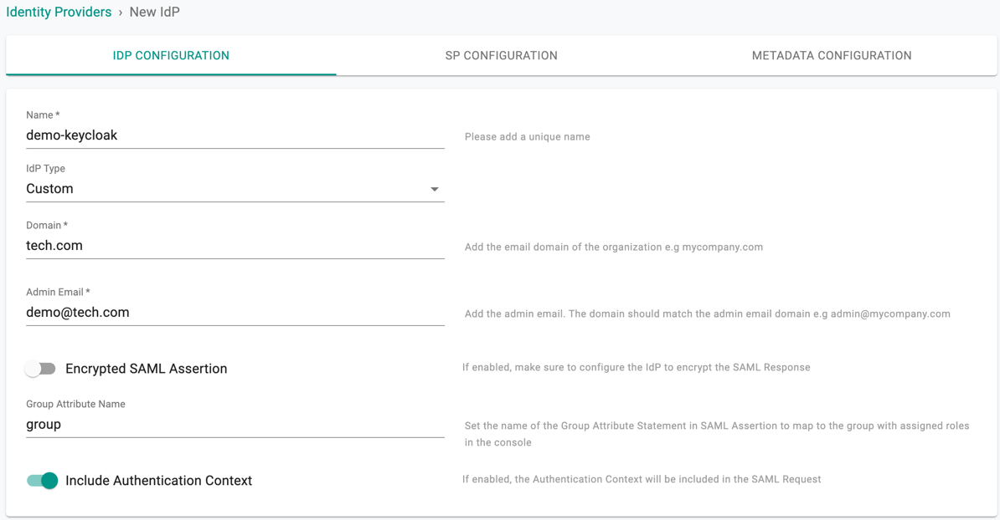

!!! Important
	Encrypting SAML assertions is optional because privacy is already provided at the transport layer using HTTPS. Encrypted assertions provide an additional layer of security on top ensuring that only the SP (Org) can decrypt the SAML assertion.

---

## Step 2: View SP Details

The IdP configuration wizard will display critical information that you need to copy/paste into your KeyCloak Org. Provide the following information to your KeyCloak administrator.

- Assertion Consumer Service (ACS) URL  
- SP Entity ID
- Name ID Format

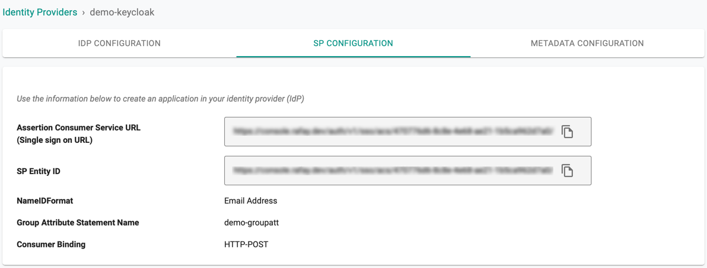

---

## Step 3: Create Client in KeyCloak

- Login to your **KeyCloak** Org as an **Administrator**
- Select **Clients** and click **Create**

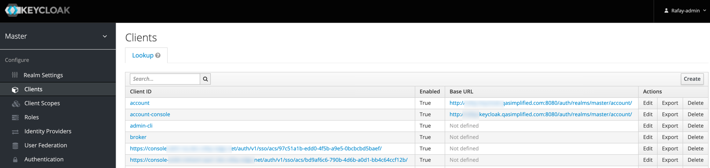

- Copy/Paste the client ID (Assertion Consumer Service (ACS) URL) retrieved from Controller as described in Step 2
- Select **saml** from the Client Protocol drop-down for Sign on method and click **Save**

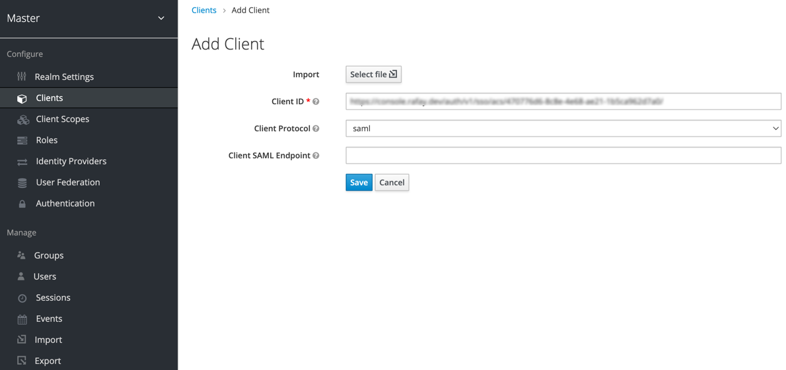

---

## Step 4: Settings

Once the client is successfully saved, the **Settings** page appears

- Provide a Name and Description

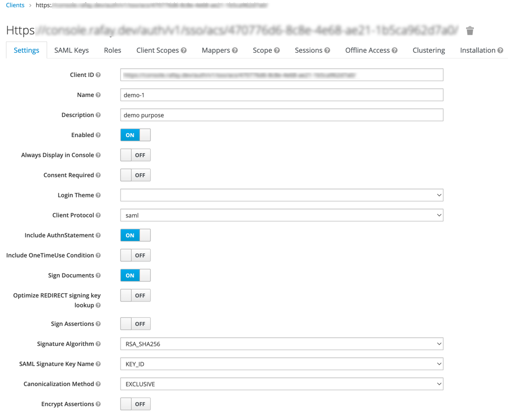

- Disable the below options
	- Client Signature Required
	- Force POST Binding
	- Front Channel Logout
- Select **Email** from the Name ID Format drop-down
- Copy/Paste the same URL (Assertion Consumer Service (ACS) URL) in **Valid Redirect URIs** as described in Step 2

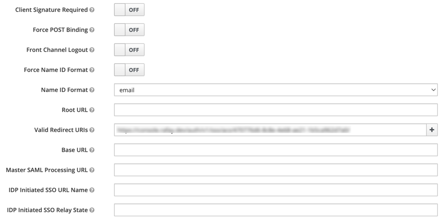

---

## Step 5: Fine Grain SAML

Expand the **Fine Grain SAML Endpoint Configuration** section and provide the required details

- Copy/Paste the ACS URL as described in Step 2 and click **Save**

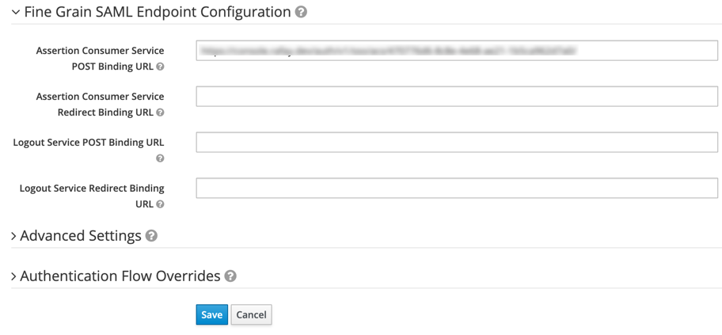

You will receive a success message once the client settings are saved

---

## Step 6: Create Mappers

Mappers allows the users to add the required details to the SAML data

- Select **Mappers** tab and click **Create**

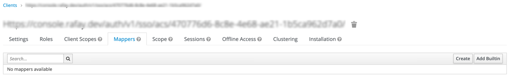

- Provide a Name and select **Group List** from Mapper Type drop-down
- Copy/Paste the **Group Attribute Name** from the Controller SP Configuration page
- Disable the below options and click **Save**
	- Single Group Attribute
	- Full group path

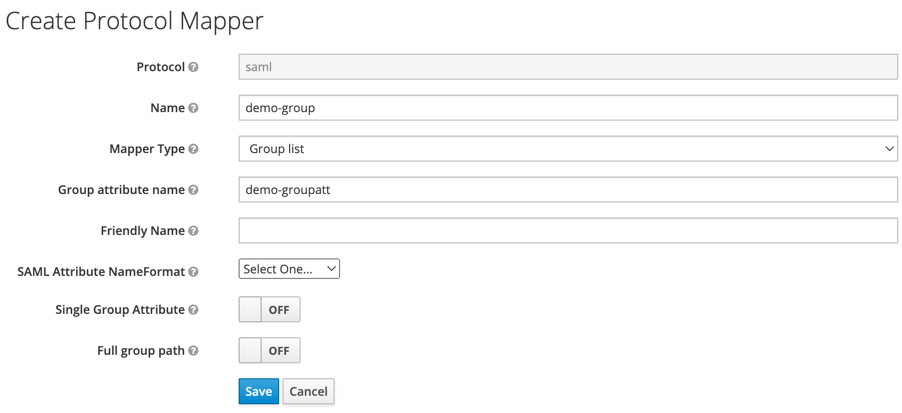

The **Group** configuration step is critical because it will ensure that KeyCloak sends the groups the user belongs to as part of the SSO process. The controller uses the group information to transparently map users to the correct group/role.

---

## Step 7: Specify IdP Metadata

Copy the "Identity Provider Metadata" URL from the KeyCloak App using the below steps

- Open the **Realm Settings** page in the KeyCloak app
- Click on the Endpoints **SAML 2.0 Identity Provider Metadata** available in the General settings page

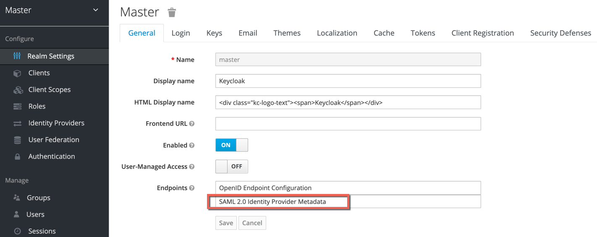

- Copy the URL and navigate back to the Web Console's IdP configuration wizard

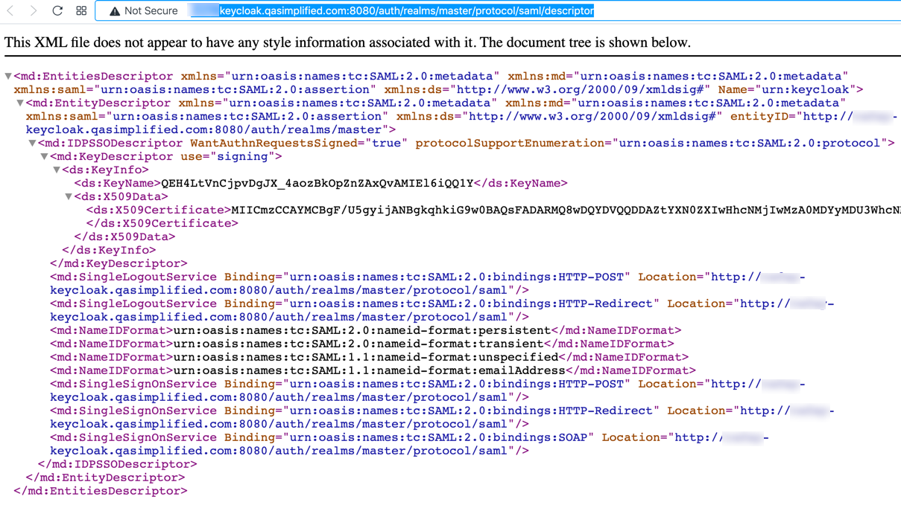

- Paste the Identity Provider Metadata URL from KeyCloak and click **Save & Exit** to complete the IdP Registration

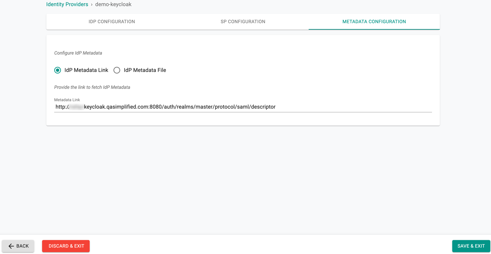

- Once this process is complete, you can view details about the IdP configuration on the Identity Provider page.
- You can also edit and update the configuration if required.  

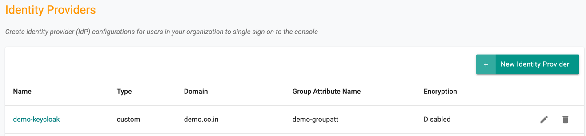

---

## Step 8: Assign Users and Groups

Once your Org and KeyCloak are integrated using the steps documented above, customers need to create and assign "Groups" in KeyCloak to the application. Multiple KeyCloak users can be added/removed from this group.

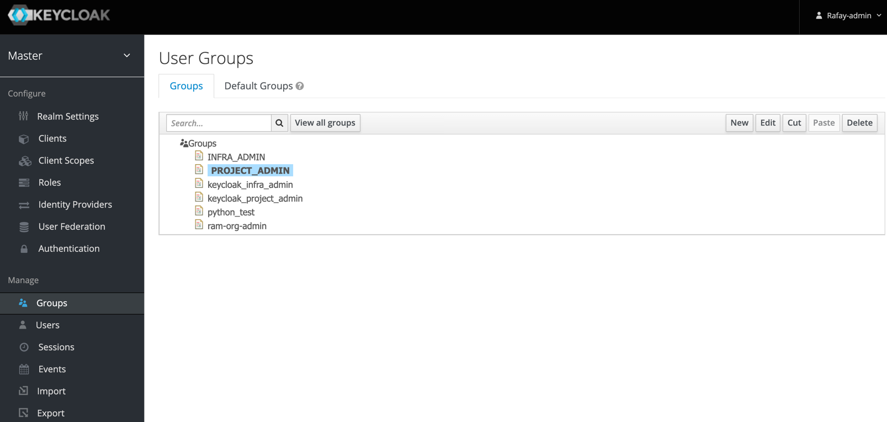

An identically named group needs to be created on your Org. Ensure that this group is mapped to the appropriate Projects with the correct privileges.

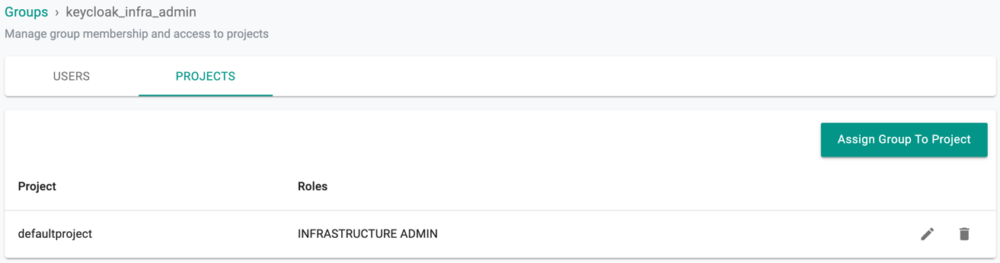

It is important to add user(s) to the KeyCloak group(s).

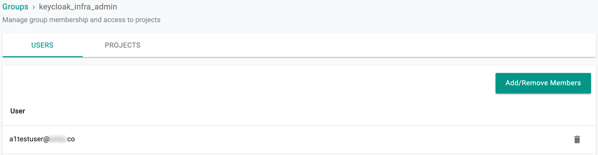

---
