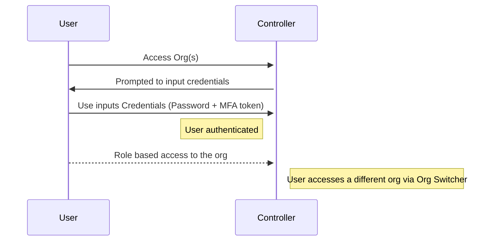
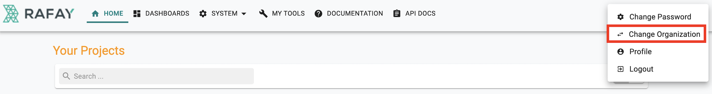
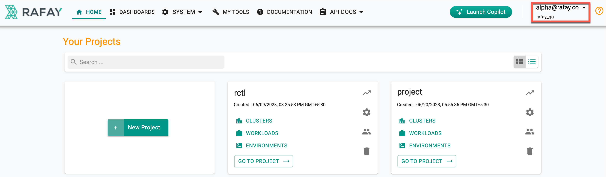
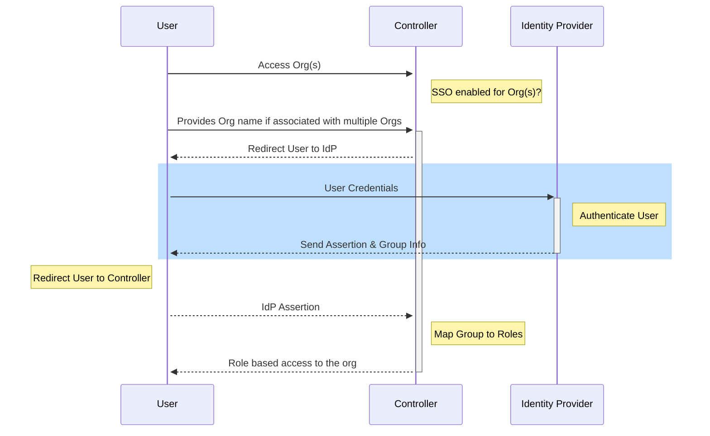
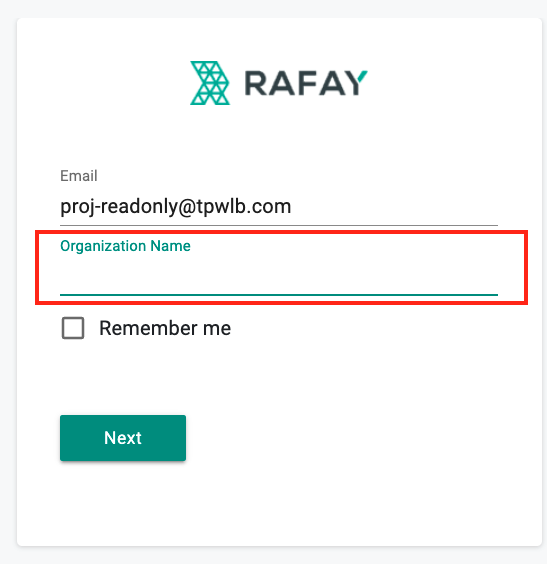
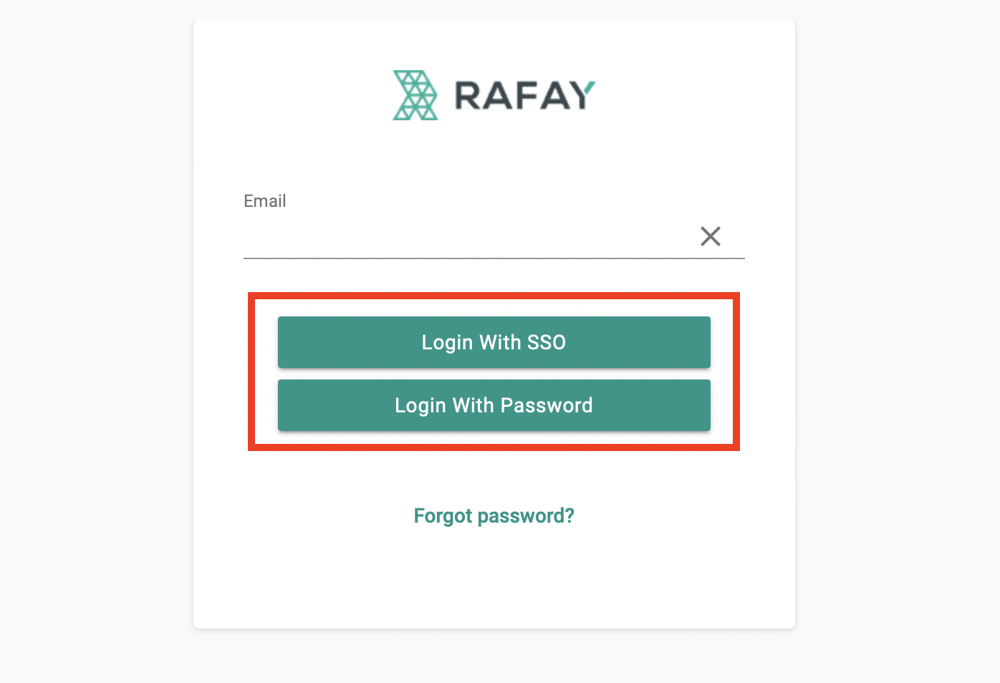
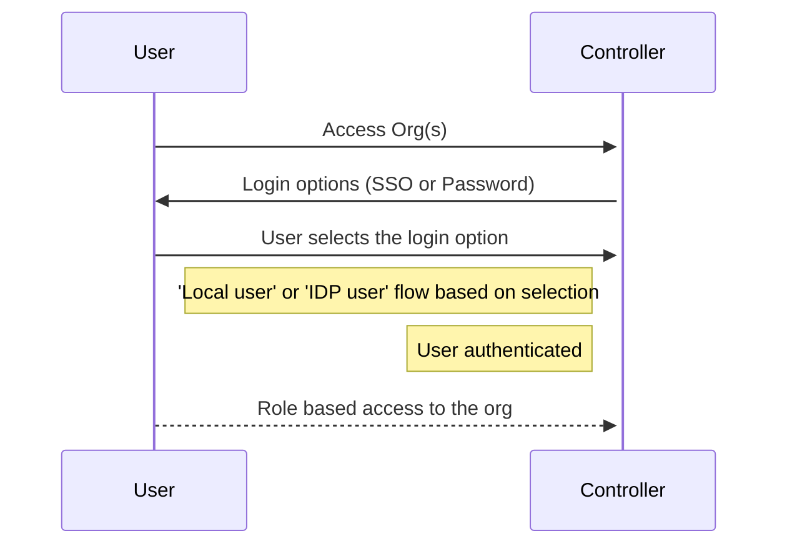

Customers can:

- Manage users, groups and roles locally in the Org (Tenant), these are referred to as **local users**

AND/OR

- Integrate their Org(s) with their corporate Identity Provider (IDP) via SAML 2.0. Users leveraging the SSO based login process are referred to as **IDP users**. The user's role in this case is determined by the assertion sent from the IdP.

There could be scenarios where a customer may require multiple orgs (tenants) to be set up and users may need to access one or more of these orgs (tenants). As an example, customer may use one org (tenant) for Production Clusters and another org (tenant) for testing or training purposes.

The section below documents the login experience under various scenarios when users are attached to multiple orgs.

---

## Local user for multiple orgs

If the user is a local user for multiple orgs, the controller prompts the user to input the password credentials (and MFA token if enabled) on login. After the user successfully logs in, the user can navigate to/access a different org using the 'Org switcher'.

---

## Name of the Org

To find the current organization of a user:

- Login to the Rafay Console
- Look in the top right corner of the console below the user ID to view the current org
- To switch from the current organization to another, click the expandable arrow next to the user ID and select the desired organization

---

## IDP user for multiple orgs

If the user is an IDP user for multiple orgs:

- For the Service Provider Initiated flow, the user is prompted to input the Org name on selecting ***Login with SSO***. The user is then redirected to the configured Identity Provider (IdP) for authentication and optional authorization. The resulting assertion is then forwarded to the controller which uses the provided details to calculate the user's role.

If the user wants to switch to a different org, the user has to log out and log back in.

- For the IdP initiated flow, the user experience is the same as what it would be if the user were to be associated with only one org. The user clicks on the IDP app (corresponding to the org that the user wants to access) and is redirected to the controller by the IdP. An assertion is forwarded to the controller which uses the provided details to calculate the user's role.

!!! Note
	It is recommended that System admins provide user friendly names for the IdP apps (for the various orgs/tenants) to ensure an intuitive login experience for end users

---

## Local user for some orgs and IDP user for others

If the user is a local and IDP user across multiple orgs, the user is provided with both 'Login with SSO' and 'Login with Password' options for authentication.

- To access org(s) as an IDP user, the user can select the 'Login with SSO' option. The user is then led through the workflow outlined [here](#idp-user-for-multiple-orgs)

- To access org(s) as a local user, the user can select the 'Login with Password' option. The user is then led through the workflow outlined [here](#local-user-for-multiple-orgs)

!!! Note
	The orgs that users can access as an IDP user or a local user is controlled by the System admin

---
