Follow the steps documented below to integrate your Org and Okta Organizations for Single Sign On (SSO).

!!! important
	Only users with "Organization Admin" privileges can configure SSO in the Web Console.

----
## Step 1: Create IdP

- Login into the Web Console as an Organization Admin
- Click on System and IdPs
- Click on "New IdP"
- Provide a name, select "Okta" from the drop down
- Enter the "domain" for which you would like to enable SSO

!!! Important
	Within an org, the domain of an IdP cannot be used for another IdP. A domain existing in an org can be used in multiple orgs (for one IdP in each org)

- Enter a domain admin email address.
	- After saving the Identity Provider, an email is sent to the IdP Admin. The IdP Admin must verify the web console Identity Provider by clicking the link in the email.
- Optionally, toggle "Encryption" if you wish to send/receive encrypted SAML assertions  
- Provide a name for the "Group" attribute
- Optionally, toggle "Include Authentication Context" if you wish to send/receive auth context information in assertion
- Click on Save & Continue

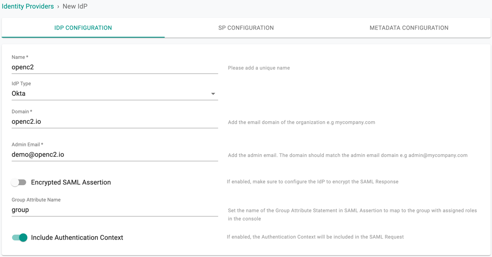

!!! Important
	Encrypting SAML assertions is optional because privacy is already provided at the transport layer using HTTPS. Encrypted assertions provide an additional layer of security on top ensuring that only the SP (Org) can decrypt the SAML assertion.

---
## Step 2: View SP Details

The IdP configuration wizard will display critical information that you need to copy/paste into your Okta Org. Provide the following information to your Okta administrator.

- Assertion Consumer Service (ACS) URL  
- SP Entity ID
- Name ID Format

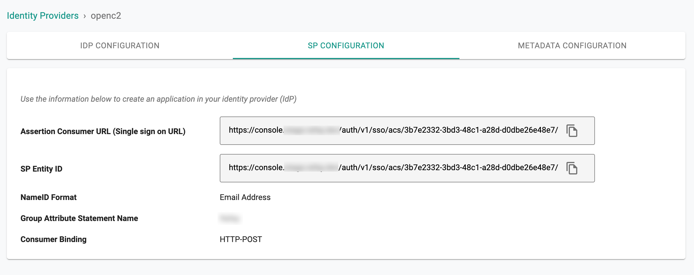

---

## Step 3: Create App in Okta

- Login into your Okta Org as an Administrator
- Select Applications and Create a New App
- Select "SAML 2.0" for Sign on method
- Click on Create

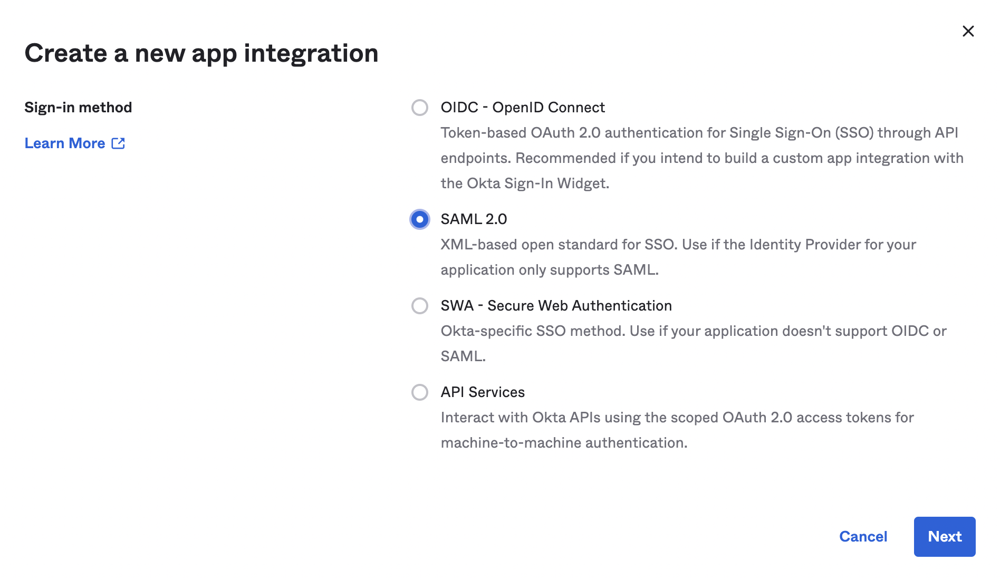

---

## Step 4: General Settings

In step 1 of the application configuration wizard

- Provide an App Name for the Web Console
- Upload the Logo

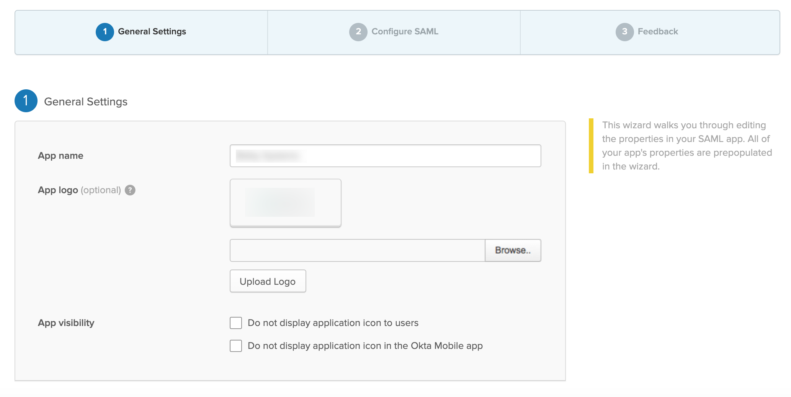

---

## Step 5: Configure SAML

In step 2 of the application configuration wizard

- Copy/Paste the ACS URL from Step 2 into the "Single sign on URL"
- Copy/Paste the SP Entity ID from Step 2
- Select "Email Address" in the Name ID format dropdown

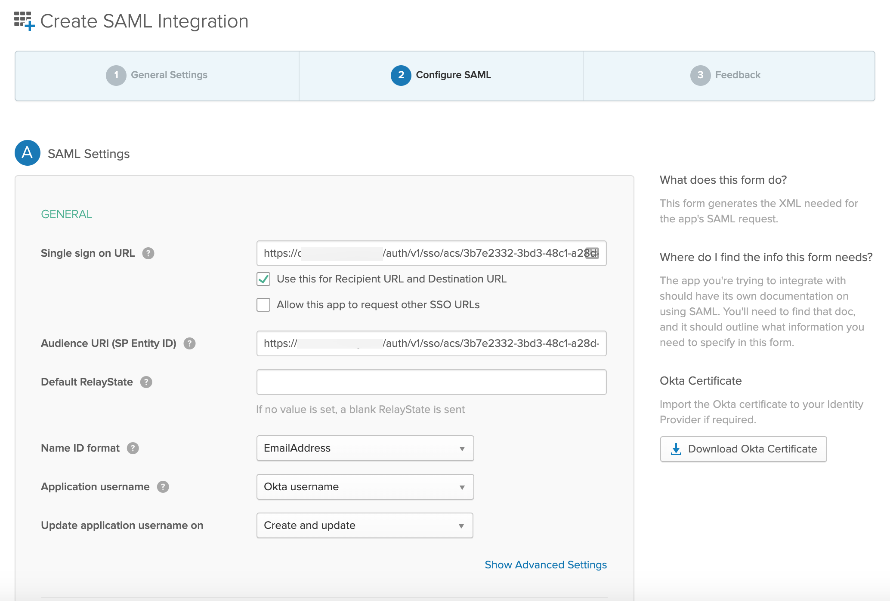

In the Group Attribute Statements section,
- Provide the name for the "Group", select the "Matches regex" filter and ".*" for the value.

The "Group" configuration step is critical because it will ensure that Okta will send the groups the user belongs to as part of the SSO process. The controller uses the group information to transparently map users to the correct group/role.

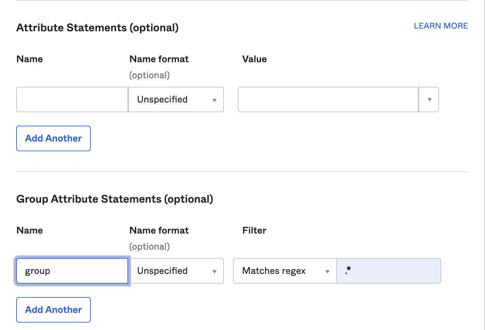

!!! Important
        Use same Group Attribute Name provided in Create IdP section(step 1).

Complete the Feedback portion of the Okta app wizard.

---

## Step 6: Specify IdP Metadata

Copy the "Identity Provider Metadata" URL from the App

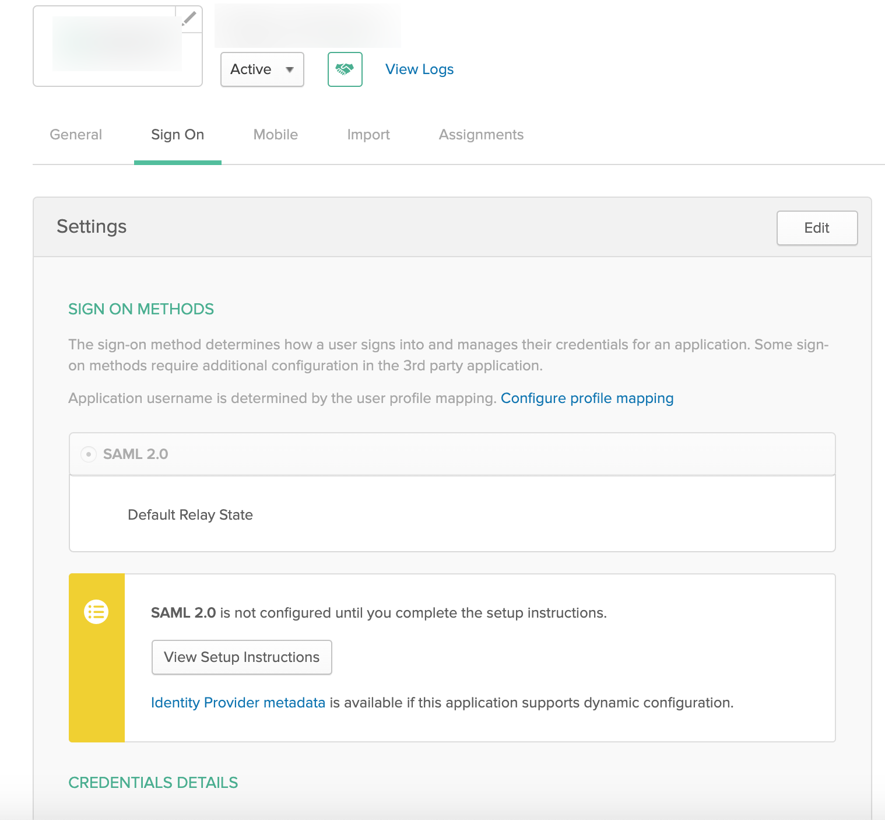

- Navigate back to the Web Console's IdP configuration wizard
- Paste the Identity Provider Metadata URL from Okta
- Complete IdP Registration

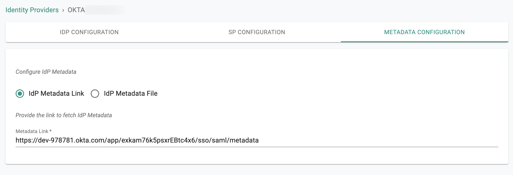

- Once this process is complete, you can view details about the IdP configuration on the Identity Provider page.
- You can also edit and update the configuration if required.  

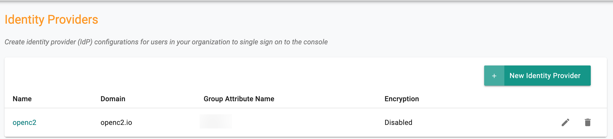

---

## Step 7: Assign Users and Groups

Once your Org and Okta are integrated using the steps documented above, customers need to create and assign "Groups" in Okta to the application. Multiple Okta users can be added/removed from this group.

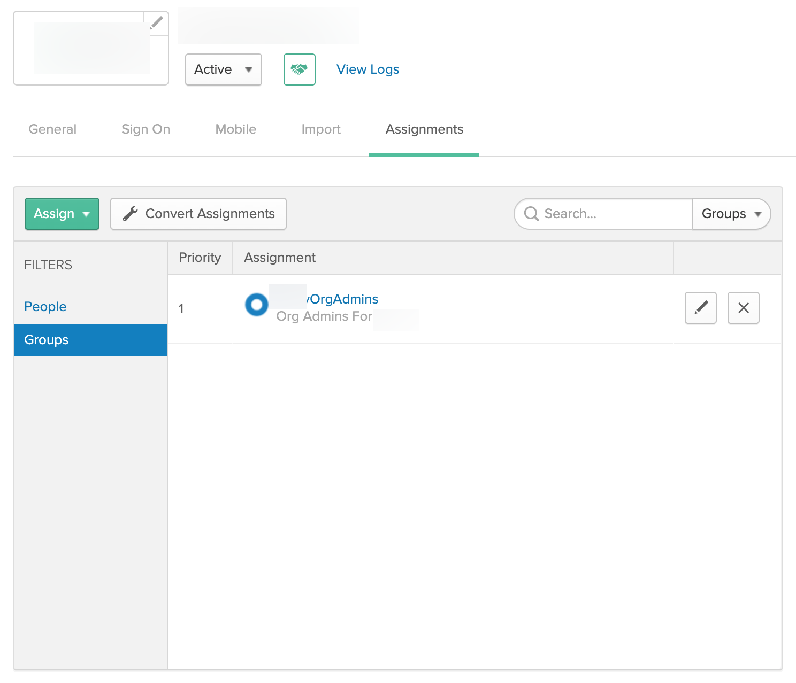

An identical named group needs to be created on your Org. Ensure that this group is mapped to the appropriate Projects with the correct privileges.

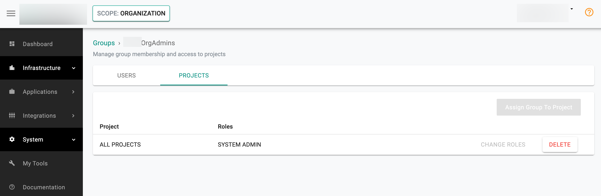

It is important to emphasize that because of SSO via Okta, user lifecycle management can be completely offloaded to the IdP. In the example below, note that there are no users managed in this group because they are all managed in the attached Okta Org.

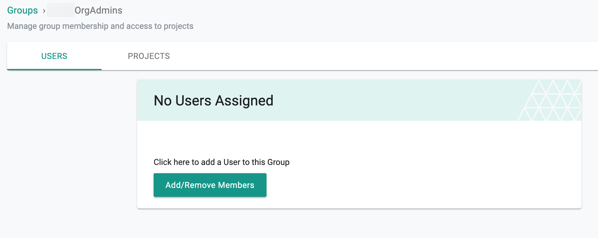

---
