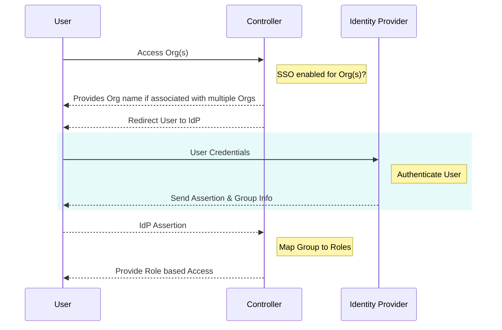

System administrators can integrate their environment with their corporate Identity Provider (IdP) via SAML 2.0.

The SSO login process validates the user's credentials against the corporate user directory managed by the Identity Provider (IdP). A successful validation ensures that users can access the console without a separate login.

The integration with SAML 2.0 IdPs supports both IdP and SP initiated flows.

!!! important
	Only privileged users with the **System Admin** role are authorized to view, configure, and manage this setting.

---

## How SSO Works

The platform supports SSO by implementing federated authentication using Security Assertion Markup Language (SAML) version 2.0.

To enable SSO, a system administrator must configure the environment to work with the Identity Provider (IdP). The IdP maintains a record of all usernames and their passwords in an encrypted format.

For every login attempt, the console sends SAML requests to the configured IdP login URL. The IdP validates the request and sends a SAML assertion back to the console.

---

### Service Provider Initiated Flow

With the SP initiated flow, the user accesses the console first and is redirected to the configured Identity Provider (IdP) for authentication and optional authorization.  

---
