Follow the steps documented below to integrate your Org and PingOne Tenant for Single Sign On (SSO).

!!! important
	Only users with "Organization Admin" privileges can configure SSO

----
## Step 1: Create IdP in Console

- Login into the Web Console as an Organization Admin
- Click on System > Identity Providers
- Click on "New Identity Provider"
- Provide a Name, select "Ping" from the drop down
- Enter the "Domain" for which you would like to enable SSO

!!! Important
	Within an org, the domain of an IdP cannot be used for another IdP. A domain existing in an org can be used in multiple orgs (for one IdP in each org)

- Enter a domain admin email address.
	- After saving the Identity Provider, an email is sent to the IdP Admin. The IdP Admin must verify the web console Identity Provider by clicking the link in the email.
- Optionally, toggle "Encrypted SAML Assertion" if you wish to have SAML assertions encrypted  
- Provide a "Group Attribute Name" for the name of group attribute statement in SAML Assertions to map to the Group with assigned roles in Web console  
- Optionally, toggle "Include Authentication Context" if you wish to send/receive auth context information in assertion
- Click on Save & Continue

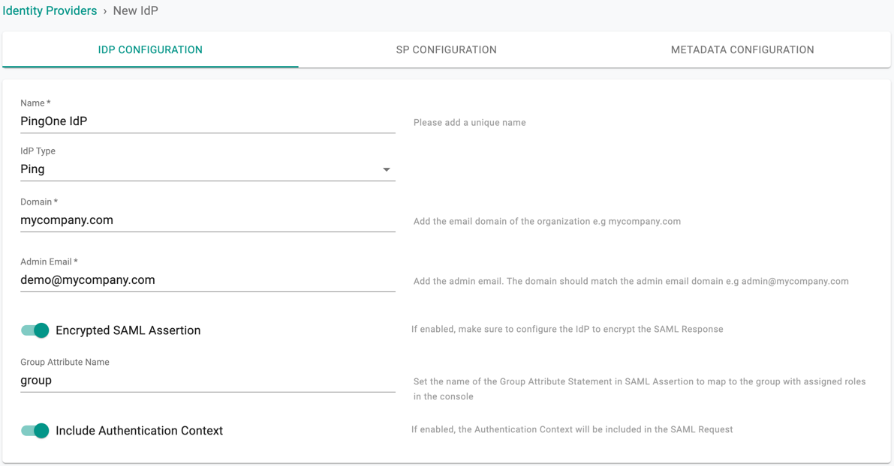

!!! Important
	Encrypting SAML assertions is optional because privacy is already provided at the transport layer using HTTPS. Encrypted assertions provide an additional layer of security on top ensuring that only the SP (Org on Controller) can decrypt the SAML assertion.

---
## Step 2: View SP Details

The IdP configuration wizard will display critical information that you need to copy/paste into your PingOne SAML application . Provide the following information to your PingOne administrator.

- Assertion Consumer Service (ACS) URL  
- SP Entity ID
- NameID Format
- Encryption Certificate (if Encrypted SAML Assertion enabled)
- Group Attribute Statement Name
- Consumer Binding
- Click on Save & Continue to go to Metadata Configuration page

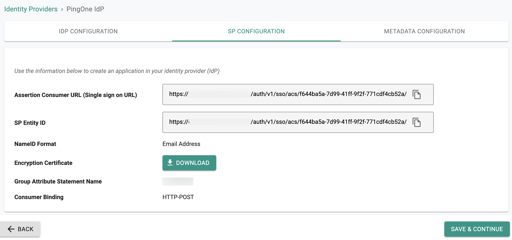

---

## Step 3: Create Application in PingOne

- Login into your PingOne as an Administrator
- Go to Applications > My Applications > SAML
- Click Add Application and select New SAML Application

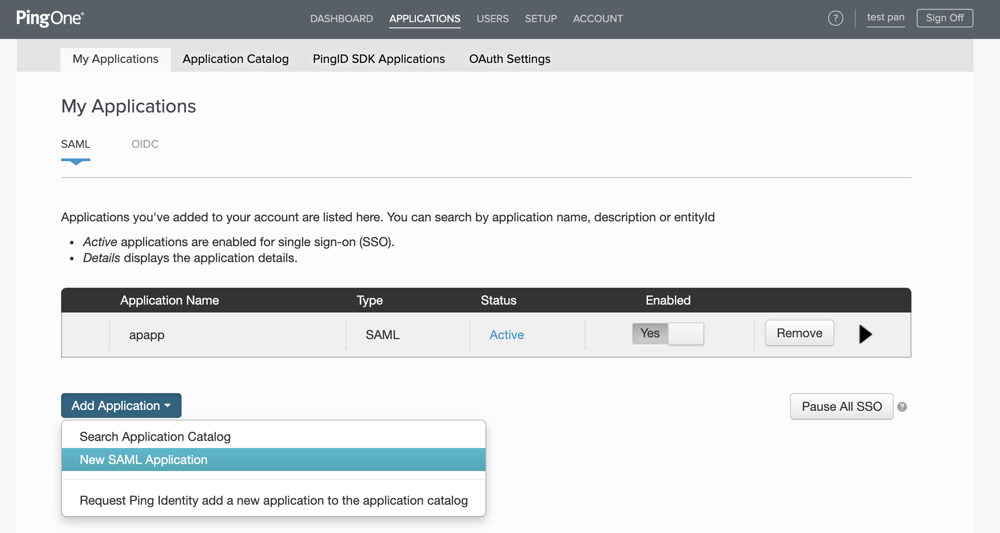

---

## Step 4: Configure Application Details in PingOne

In the Application Details page:

- Provide an App Name for the Web Console
- Upload the Logo
- Click Continue to Next Step

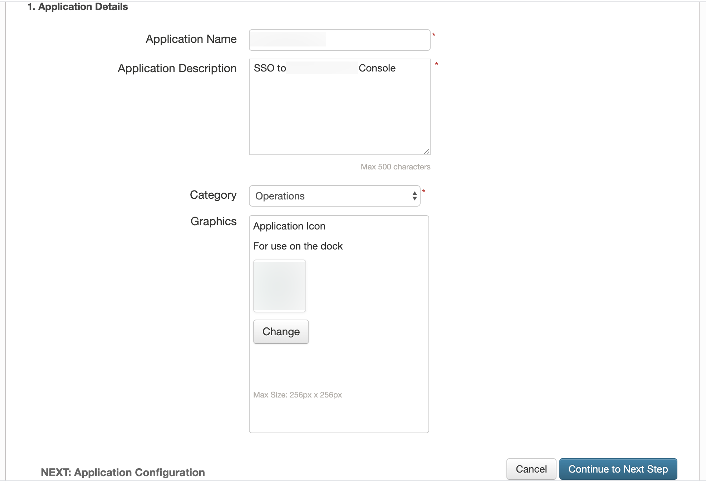

---

## Step 5: Configure SAML Application in PingOne

In the Application Configuration Page:

- Select "SAML v 2.0" for Protocol Version
- Copy/Paste the Assertion Consumer Service URL from Step 2 into the "Assertion Consumer Service (ACS)"
- Copy/Paste the SP Entity ID from Step 2 into the "Entity ID"

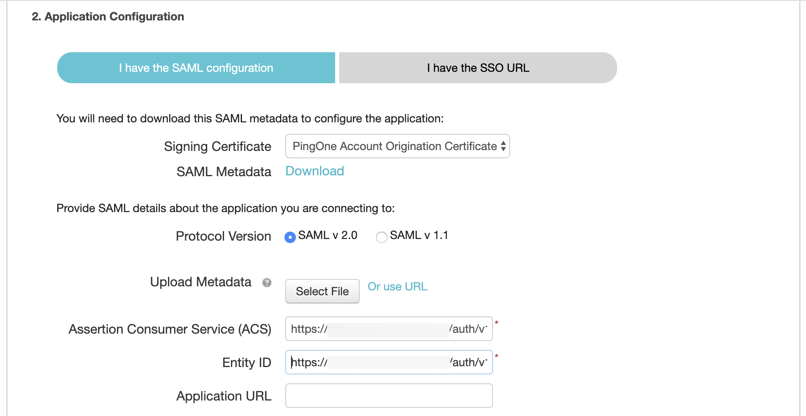

If Encrypted SAML Assertion is enabled in Step 1,

- Enable "Encrypt Assertion"
- Upload the downloaded Encryption Certificate in Step 2 to "Encryption Certificate"

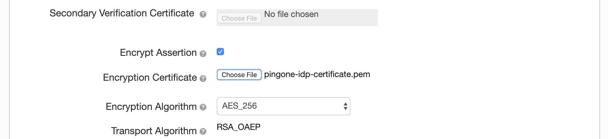

- Click Continue to Next Step

---

## Step 6: Configure SSO Attribute Mapping for Group in PingOne

In SSO Attribute Mapping page:

- Provide the Group Attribute Statement Name value from Step 2 for the "Application Attribute"
- Select "memberOf" from "Identity Bridge Attribute or Literal Value" list

The SSO Attribute Mapping configuration step for Groups is critical because it will ensure that PingOne will send the groups the user belongs to as part of the SSO process. We use the group information to transparently map users to the correct group/role.

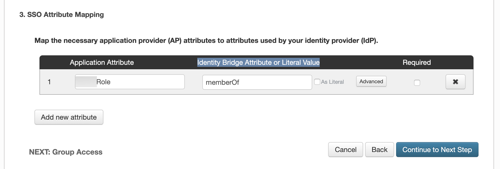

---

## Step 7: Configure SSO Attribute Mapping for sending user's email as NameID in PingOne

The current SSO works with only the email address format for the users in NameID of the SAML Subject.
In PingOne, make sure to configure SAML Subject to use Email in the SSO Attribute Mapping page:

- Add a new attribute
- Provide "SAML_SUBJECT" for the "Application Attribute"
- Select "Email" from "Identity Bridge Attribute or Literal Value" list
- Click Continue to Next Step to to to Group Access Page

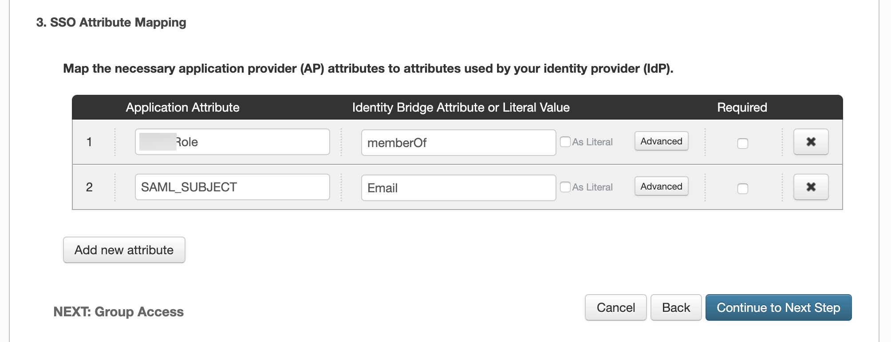

---

## Step 8: Assign Groups to Application in PingOne

In Group Access page:

- Search and Add the groups that you would like the users to have access to Web Console
- Click Continue to Next Step to Review setup

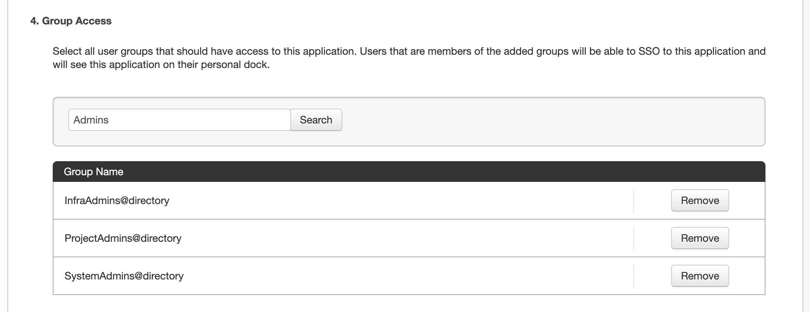

In the example above, the PingOne group "SystemAdmins" has been assigned to the Application in PingOne. Multiple PingOne users can be added/removed from this group.

An identical named group needs to be created in your Org. Ensure that this group is mapped to the appropriate Projects with the correct privileges. In the example below, the Group "SystemAdmins" is configured as an "Organization Admin" with access to all Projects.

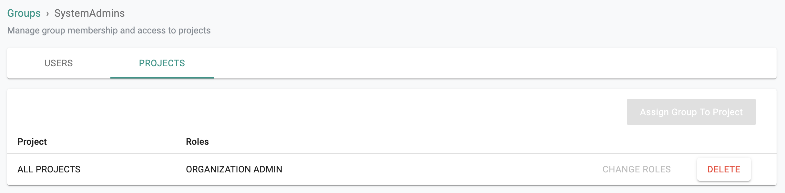

It is important to emphasize that because of SSO via PingOne, user lifecycle management can be completely offloaded to the IdP. In the example below, note that there are no users managed in the "SystemAdmins" group because they are all managed in the attached PingOne Org.

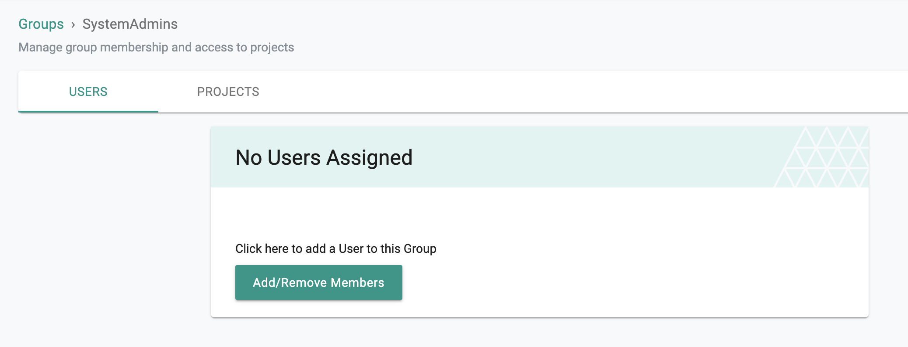

---

## Step 9: Specify IdP Metadata URL

In PingOne Review setup page:

- Save the SAML Metadata URL to configure in Web Console at next step
- Click Finish to complete the settings in PingOne

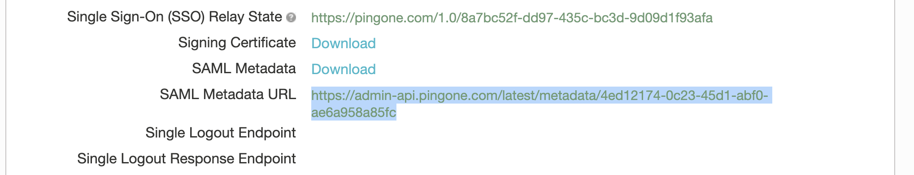

- Navigate back to the Web Console's IdP Metadata Configuration page
- Paste the SAML Metadata URL from PingOne to the Metadata Url textbox
- SAVE the IdP Settings

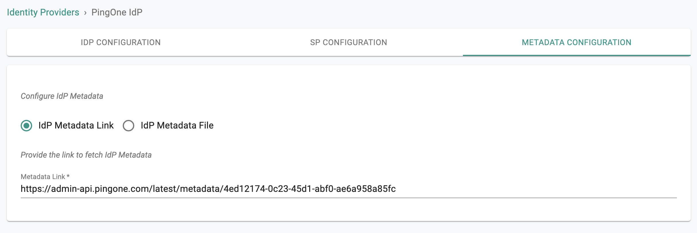

---
