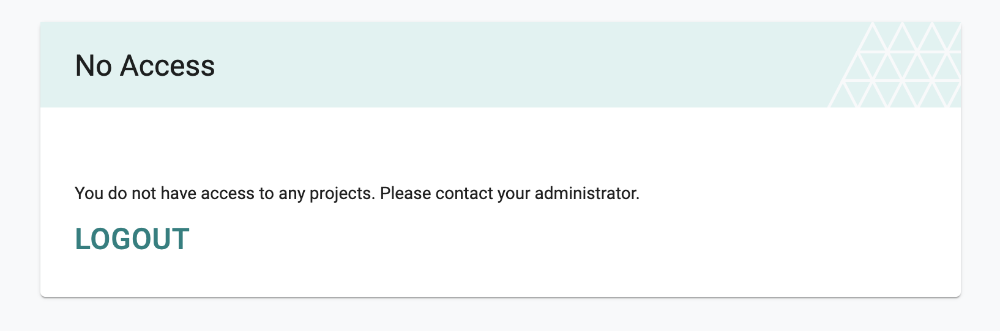
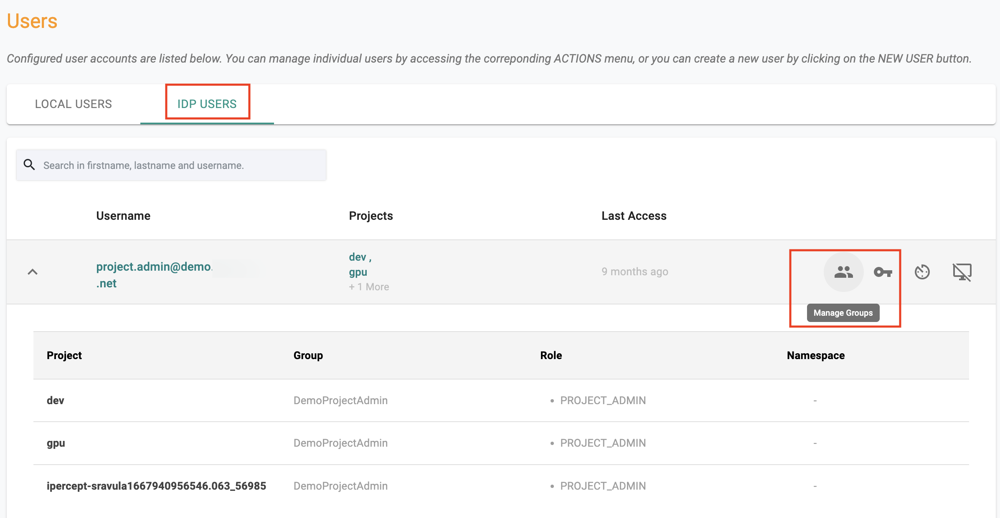
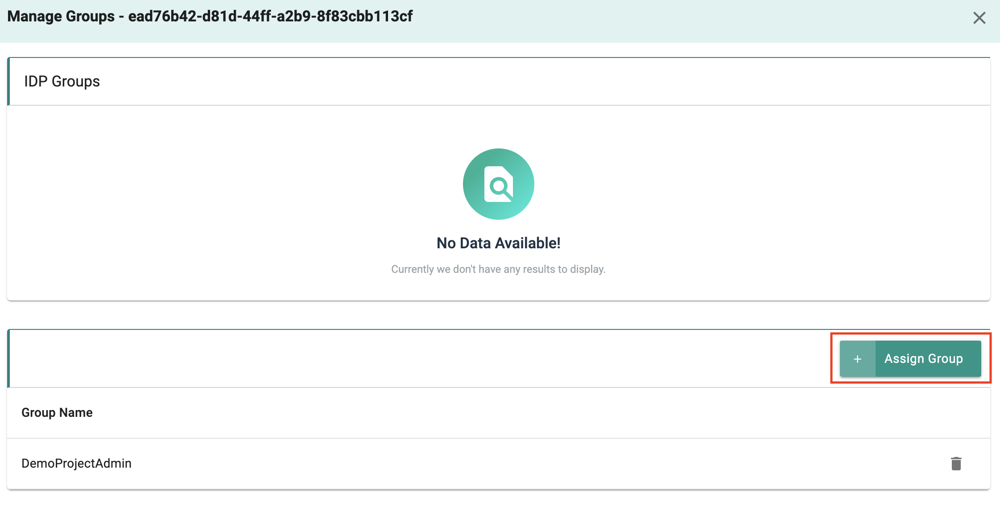
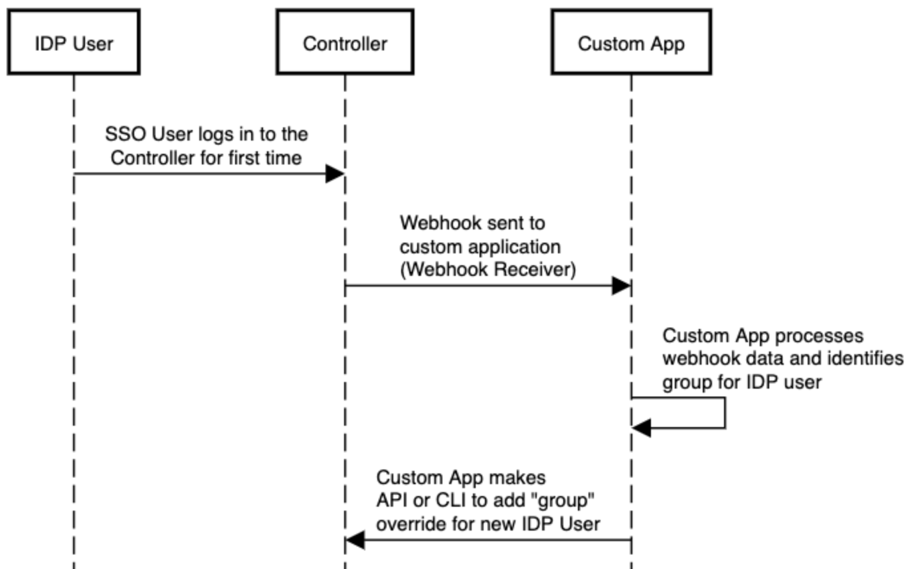
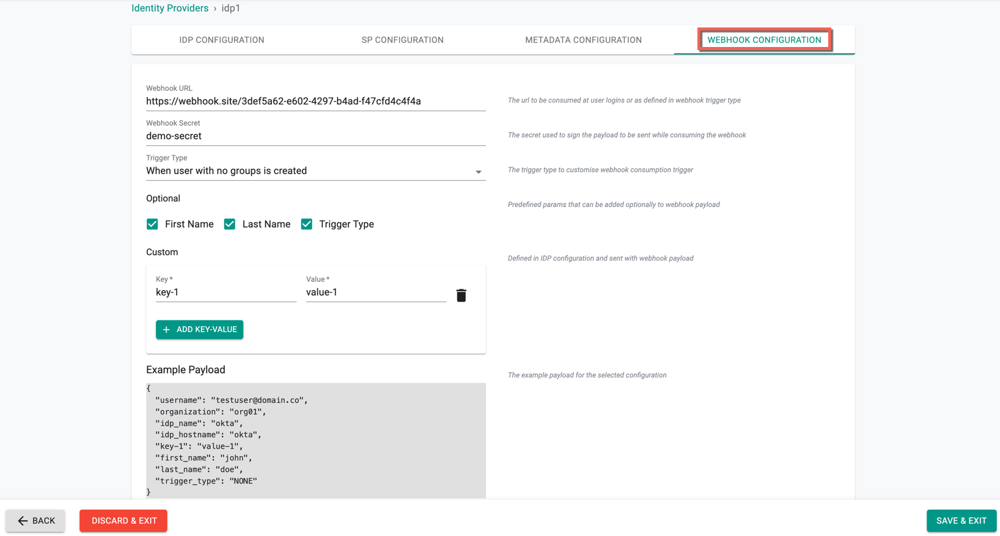

It is common for organizations to require users to access the platform via **Single Sign-On (SSO)** using their corporate **Identity Provider (IdP)**.  

Normally, the IdP sends both **authentication** and **authorization (group/role mapping)** details. However, in cases where the IdP cannot send group information, users may be authenticated but left without any role or access.  

As an **Organization Admin**, you can configure **webhooks** to automatically handle such scenarios by assigning groups to new IdP users.

---

## Handling New IDP Users (Override Groups)

When an IdP user logs into the platform for the **first time** without group mapping, they will have **no access**.  

  

As an admin, you can manually assign group overrides:

1. Navigate to **System → Users → IDP Users**.  
2. Select the IdP User.  
  
3. Click on **Manage Group**.  
4. Add the required **group overrides**.  
  

---

## Turnkey Automation

To eliminate manual work, admins can configure **webhooks** that trigger automation workflows.  

With this approach:  
- A webhook is triggered when a new IdP user logs in.  
- A custom app (using **APIs, CLI, or Terraform Provider**) automatically adds group overrides.  

  

This provides **end-to-end automation**, ensuring users immediately receive the correct role assignments.


---

## Prerequisites For Admins

- **Webhook URL:** Endpoint for receiving webhook events.  
- **Webhook Secret:** Used to sign webhook payloads.  
- **Webhook Trigger Type:** Choose based on when you want automation to occur.  
- **Webhook Payload (Optional):** Provide metadata fields or custom key-value pairs, e.g.  

```json
{
  "optional_fields": ["first_name"],
  "custom_payload": {
    "key1": "value1",
    "key2": "value2"
  }
}
```

---

## Webhook Setup

1. Log in to the web console as an **Organization Admin**.  
2. Navigate to **System → Identity Providers**.  
3. Click on **New Identity Provider** → select **Webhook Configuration**.  
4. Provide:  
   - **Webhook URL**  
   - **Webhook Secret**  
   - **Webhook Trigger Type**  
5. (Optional) Add **First Name, Last Name**, or custom key-value pairs for payload enrichment.  

You can preview the **example payload** before saving.  

  

---

## Webhook Triggers

Admins can configure when webhooks should be triggered:  

- **None:** Never generate webhooks.  
- **When users with no group are created:** Triggered only the first time an IdP user without groups is created.  
- **When users with no groups log in:** Triggered for both first-time and repeated logins.  
- **When SSO user logs in:** Triggered on **every login** attempt via IdP.  

!!! Important  
Admins can limit webhook triggers to specific scenarios. For example, only send when a **new IdP user** is detected.


----

## Webhook Setup

1. Log in to the web console as an **Organization Admin**.  
2. Navigate to **System → Identity Providers**.  
3. Click on **New Identity Provider** → select **Webhook Configuration**.  
4. Provide:  
   - **Webhook URL**  
   - **Webhook Secret**  
   - **Webhook Trigger Type**  
5. (Optional) Add **First Name, Last Name**, **Trigger Type**, and **Custom key-value pairs** for payload enrichment.  

Preview the **example payload** before saving.  

  


### Webhook Triggers

Admins can configure when webhooks should be triggered:  

- **None:** Never generate webhooks.  
- **When users with no group are created:** Triggered only the first time an IdP user without groups is created.  
- **When users with no groups log in:** Triggered for both first-time and repeated logins.  
- **When SSO user logs in:** Triggered on **every login** attempt via IdP.  

!!! Important
	Administrators can optionally configure webhooks to be sent ONLY when certain scenarios are encountered. For example, admins may wish to limit this to only when a new IDP user is seen by the platform.

---
