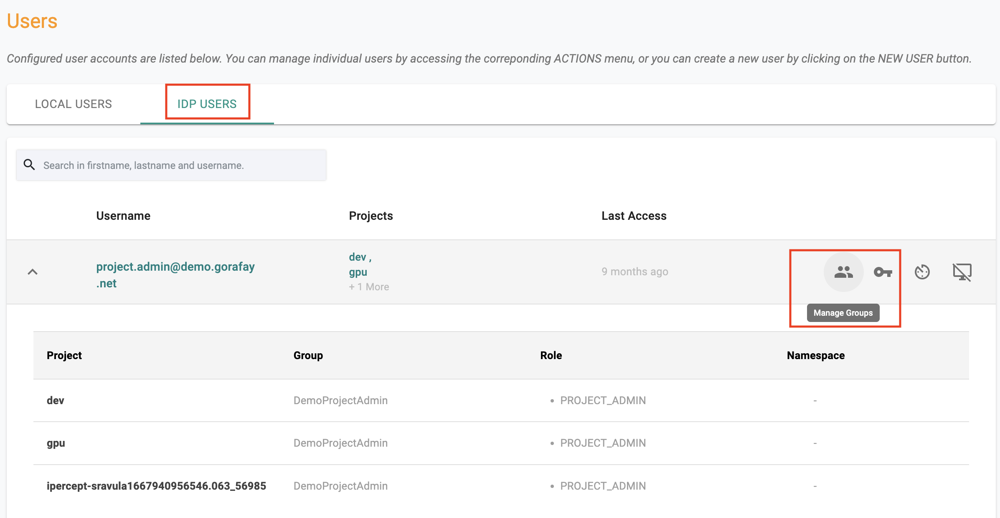

It is very common for organizations to require users to access the platform via Single Sign On (SSO) by authenticating with their corporate Identity Provider (IdP).

The ideal IdP configuration will send an assertion that will include BOTH "authentication" and "authorization" (i.e. group) details. The "group" information allows the platform to seamlessly map the user to specific roles providing "Role based Access Control".

Sometimes, organizations are "unable to configure" their IdP to send "group" information to the platform as part of the SSO process. In these cases, although the user can be successfully authenticated into the platform, they will not have access to anything in the platform because a "role" cannot be automatically assigned.

---

## Override Groups

When a IDP user logs into the platform for the **"very first time"**, they will be put in a waiting room with no access to any projects or resources in the platform because the platform has no "role" assigned.

The "new" IDP user has to contact the administrator and request to be added to specific groups. Administrators can easily add "overrides for groups for IdP users" once the IdP user has logged in "at least once" into the platform.

- Navigate to System -> Users -> IDP Users
- Select the IDP User

- Click on "Manage Group"
- Follow the process to add a "group override" for the IDP user

---

## Turnkey Automation

The workflow described above is a very manual, time consuming process for both the end user and the administrator and therefore impractical to perform at scale.

Organizations can leverage the webhooks to perform "end-to-end automation" where the "group" information for the new IDP user can be programmatically added to the controller literally immediately after the user successfully logs in. An illustrative workflow is shown below.

The "custom app" can utilize one of the following mechanisms to perform the workflow automation to automate the "addition" of group overrides for the new IDP user.

- Platform APIs
- RCTL CLI
- Terraform Provider

---

## Prerequisites
The below parameters can be specified for the webhook configuration

### Mandatory
These fields are required.

- **Webhook URL:** Used during user logins or per the webhook trigger type

- **Webhook Secret:** When consuming the webhook, the payload is signed using this secret

- **Webhook Trigger Type:** To customise the webhook consumption trigger

### Optional

- **Webhook Payload:** A collection of optional fields and custom key-value pairs. Example: {“optional_fields”: [“first_name“], “custom_payload”:{“key1”:”value1”,“key2”:”value2”}}

The payload can provide useful metadata that the webhook receiver can use to make decisions.

----

## Webhook Configuration

- Login into the web console as an Organization Admin
- Click on **System -> Identity Providers**
- Click on **New Identity Provider** and select **Webhook Configuration**
- Provide the **Webhook URL** and **Webhook Secret**
- Select the required **Trigger Type** from the drop-down

	- **None:** Webhooks are never generated

	- **When users with no group is created:** Triggered when an IDP user with no groups configured accesses the platform for the very first time.

	- **When user with no groups logs in:** Triggered when an IDP user without group association logs into the platform. This can be the first time or for subsequent access as well.

	- **When SSO user logs in:** Triggered every time an IDP user logs into the platform.

- Optionally, select the First Name, Last Name, and Trigger Type
- Optionally, add one or more key-value pair(s)

Once all the details are selected, users can view the example payload as shown below

!!! Important
	Administrators can optionally configure webhooks to be sent ONLY when certain scenarios are encountered. For example, admins may wish to limit this to only when a new IDP user is seen by the platform.

---
