## Uniqueness

Every user in the Controller (across all Orgs) is associated with a unique email address. A user can be associated with one or more Orgs (tenants).

---

## Local vs SSO Users

Users can either be "Local Users" or "IdP Users".

### Local Users
- Lifecycle of these users is fully managed in the Controller.
- Typically limited to privileged super/root users such as Org Admins.
- Are locally authenticated by the controller.
- Ensure you enable and require MFA in your Org for all local users.

### IdP Users
- Lifecycle of these users is fully managed in the customer's Identity Provider (IdP).
- Typically for all non-privileged users such as developers, operations personnel etc.
- Authentication and MFA is performed by the configured Identity Provider such as Okta, Azure AD etc.

The sequence diagram below shows the high level workflow that can used to secure user access using MFA.

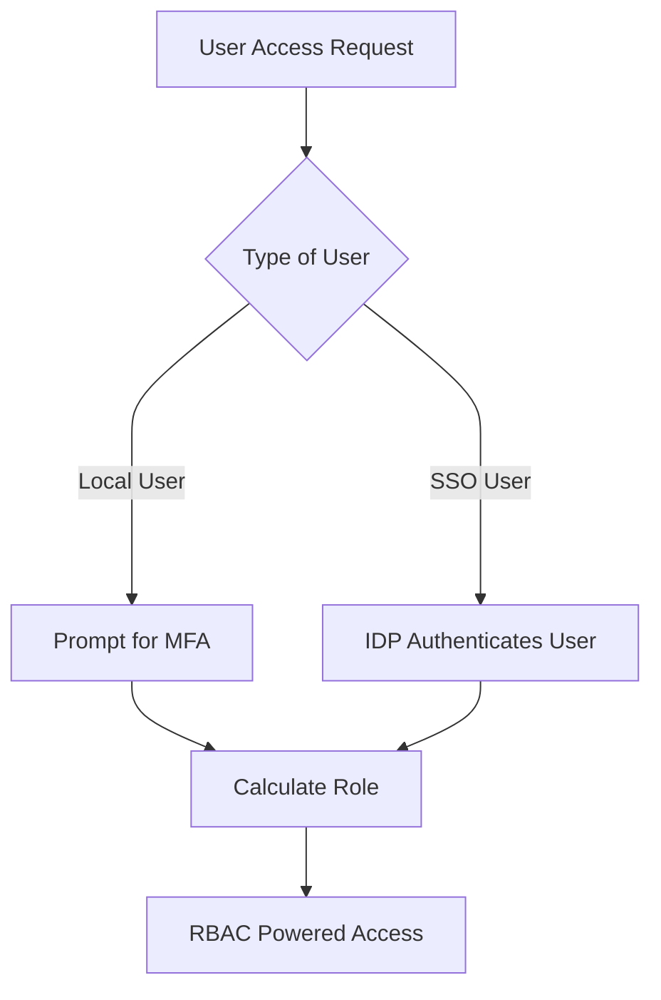
```mermaid
flowchart TD
    A[User Access Request] --> B{Type of User}
    B -->|Local User| C[Prompt for MFA]
    C --> E[Calculate Role]

    B -- SSO User ----> D[IDP Authenticates User]
    D --> E[Calculate Role]
    E --> F[RBAC Powered Access]
```

---

## User Profile

Users can access/view their configured profile.

- Click on the Email Address on the top right
- Select Profile

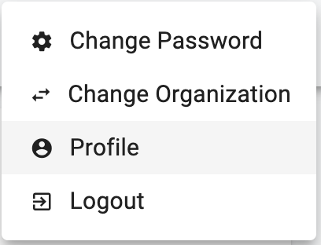

The user can now view their profile which describes what they are allowed to do on the platform.

### Example 1
In this example, the user has

- Access to All Projects in an Organization
- Has the Role "Organization Admin"

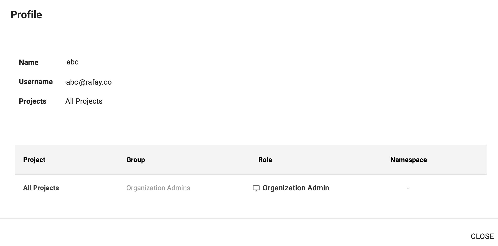

### Example 2
In this example, the user has

- Access to the projects "new" and "defaultprojectProject
- Assigned with Base Role and Custom Role

  - Base Role: "Workspace Admin" for "new" project
  - Custom Role: "cr1" for the "defaultproject" project, granting access to specific namespaces

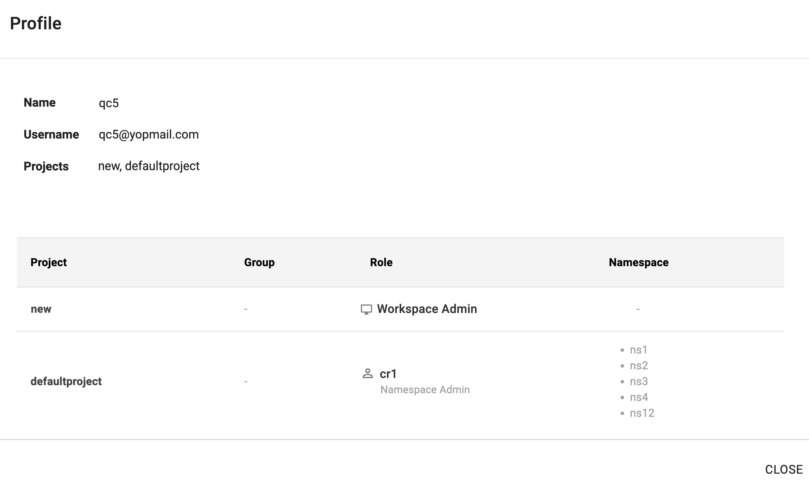

---

## Onboarding Users

The user onboarding workflows are different for Local versus SSO Users. Only "Organization Admins" have the privileges to handle user lifecycle management.

### Local Users

Every user in the Controller is associated with a unique email address. Users in an Org can have email addresses from different domains. This can be critical for Organizations that may

(a) Outsource operational tasks to a 3rd party entity especially for 24x7 coverage.

(b) Be required to provide Read Only access to an external auditor.

An admin of an existing Org can invite a new user to their Org. The new user is sent an email with a "temporary password" and instructions on how to access the Application Console.  After logging in with the temporary password, the user will be required to create a new password for their account.

The temporary password is valid only for 72-hours.

---

### SSO Users

Users that will access the Console are managed in the configured Identity Provider (IdP). Follow the documentation for SSO Integration for exact steps.

---

### Machine Users

Users that only need to access the Controller programmatically using the APIs or CLI. This is well suited for CI systems such as Jenkins etc that will use the RCTL CLI to interact with the  Controller.

- As an Org Admin, navigate to the Users menu under System
- Create New User
- Ensure "Console Access" is disabled
- Provide a username

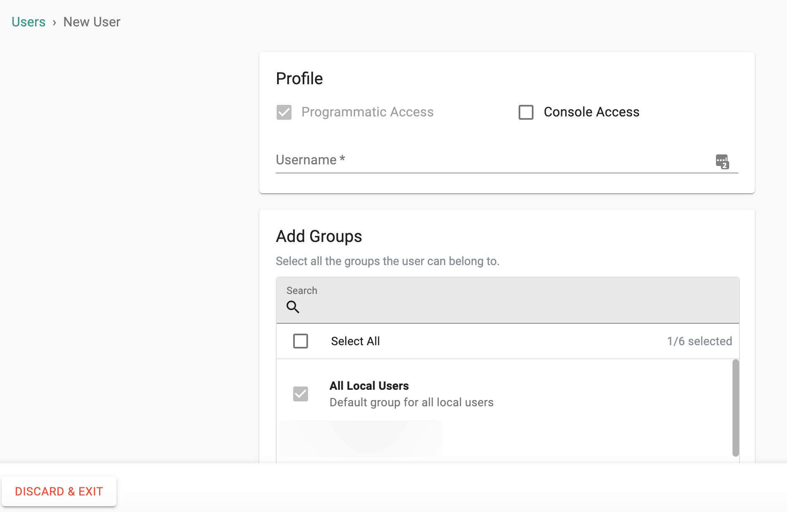

To generate and download the "Access Key" for the machine user, as an Org Admin

- Click on "Manage Keys"
- Copy/Paste the generated Access Key
- Configure the RCTL CLI and test access to the controller

---

## Password Policy

As a best practice, align with **NIST's Digital Identity Guidelines** i.e. [SP 800-63B](https://pages.nist.gov/800-63-3/sp800-63b.html). An organization typically uses multiple applications, so it makes sense to [centralize access policy](../../integrations/sso/overview.md) by integrating the platform with the organization's Identity Provider.

For local users,

- Minimum password length of 8 characters.
- The reuse of previously used passwords is blocked.
- Passwords are salted and hashed using strong key derivation functions.
- Strongly recommend enabling the use of [MFA](mfa.md) org/tenant wide.
- User is automatically locked out after a specified number of consecutive failed attempts within the defined time period.
- Users are automatically logged out after the specified number of minutes of inactivity.

---

## Create Local Users

- As an Org Admin, navigate to the Users menu under System
- Provide the user's email address, first and last name
- Select the "Groups" the user needs to belong to

By default, all local users belong to the "local users" group. Although access to this group allows the user to login into the Console, they will not have access to any resources.

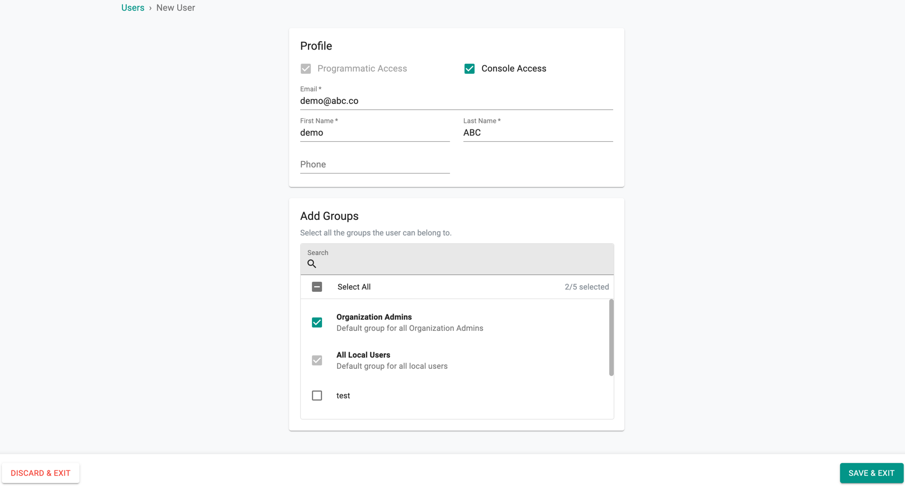

Visit [this page](https://docs.rafay.co/security/rbac/cli/) for User Management via CLI.

---

## Manage Local Users

Org Admins can view and manage the entire list of locally managed users in their Organization

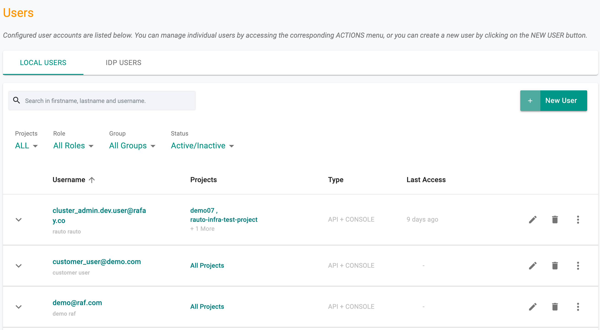

__Username__
The username column displays the unique email address the user has to use to access the Console and their full name if it was provided during user creation

__Projects__
This column displays all the Projects the user is authorized to access, the assigned role for the project and the group they belong to

__Type__
The column indicates the user's access type, determining whether they have access to both the API and console or only one of the two.

__Last Access__
This column displays the timestamp when the user last accessed the Controller.

---

## Authentication settings for local users

Navigating to **System → Settings** brings you to the Settings page, where administrators can manage key configuration options for the organization. This page provides various sections, accessible through the navigation panel on the left, to customize and control organizational policies and behaviors. Local users are authenticated and authorized by the Console, while SSO users, including administrators, are authenticated through an integrated Identity Provider (IdP), such as Okta or Ping.

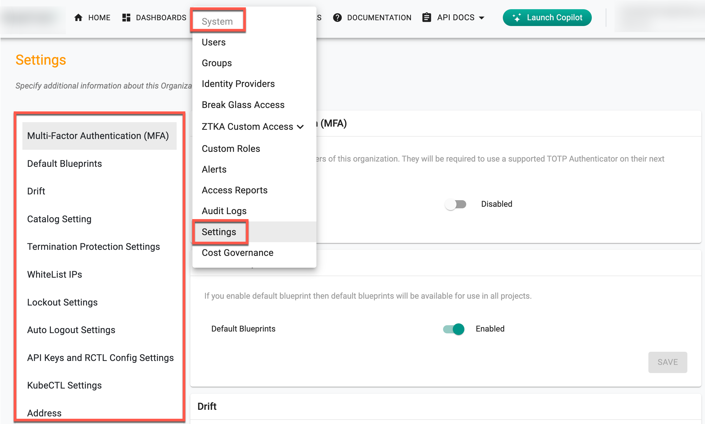

### Password Complexity

All approved users in the Controller are required to create passwords that are a minimum of 8 characters in length.

### MultiFactor Authentication (MFA)

We support and __strong recommend__ the use of TOTP based MFA Authenticators to secure admin access to the Application and Ops Console. Once Admins enable MFA for their  Org, all users in the Org will be required to use MFA. They will be automatically steered into a MFA enrollment workflow the next time they attempt to login.

#### Session Expiration

After a successful login, the user session is valid for 24-hours and will be required to authenticate again.

### Auto Lockout

Org Admins can optionally configure and enable an Org wide policy to automatically lockout users after "x" consecutive invalid login attempts in the specified time period. The defaults are "5" consecutive, invalid attempts in a 15-min time period.

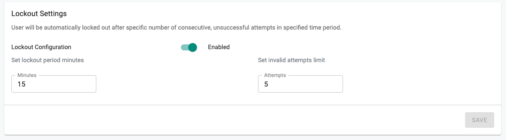

### Auto Logout

Org Admins can optionally configure and enable an Org wide policy to automatically logout users after "x" minutes (default of 60-minutes) of no activity.

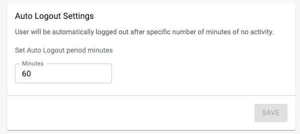

### Self Service Password Reset

Users who have forgotten or misplaced their passwords can regain access to their Org via a self-service password reset workflow. They will be sent a password reset link via email (valid for 72-hours) that will allow them to reset their password.

---

### Profile

Select the required user from the Users page and the Profile page appears.
- Users can update the profile details, KubeCTL validity period, and API Keys and RCTL CLI Config validity period based on the requirement. User specific setting overrides global configuration set by the Org Admin
- Click **Save**

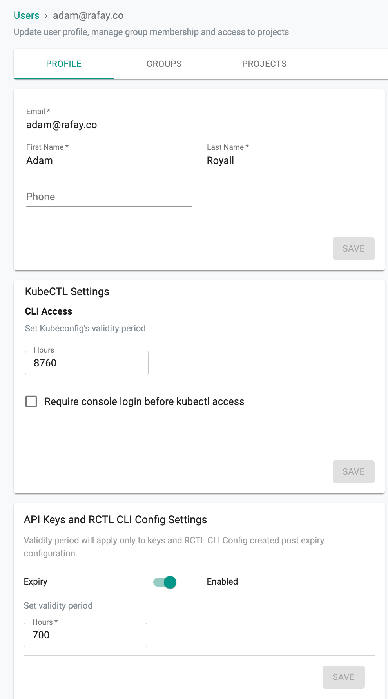

Explore our blog for deeper insights on **Kubernetes Cluster Access with Minimal Privileges for Developers**, available [here](https://docs.rafay.co/blog/2023/08/01/least-privilege-developer-access-for-kubernetes-clusters/)!

### Groups

Click **Groups** tab to update the user's group assignments. Click **Manage Membership** to add or remove the users from one or more group(s)

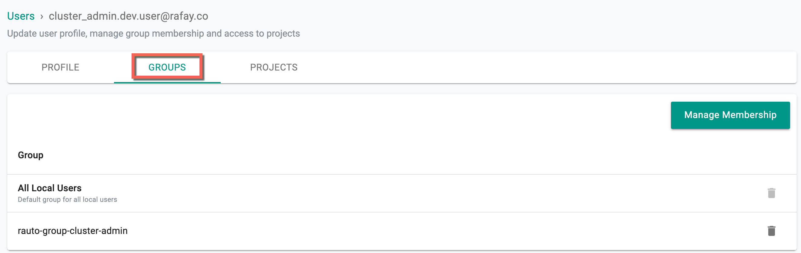

### Projects

Clicking on the **Projects** tab shows the list of projects, assigned roles, and the role association ([Custom Roles](./custom_roles.md) or [Base Roles](./roles.md)) of the selected user

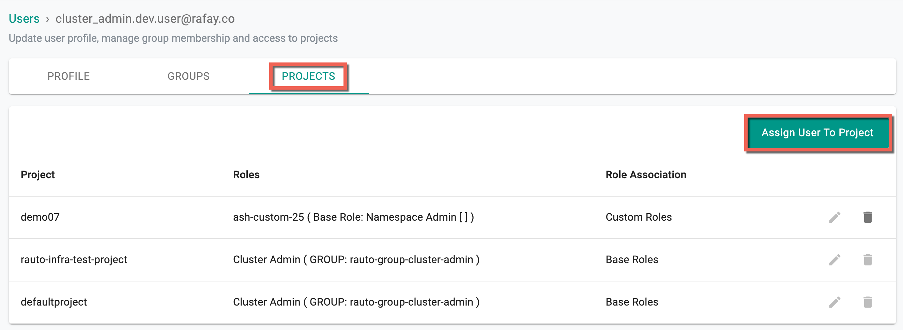

- To assign a user to the desired project with a specific role, click **Assign User to Project**
- Select the required project and role association, either Base Roles or Custom Roles.

Below is an example of the permissions allowed for base role

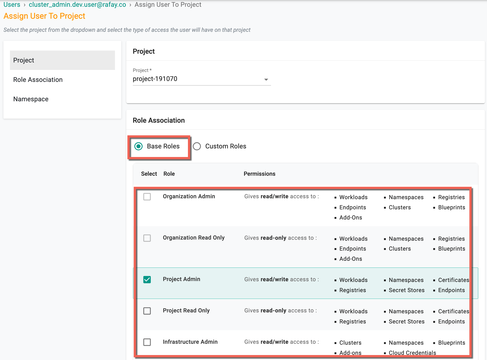

- Select **Custom Roles** option to add a custom role to the user
- Select the required namespace and click **Save and Exit**

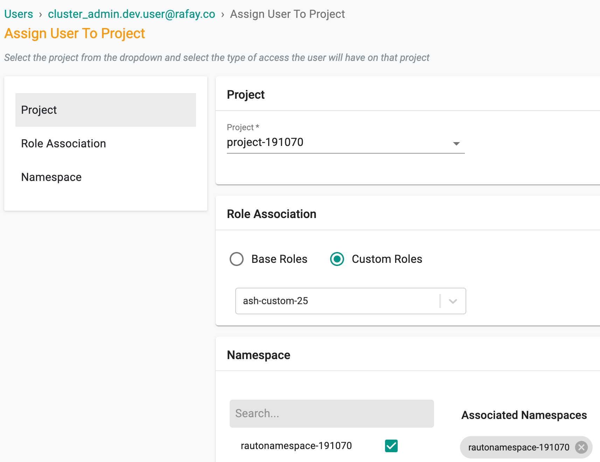

!!! Important
    Namespace selection is mandatory when assigning Namespace Admin or Namespace Read Only role to the users. This requirement applies to both base roles and custom roles.

Admins can modify custom roles assigned to users holding base roles of Namespace Admin and Namespace Read Only.

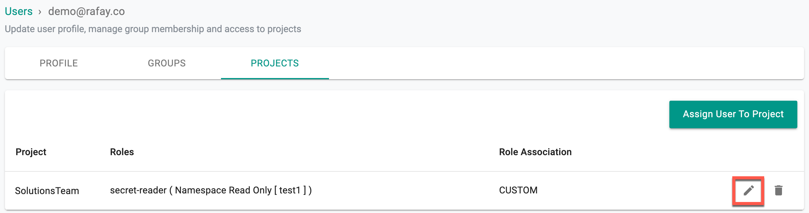

---

## Offboarding Users
Once users are created, admins are allowed to deactivate and delete users.

### Deactivate User
The user will be temporarily blocked from being able to access the Controller via all channels (browser, CLI or REST API). This action is fully reversible by an Organization or Project Admin.

The Organization admin can deactivate a user by removing them from all Projects. In the example below, notice the reference to "No Projects assigned".  

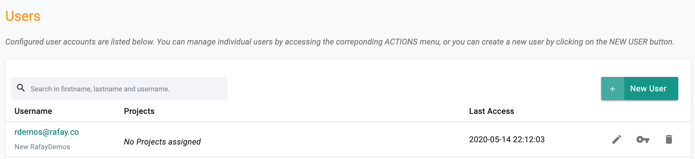

When the deactivated user attempts to login, they will be presented with the following message.

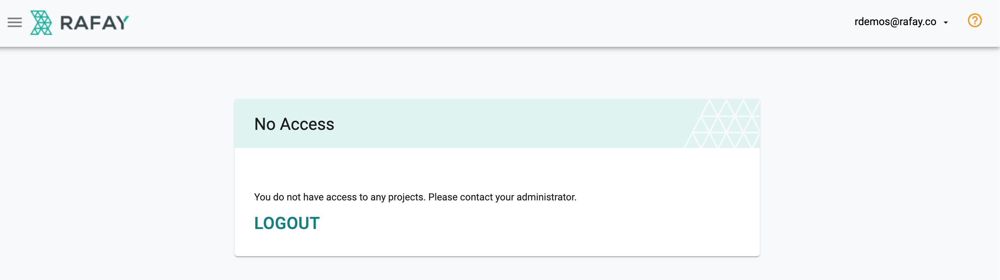

---

### Delete User
The user will be permanently blocked from being able to access the Controller via all channels (browser, CLI or REST API). This action is NOT reversible and the user is permanently removed from the Org.

!!! Important
	Deletion or deactivation of a user from one Org does not block the user from accessing other Orgs they are allowed to access.

---

### Revoke Kubeconfig

If required, admins can revoke a user's existing Kubeconfig (e.g. user lost their laptop with the Kubeconfig file). Once revoked, the user can download a new Kubeconfig to become productive again.

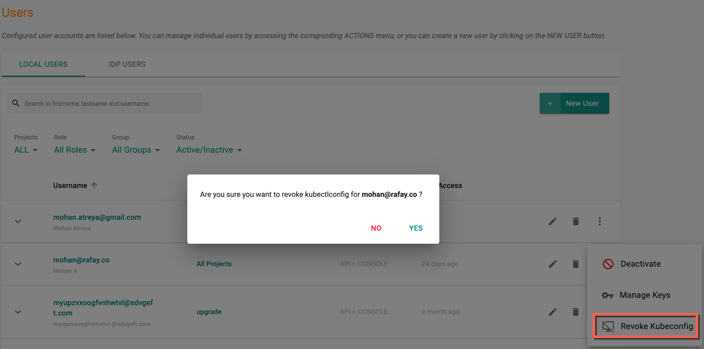

---

### Download Kubeconfig

**API** type users can download the Kubeconfig using the **Download Kubeconfig** option

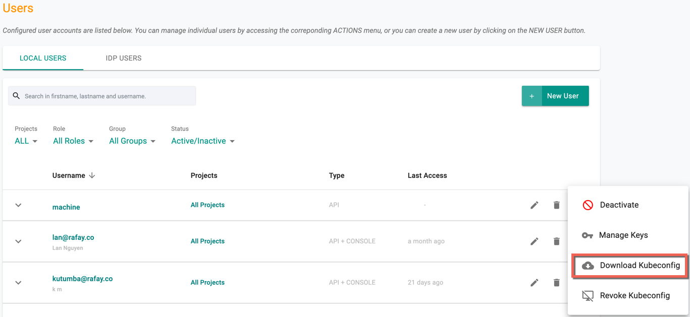

---

### API Keys Settings

Org Admin can configure the duration of validity for keys and RCTL CLI Config for users. This validity period will be applicable only to keys and RCTL CLI Config created after the expiration configuration. User specific setting overrides global configuration set by the Org Admin.

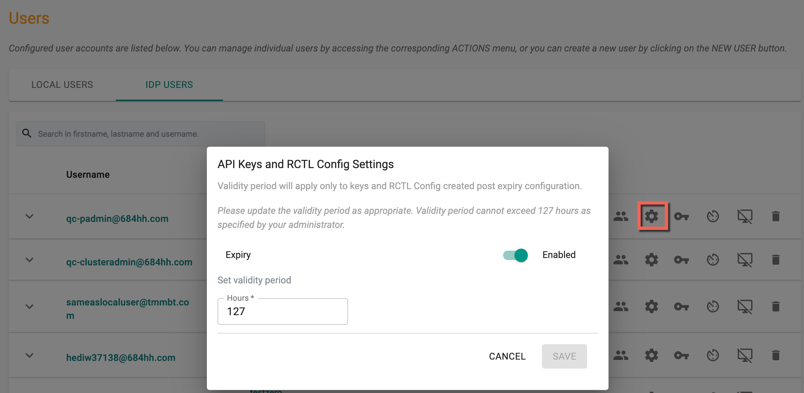

---

### Manage Keys

Use the **Manage Keys** icon to generate and download the **API key** for the local user, as an Org Admin. The integration of a single API key includes a Key section and a Secret section, which are separated by dots in the format of ""<prefix>.<api-key>.<secret"

Example: "***ra2.e53b67c05ec9aaa069ca2e2d86aa005dfa810578***********************************************"

Copy/Paste the generated access key. This helps to configure the RCTL CLI and test access to the controller.

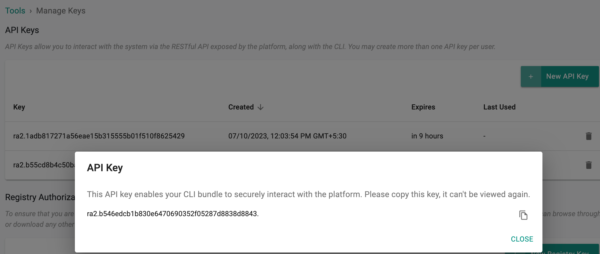

!!! Important
    By utilizing this API key, your CLI bundle gains the ability to securely engage with the platform. Make a copy of this key as it cannot be accessed or viewed again

---

## IDP Users

Administrators can also view the list of users that access the Controller via Single Sign On (SSO). Since these users are managed in the configured Identity Provider, they cannot be removed. However, admins can tune/configure certain aspects of what the SSO user can do.

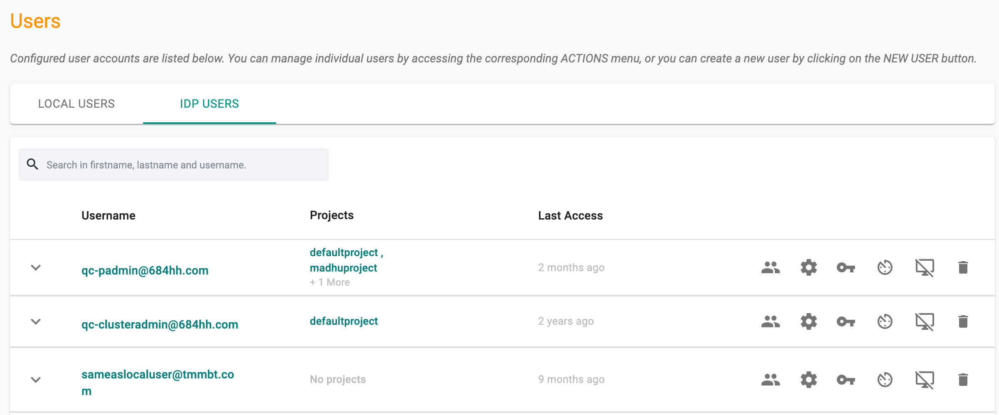

***IDP Badge***

To view user details such as their assigned group, project, role, and namespace, click on the expansion arrows. If the user belongs to any IDP group, an **IDP** badge will appear to indicate their existence in that group.

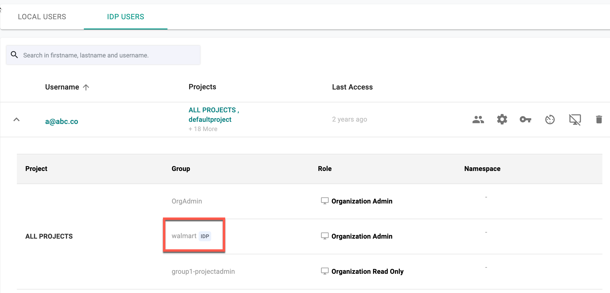

### Manage Groups

An IdP user might not be a part of any group at login and hence they won't have access to any of the projects. On login, that user gets placed in a gated area where they cannot access any projects.

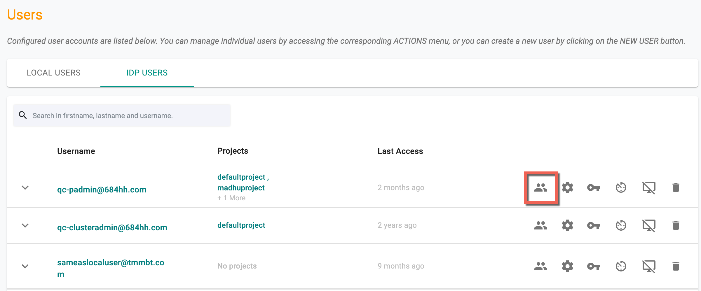

***IDP Badge***

Clicking on the **Manage Groups** option shows the list of both IDP and other group(s) to which the users are added. **IDP Groups** represent the groups from incoming SAML request. A badge labeled **IDP** will be displayed next to the IDP groups to signify their origin from the Identity Provider (IDP) through a SAML request. The existing/new users can also be manually added to any groups within the organization. This allows the user(s) to be a part of both IDP and any other group(s).

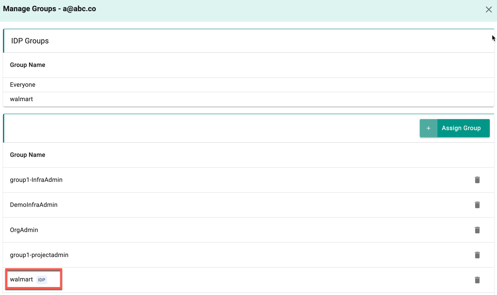

To add users to a group,

- Click **Assign Group** and select the required group(s) from the drop-down
- Click **Add**
- The users can be removed from a group any time using the **Delete** icon. The deleted groups from SAML request are re-added to the users again when they login

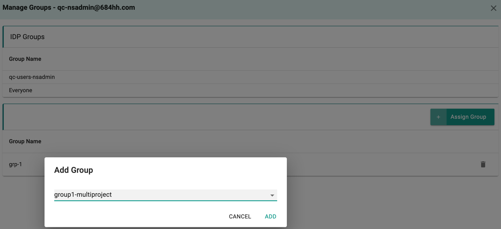

If there are no groups under Managed Groups i.e assigned by org admin, the user will be a part of the IDP group.

### Kubeconfig Settings

Admins can configure/tune a specific SSO user's kubeconfig validity. A good example is when temporary access for a certain time period needs to be provided to a specific user. Admins can also require SSO users to have an active, authenticated session with the Console before they can use the downloaded Kubeconfig file.

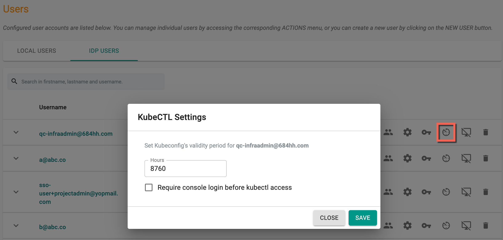

### Revoke Kubeconfig

If required, admins can revoke a SSO user's existing Kubeconfig (e.g. user lost their laptop with the Kubeconfig file). Once revoked, the SSO user can download a new Kubeconfig to become productive again.

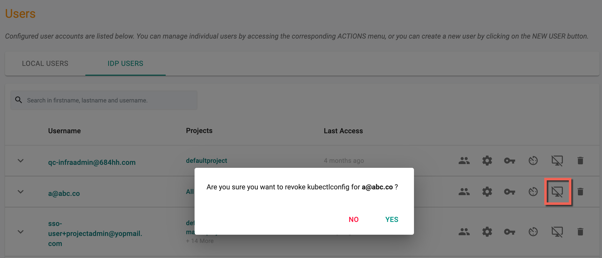

### Delete IDP User

An Org Admin can delete an SSO User from the console. When a deletion request for an SSO user ID is issued, the system will eliminate all group associations with the user.

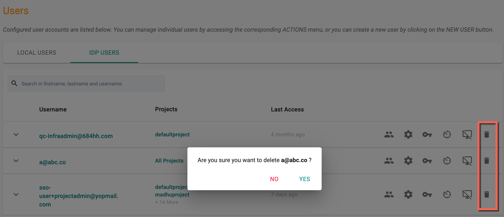

---

### KubeCTL Settings

- Minutes (De-provision service account if inactive for more than): This specifies the duration (in minutes) after which an inactive service account should be de-provisioned.
- Enable Kube API Proxies: When checked, this option enables the use of Kubernetes API proxies. This can be useful for accessing the Kubernetes API server through a proxy
- Allow Read only roles to exec to pods via Kubectl: This option allows users with read-only roles to execute commands inside pods using kubectl exec.
- Allow Read only roles to access secrets via Kubectl: Allows users with read-only roles to access Kubernetes secrets using kubectl.
- Allow only Organization Admin to access secret via Kubectl: This restricts access to Kubernetes secrets to only users with Organization Admin roles.

__CLI Access__

- Hours: This specifies the validity period (in hours) for the Kubeconfig file.
- Disable Kubectl CLI Access (Terminal): Enabling this option disables the ability to use the kubectl command-line interface (CLI) via a terminal.
- Require console login before kubectl access: Enabling this option requires users to log in through the console before they can access Kubernetes resources using kubectl.

__Browser Access__

- Disable Browser Kubectl Access: Enabling this option will disable the ability to use the kubectl command-line interface (CLI) directly from within a web browser.

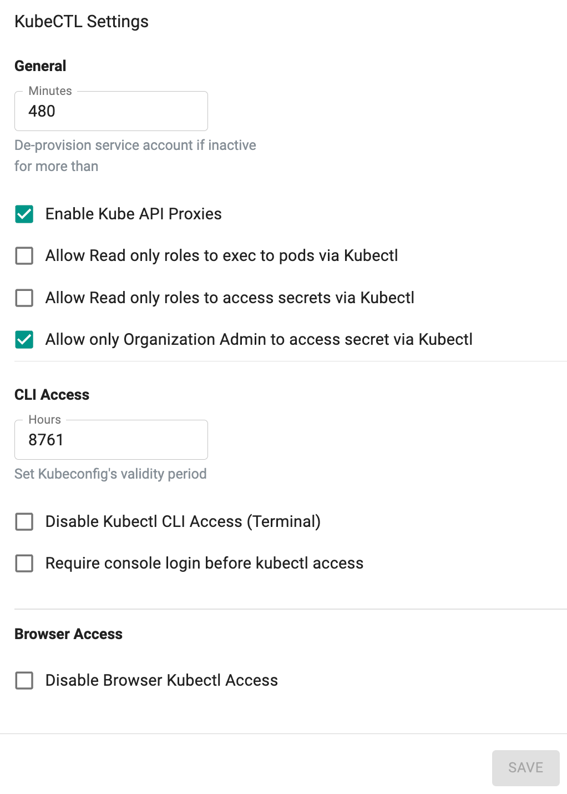

---
