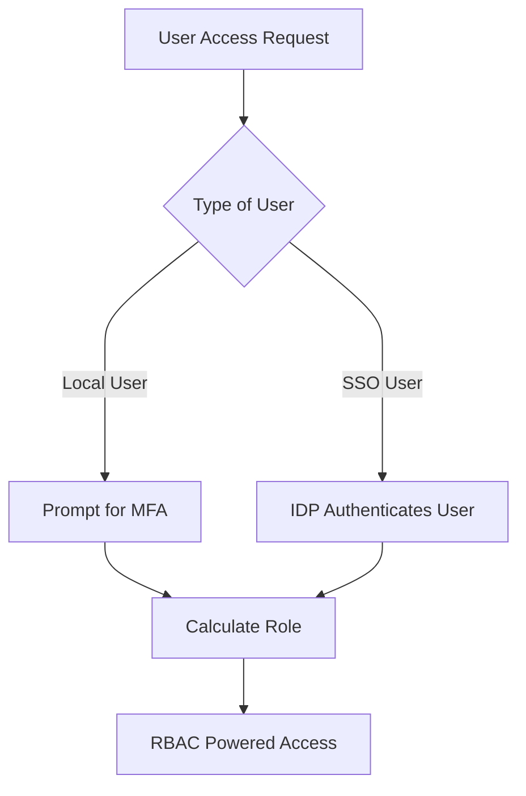
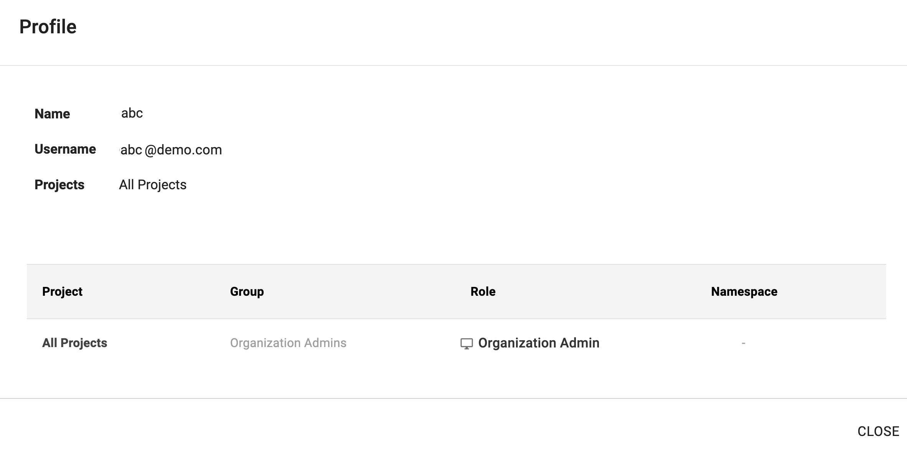
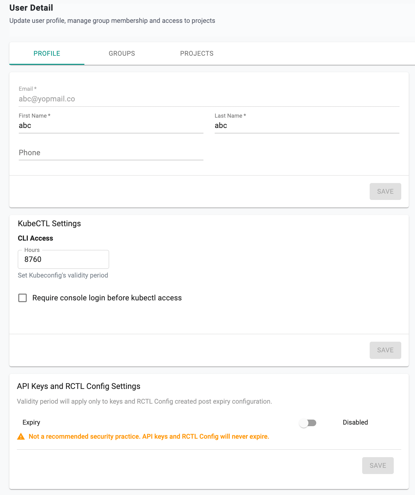
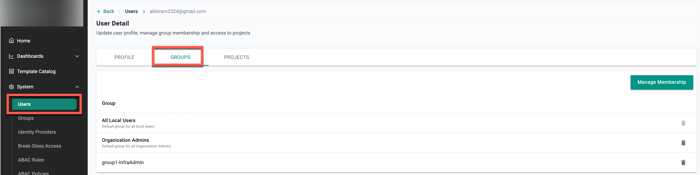
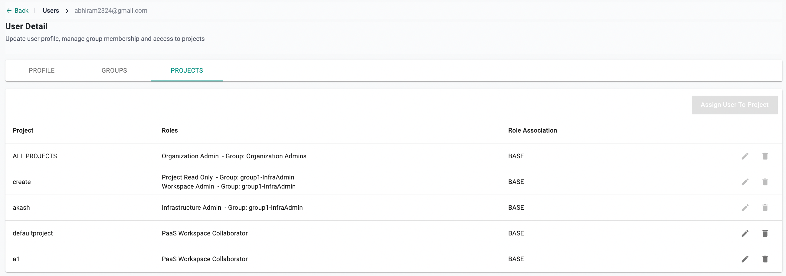
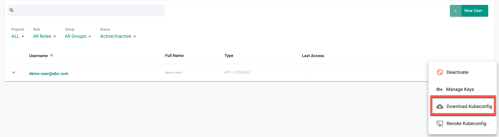

## Uniqueness

Every user in the Controller (across all Orgs) is associated with a unique email address. A user can be associated with one or more Orgs (tenants).

---

## Local vs SSO Users

Users can either be **Local Users** or **IdP Users**.

### Local Users
- Lifecycle of these users is fully managed in the Controller.
- Typically limited to privileged super/root users such as Org Admins.
- Are locally authenticated by the controller.
- MFA is strongly recommended for local users.

### IdP Users
- Lifecycle of these users is fully managed in the customer's Identity Provider (IdP).
- Typically for all non-privileged users such as developers, operations personnel etc.
- Authentication and MFA is performed by the configured Identity Provider such as Okta, Azure AD, etc.

The diagram below shows the high-level workflow for securing user access with MFA.

---

## User Profile

Users can access and view their profile.

- Click on your **Email Address** at the top right
- Select **Profile**

The profile displays your permissions and what you are allowed to do on the platform.

### Example 1
In this example, the user has:

- Access to all Projects in an Organization
- The Role **Organization Admin**

### Example 2
In this example, the user has:

- Access to the projects **new** and **defaultproject**
- Roles assigned:  
  - Base Role: *Workspace Admin* for the "new" project  
  - Custom Role: *cr1* for the "defaultproject" project, granting access to specific namespaces

---

## Password Policy

- Minimum password length of 8 characters  
- Reuse of previous passwords is blocked  
- Passwords are salted and hashed with strong key derivation functions  
- MFA is strongly recommended  
- Automatic lockout after consecutive failed login attempts  
- Automatic logout after a defined period of inactivity  

If you forget your password, use the **self-service password reset workflow**. You will receive an email with a reset link valid for 72 hours.

---

## Profile Settings

From your **Profile page**, you can:  

- Update personal details  
- Update kubeconfig validity period  
- Manage API Keys and RCTL CLI Config validity period  

User-specific settings override global configuration set by the Org Admin.  

---

## Groups

From the **Groups** tab in your profile, you can view the groups you are assigned to.  

---

## Projects

From the **Projects** tab in your profile, you can view the list of projects you are assigned to, including base or custom roles.

---

## Kubeconfig

Users can download kubeconfig files for CLI or API access (if enabled).  

- **Download Kubeconfig**: Use this to authenticate kubectl access.  
- If your kubeconfig is revoked (e.g., device lost), you can download a new one once re-enabled.  

---

## MFA and Session Settings

- If MFA is enabled for your org, you will be prompted to enroll and authenticate with a TOTP authenticator  
- After login, sessions are valid for 24 hours  
- You may be locked out temporarily after repeated failed login attempts  
- Auto logout occurs after the configured inactivity period  

---
