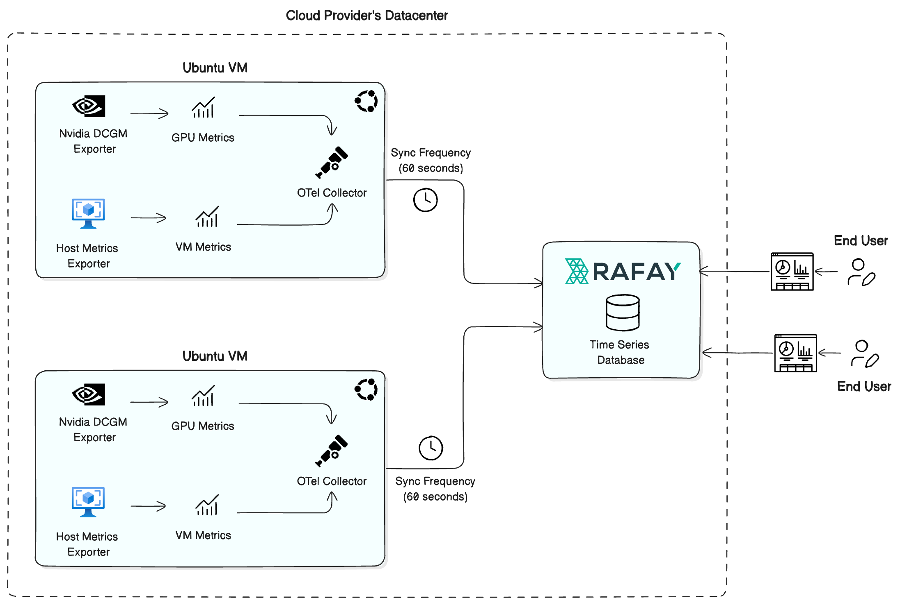

The image below outlines the architecture and approach used by Rafay to centrally aggregate GPU and VM telemetry from end user virtual machines (VMs) hosted in the cloud provider's datacenter. The metrics are aggregated using [OpenTelemetry (OTel)](https://opentelemetry.io/) and synchronized to a centralized **Time Series Database** at the Rafay Controller for end-user visualization and analytics.

!!! info
    Only Ubuntu 22.04 and 24.04 OS based VMs are currently supported for integrated metrics. 

--- 

## Key Capabilities 

### Open Standards
Uses OpenTelemetry for portability and extensibility

### Multi-VM Scaling
Architecture supports deployment across many VMs

### Tenant Isolation
Metrics collected per-host, enabling multi-tenant observability

### No Kernel Modules
All exporters and collectors run in user space

---

## Central Time Series Database

Metrics data from all the VMs under management is aggregated in a time series database co-located on the Rafay Controller. This centralized telemetry backend: 

1. Stores time-series data from all VMs
2. Supports querying and dashboard rendering
3. Implements retention and downsampling policies

--- 

## Components

The following modules are used for metrics aggregation at the Virtual Machine. 

### **NVIDIA DCGM Exporter**  

This component collects GPU-related metrics such as:

- Memory utilization
- Core utilization
- Temperature
- Health status

### **Host Metrics Exporter**  

This component collects VM/system-level metrics including:

- CPU usage
- Memory usage
- Disk I/O
- Network statistics

### **OpenTelemetry (OTel) Collector**  

This is operated as a local service on the VM. 

- It scrapes data from the DCGM and Host Metrics exporters
- Normalizes and prepares metrics
- Forwards metrics to the central TSDB at the Rafay Controller

!!! important
    By default, metrics data is aggregated from the VM to the centralized TSDB **every 60 seconds**. 

---

