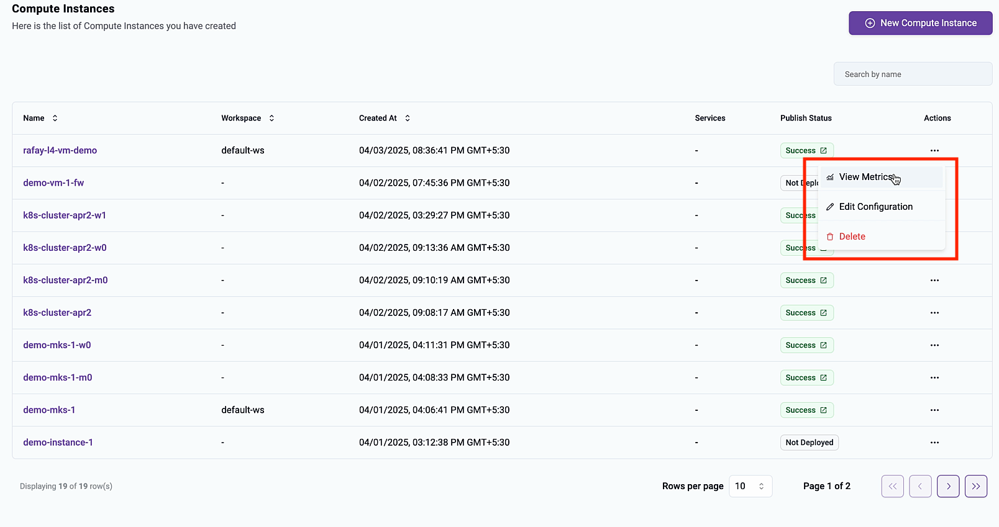
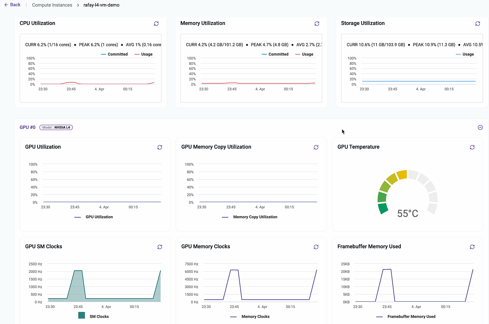
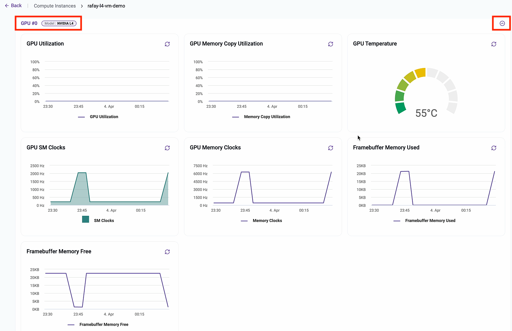
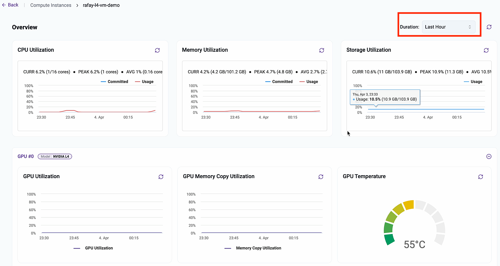

GPU and VM Metrics are available to end users from the end user portal (i.e. Developer Hub). 

---

## View Metrics

Users just need to click the actions menu on the right of the VM and select **View Metrics** to view the metrics dashboard

--- 

## Base Metrics 

### CPU, Memory and Storage Utilization

Base VM metrics are available for all types of VMs immaterial of whether they include a GPU or not. 

--- 

### GPU Metrics

Critical GPU metrics on a per GPU basis are available to users. In the example below, the VM has only a single "Nvidia L4" GPU. 

--- 

## Metrics Duration 

By default, the user is presented with metrics for the **last hour**. They are provided the means to select metrics duration of **last 24 hours** as well. 

