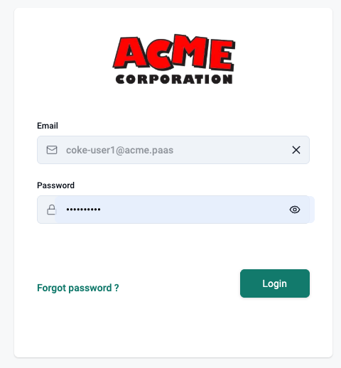
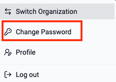
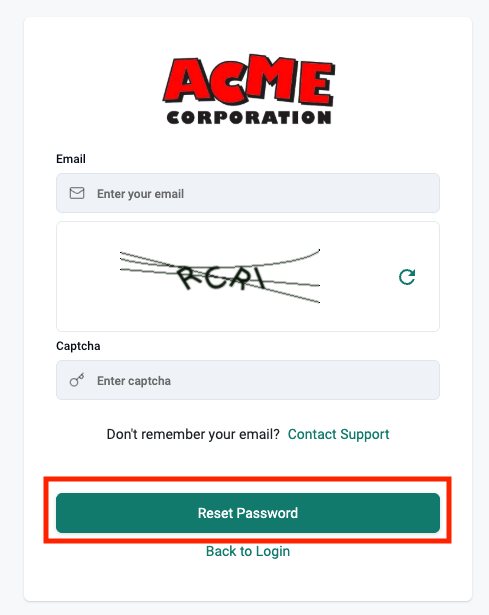
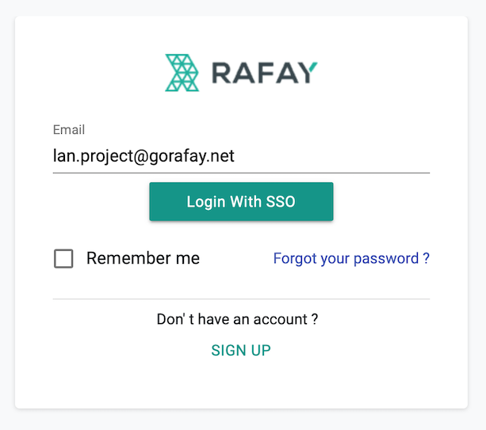

Roles are used to enforce governance and access controls to ensure that there are guardrails in terms of what a user can and cannot do. Users with the role "Organization Administrators" are responsible for role assignments and user management. End users are assigned one of the following end user facing roles (Developer, Data Scientist etc). 

---

## Passwords

Users have to authenticate with their username and password before they are able to access/use the self service portal. 

### Change Password 

Users are provided with a "self service" option to change their password from within the self service portal (after a successful login)

### Forgot Password

Users that have forgotten their password can employ the "self service, password reset" workflow to securely reset/change their login password. 

!!! info
    Org Admins can always reset/set passwords for users if required. 

--- 

## Single Sign On (SSO)

If the Org Admins has configured the use of authentication via Single Sign On (SSO), users will be automatically redirected to the configured IdP (Identity Provider) during the login process. 

--- 

## MFA (Optional)

Org Admins can enable/require the use of TOTP as a second authentication factor. This allows users to be strongly authenticated before they are allowed access to the Org. When you attempt to login, 

- The password based primary authentication is performed first. 
- Once the primary authentication is successful, the user is prompted to verify their identity with MFA using TOTP. 

!!! info
    The user needs to pass both primary and secondary authentication methods before they are allowed access to the Org

ANY TOTP based Authenticator will work for MFA. There are several authenticators available in the market with varying degrees of sophistication. We recommend that users select an authenticator that also supports the following capabilities on top of basic TOTP support. These capabilities are critical for end users especially when their phone has been stolen or broken.

- Multiple Device Support
- FaceID/TouchID protected access to TOTP app
- Cloud Backup and Recovery

Some illustrative examples of TOTP Authenticator apps are listed below:

### Advanced Capabilities

1. Authy by Twilio
2. Duo
3. LastPass

### Basic Capabilities

1. Google Authenticator
2. Microsoft Authenticator
3. Okta Verify

